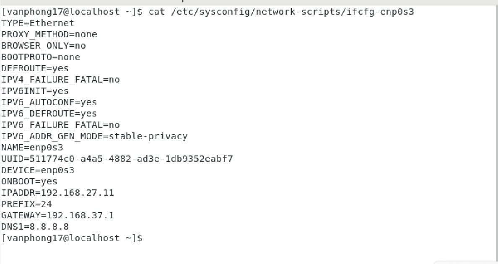
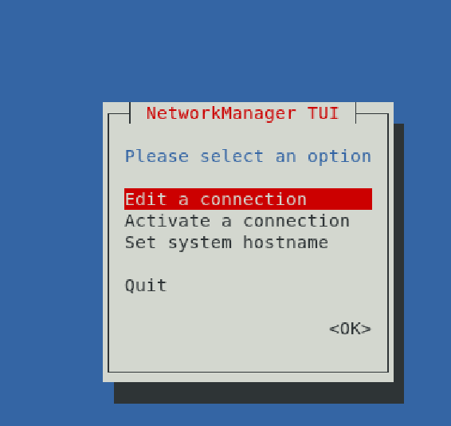
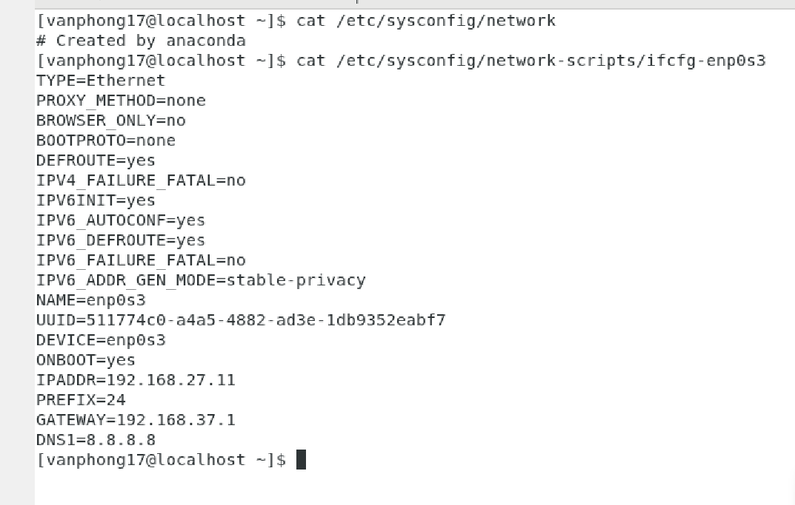
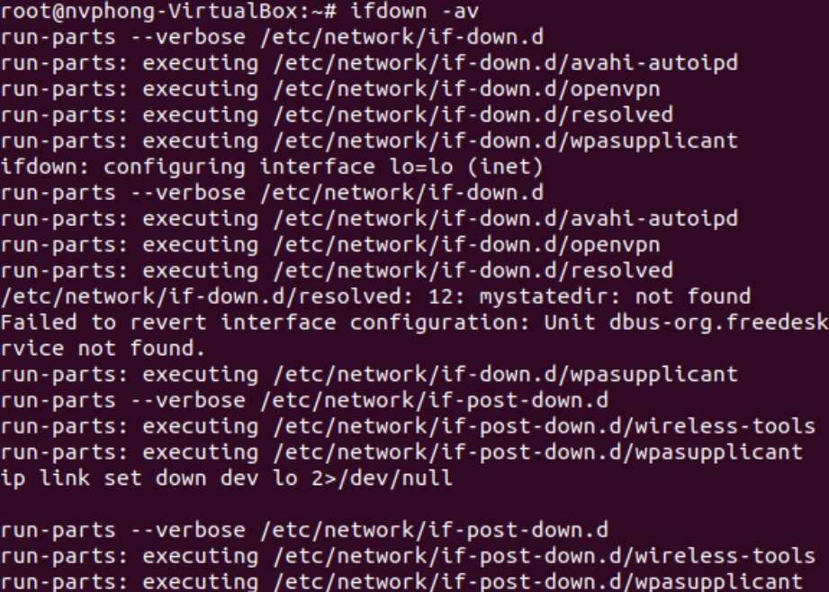

# ***Cấu hình mạng***
## Lệnh `ip` : 
### Lệnh trả lại thông tin trên từng thiết bị Ethernet được kết nối.
`# ip addr show` 


Để xem thông tin về `enp0s3`:

### Hiện thị bảng định tuyến
`ip route show`

### Gán IP cho một giao diện mạng:
`# ip addr add 10.0.2.16 dev enp0s3`


### Gán nhiều IP cho một giao diện mạng:
Để gán nhiều IP cho giao diện mạng ta làm tương tự như trên

### Gỡ bỏ IP từ giao diện mạng

`# ip addr del 192.168.37.133/32 dev ens33`


### Hiển thị thông tin về một giao diện mạng


### Thay đổi trạng thái giao diện mạng (up/down)
`ip link set dev {DEVICE} {up|down}`

### Hiện thị bảng định tuyến
`# ip route`


### Thêm một định tuyến mới
`# ip route add 10.0.2.0/24 via 10.0.2.2`
### Xóa một định tuyến
`ip route del default`

Hoặc chỉ định định tuyến cần xóa.

`ip route del <dia_chi_ip> via <gateway>`


# ***Cấu hình trên Centos 7***
## ***Cấu hình bằng lệnh `nmcli`***

### ***Hiện thị mạng sẵn có***
- `nmcli device` :Lệnh này sẽ hiện thị ra toàn bộ các thiết bị mạng có sẵn trên hệ thống và trạng thái của chúng.

- Tại cột `STATE` sẽ có 2 kiểu :

  - managed: có nghĩa là thiết bị đó đặt dưới quyền kiểm soát của NetworkManager và thiết bị này có thể "connected" (Đã được config và active) hay disconnect (chưa được config những sẵn sàng để active trở lại)
  - unmanaged: thiết bị mạng này chưa được dưới quyền kiểm soát của NetworkManager.

### ***Đặt IP cho Interface enp0s3***
Ta sẽ đặt theo số liệu sau:

IP address: 192.168.27.11
Gateway: 192.168.37.1
Subnetmask: 255.255.255.0/24
DNS-nameserver: 8.8.8.8
1. Đặt IP:

`nmcli connection modify enp0s3 ipv4.addresses 192.168.27.11/24`

hoặc

`nmcli con mod enp0s3 ipv4.addresses 192.168.27.11/24`

-> "con" = "connection"
   "mod" = "modify"
2. Đặt Gateway:

`nmcli connection modify enp0s3 ipv4.gateway 192.168.37.1`

3. Đặt DNS:

`nmcli con mod enp0s3 ipv4.dns 8.8.8.8`

4. Chọn phương thức method: ở đây ta sẽ để manual có thể hiểu là cấu hình bằng tay:

`nmcli con mod enp0s3 ipv4.method manual`

5. Chọn kiểu kết nối tự động:

`nmcli con mod enp0s3 connection.autoconnect yes`

6. Kiểm tra lại xem IP đã đặt chính xác chưa

## ***Cấu hình`nmtui`***
- B1: `nmtui`
- 
- 
- 

## ***Cấu hình file***

Để cấu hình file dùng câu lệnh: `vi /etc/sysconfig/network-scripts/ifcfg-enp0s3`


Một số dòng cấu hình cần quan tâm:
```
1. BOOTPROTO 
    - "none": khi chúng ta muốn sử dụng Static IP. 
    - "dhcp": khi chúng ta muốn đặt IP động nhận từ DHCP server
2. IPADDR - Địa chỉ IP
3. PREFIX(khi đã set Static IP) - Xác định Network Prefix (ví dụ: /24)
4. GATEWAY(khi đã set Static IP) - Xác định Default Gateway cho mạng
5. DNS(khi đã set Static IP) - Ta có thể sử dụng tùy chọn này để xác định 
```

# ***Cấu hình trên Ubuntu***
## ***Cấu hình ifup và ifdown***
### ***Cài đặt ifup và ifdown***
Cài đặt cấu hình ifup và ifdown
`sudo apt install ifupdown`
### ***Lệnh `ifup`***
Để kích hoạt hoặc thiết lập một giao diện
- Cú pháp

`ifup [option]`
- Cập nhật tất cả giao diện mạng


### ***Lệnh `ifdown`***
Để ngắt một giao diện
- Cú pháp

`ifdown [option]`
Ngắt kết nối tất cả các mạng


### ***Disable Netplan***
1. Tắt netplan:

`echo 'GRUB_CMDLINE_LINUX = "netcfg/do_not_use_netplan = true"' >>  /etc/default/grub`
2. Cập nhật lại grub:

`update-grub`
3. Cài đặt ifupdown thay thế netplan
Cài đặt ifupdown bằng câu lệnh:

`apt-get update``
`apt-get install -y ifupdown`
4. Xóa netplan khỏi hệ thống
Xóa bỏ netplan khỏi hệ thống:

`apt-get --purge remove netplan.io`
Nếu bạn chưa cài đặt ifupdown, khi xóa bỏ netplan hệ thống sẽ tự cài đặt ifupdown thay thế cho bạn.

5. Sau đó ta xóa toàn bộ cấu hình của netplan:

`rm -rf /usr/share/netplan`
`rm -rf /etc/netplan`

# ***Tìm hiểu `net plan`***

- Tệp cấu hình mặc định của Netplan nằm trong thư mục `/etc/netplan`.Có thể thấy rằng bằng cách sử dụng lệnh sau:`ls /etc/netplan/`


- Để xem nội dung của tệp cấu hình mạng Netplan,chạy lệnh sau: `cat /etc/netplan/*.yaml`
  
- Để chỉnh sửa tệp cấu hình: `sudo nano /etc/netplan/*.yaml`

  Cấu hình địa chỉ IP tĩnh: 


# ***Tài liệu tham khảo***
<https://www.serverlab.ca/tutorials/linux/administration-linux/how-to-configure-centos-7-network-settings/>
<https://www.tecmint.com/nmtui-configure-network-connection/>
<https://www.redhat.com/sysadmin/7-great-network-commands>
s

<https://vietnetwork.vn/routers-switches/cach-cau-hinh-mang-voi-netplan-tren-ubuntu/>

<https://linuxhandbook.com/ifup-ifdown-ifquery/>


