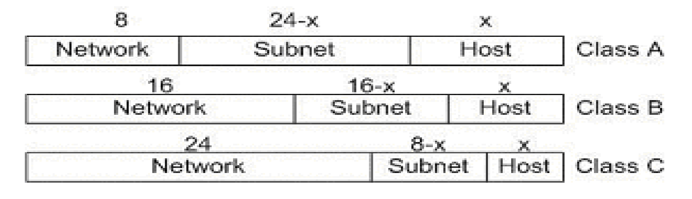
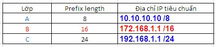
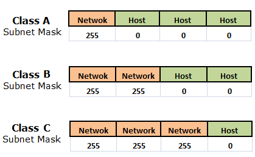
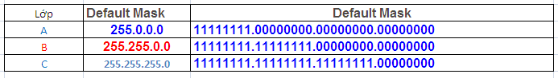
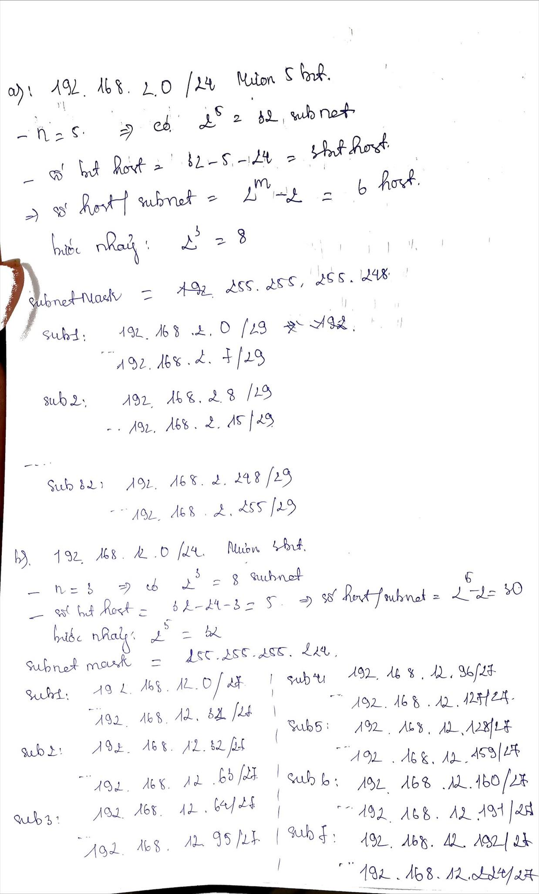
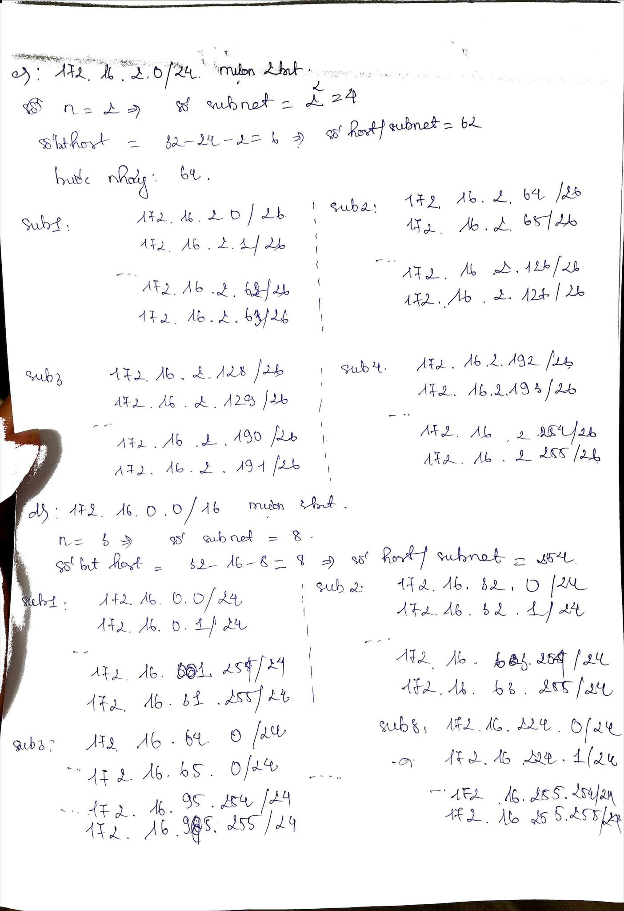
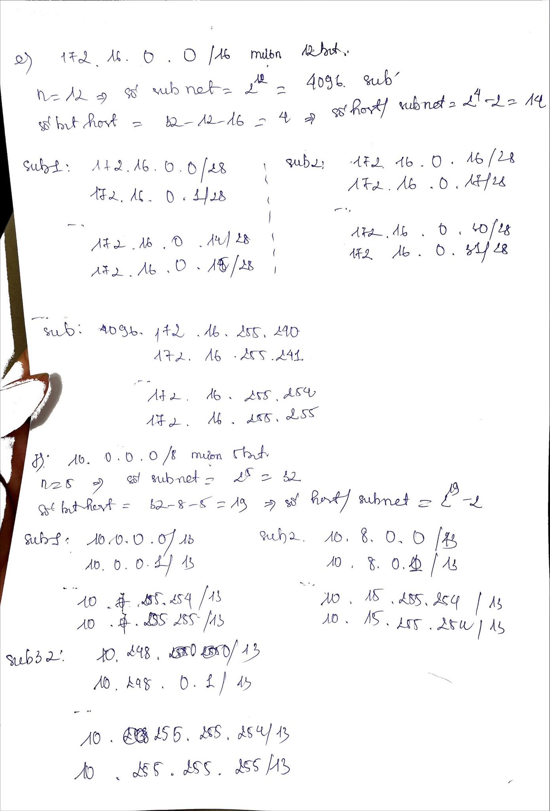
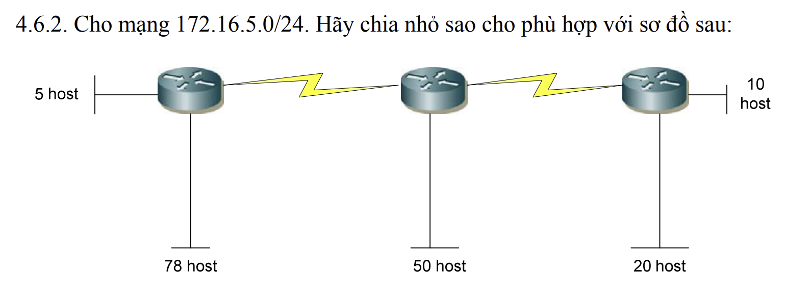
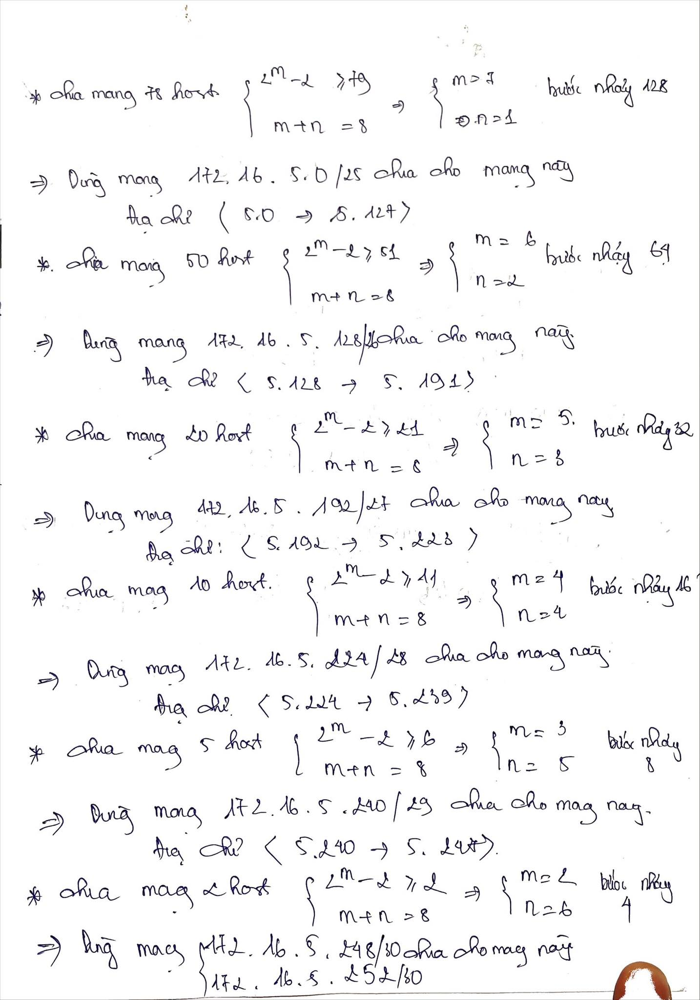
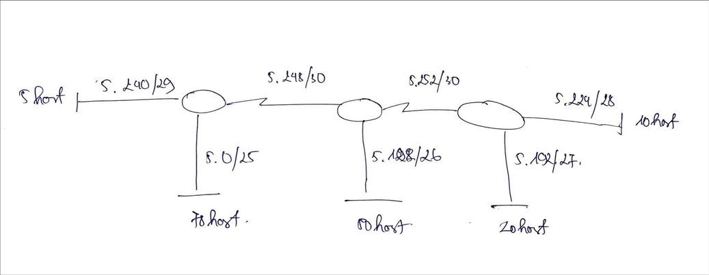

# CÁCH CHIA ĐỊA CHỈ IP.


## MỤC LỤC.


[I. MỘT SỐ KHÁI NIỆM](#i-một-số-khái-niệm)

[II. CÁCH CHIA ĐỊA CHỈ IP.](#cách-chia-địa-chỉ-ip)

[III. KỸ THUẬT CHIA VLSM.](#iii-kỹ-thuật-chia-vlsm)

[VI. MỘT SỐ BÀI TẬP CHIA MẠNG CON.](#vi-một-số-bài-tập-chia-mạng-con)

## I. MỘT SỐ KHÁI NIỆM.

_Đặt vấn đề_: Trong khi nguồn tài nguyên IP dần cạn kiệt, mà trong một hệ thống, rất khó sử dụng hết toàn bộ địa chỉ IP khả dụng của một lớp IP. Điều này gây lãng phí không gian địa chỉ rất lớn. Do đó vấn đề đặt ra là phải chia từng lớp mạng này thành những lớp mạng nhỏ hơn có số IP phù hợp với nhu cầu sử dụng hợp lý.Sự phân chia này còn giúp người quản trị dễ dàng hơn trong việc quản lý, bảo mật dữ liệu đồng thời giảm tải cho các thiết bị định tuyến.

### 1.1. KHÁI NIỆM CHIA MẠNG CON SUBNETING.


Subnetting là tổ hợp những kỹ thuật phân chia không
gian địa chỉ của một lớp mạng cho trước thành nhiều
lớp mạng nhỏ hơn bằng cách lấy một số bit ở phần
Host ID để làm địa chỉ mạng cho mạng con (Subnet)


<p style="text-align:center">Hình : Giới thiệu subneting</p>

### 1.2. MỘT SỐ KHÁI NIỆM CẦN BIẾT.


***Prefix length***: Là đại lượng chỉ số bit dùng làm địa chỉ mạng. Chẳng hạn lớp A có prefix length là 8, lớp B là 16, lớp C là 24. Với một địa chỉ IP tiêu chuẩn prefix length là giá trị sau dấu /. Chẳng hạn 192.168.1.1 /24. Ta có bảng tương ứng sau:


<p style="text-align:center">Hình :prefix</p>


***Subnet Mask***: Giá trị trần của mạng con, là giá trị thập phân tính khi tất cả các bit của prefix length bằng 1 và phần còn lại bằng 0. Như vậy địa chỉ thực của một mạng ( hay địa chỉ mạng ) sẽ là hợp của địa chỉ IP và subnet mask

Một số subnet mask mặc định theo lớp là :

o   Class A : 255.0.0.0 (/8)

o   Class B : 255.255.0.0 (/16)

o   Class C: 255.255.255.0 (/24)


<p style="text-align:center">Hình : subnetmask của lớp A,B,C</p>


***Default Mask (Network Mask)***: là giá trị trần của mỗi lớp mạng A, B, C (D, E không xét đến) và là giá trị thập phân cao nhất (khi tất cả các bit ở Network Address bằng 1 và các bit ở Host Address bằng 0). Như vậy Default Mask của lớp A là 255.0.0.0, của lớp B là 255.255.0.0 và C là 255.255.255.0.Cụ thể:



<p style="text-align:center">Hình : defaultmask của lớp A,B,C</p>


***Subnet Address*** của một địa chỉ IP cho trước là giá trị nhỏ nhất của dải địa chỉ mạng con mà IP đó thuộc về. Các thiết bị định tuyến dựa vào địa chỉ này để phân biệt các mạng con với nhau. Giá trị của địa chỉ mạng có thể được tính bằng nhiều cách. Cách cơ bản nhất là dùng phép AND giữa địa chỉ Subnet Mask và IP dưới dạng nhị phân


***Địa chỉ quảng bá (Broadcast Address)*** của một mạng con là địa chỉ IP cao nhất của mạng đó. Subnet Address và Broadcast Address không dùng để gán cho máy chủ. Do đó mới có công thức tính số IP khả dụng là 2n – 2 với n là số bit dùng cho Host Address.


## II. CÁCH CHIA ĐỊA CHỈ IP.

### 2.1 QUY ƯỚC VIẾT ĐỊA CHỈ IP.

Nếu có địa chỉ IP như 172.29.8.230 thì chưa 
thể biết được host này nằm trong mạng nào, 
có chia mạng con hay không và có nếu chia thì 
dùng bao nhiêu bit để chia. Chính vì vậy khi 
ghi nhận địa chỉ IP của một host, phải cho biết 
subnet mask của nó

Ví dụ: 172.29.8.230/255.255.255.0 hoặc 
172.29.8.230/24 (có nghĩa là dùng 24 bit đầu 
tiên cho NetworkID).

### 2.2 CHIA MẠNG CON.

Thực hiện 3 bước:
- Bước 1: Xác định subnet mask.
- Bước 2: Liệt kê ID của các Subnet mới.
- Bước 3: Xác định các vùng địa chỉ cho host.


## III. KỸ THUẬT CHIA VLSM.


VLSM (Variable Length Subnet Mask): là kỹ thuật chia nhỏ một mạng thành các mạng có độ dài khác nhau (sẽ có các subnet mask khác nhau).

_**Ví dụ**_: Dùng địa chỉ 192.168.1.0 /24 để triển 
khai 3 network sau: HCM 100 máy, Cần Thơ 50 
máy, Hà Nội 50 máy. Hỏi phải đặt IP như thế 
nào?

```
bước 1: Xét các mạng theo thứ tự số host từ cao xuống thấp
- Đầu tiên , xét mạng nhiều host nhất: 100 host, ta phải xem mượn bao nhiêu bit thì đủ cho mạng này. Ta giải hệ: 
    2^m – 2 ≥ 101 
    m + n = 8 (mượn bit ở octet thứ 4).Với m: số bit host, n: số bit mượn 
- Ta được m = 7, n = 1. Vậy ta mượn 1 bit và dành mạng 192.168.1.0/25 để gán cho mạng có 100 host. Mỗi mạng /25 có 27 – 2 = 126 host => đáp ứng đủ cho mạng 100 host. 
- Vậy mạng được chia ra làm 2 mạng: Net0 từ 192.168.1.0 đến 192.168.1.127, Net1: từ 192.168.1.128 -> 192.168.1.255. 
- Chọn Net0 cho HCM, lúc đó một máy ở HCM sẽ có IP dạng 192.168.1.x (x chạy từ 1 đến 126), netmask: 255.255.255.128.

bước 2: Tiếp theo chia net1 ra làm 2 bằng cách mượn thêm 1 bit nữa: /26 (255.255.255.192) 

bước 3: Sẽ có 2 net mới, mỗi net có 62 host (64 - 2): net1a có địa chỉ từ 192.168.1.128 đến 192.168.1.191, và net1b có địa chỉ từ 192.168.1.192 đến 192.168.1.255

bước 4: Chọn net1a cho Cần Thơ và net1b cho Hà Nội

kết luận: Như vậy tại HCM giá trị subnetmask là /25, cần thơ và hà nội là /26 nên ta gọi là variable lenght subnet mask –VLSM. Và 192.168.1.0 là supernet của HCM, HN và CT. 


```


## VI. MỘT SỐ BÀI TẬP CHIA MẠNG CON.

**bài 1:**Cho mạng và số bit mượn. Giả sử có hỗ trợ subnet zero. Hãy xác định : 
- Số subnet có thể có. 
- Số host/subnet. 
- Với mỗi subnet, hãy xác định: địa chỉ mạng, địa chỉ host đầu, địa chỉ host cuối, địa chỉ broadcast (nếu số lượng mạng quá nhiều chỉ cần ghi ra một vài mạng đầu và mạng cuối cùng), subnet mask và số prefix.

a) 192.168.2.0/24 mượn 5 bit. 

b) 192.168.12.0/24 mượn 3 bit. 

c) 172.16.2.0/24 mượn 2 bit 

d) 172.16.0.0/16 mượn 3 bit 

e) 172.16.0.0/16 mượn 12 bit. 

f) 10.0.0.0/8 mượn 5 bit. 

g) 10.0.0.0/8 mượn 10 bit. 

h) 10.0.0.0/8 mượn 18 bit.

GIẢI:






**BÀI 2:**  

GIẢI:




**BÀI 3**: Cho các địa chỉ host sau đây. Hãy xác định các địa chỉ subnet tương ứng và 
cho biết địa chỉ này có thể dùng đặt cho host được không: 
a) 192.168.1.130/29 

b) 172.16.34.57/18 

c) 203.162.4.191/28 

d) 1.1.1.1/30 

e) 10.10.10.89/29 

f) 70.9.12.35/30

```
GIẢI:

a) được

subnetmask: 255.255.255.248

b)  được

subnetmask: 255.255.192.0

c) được

subnetmask: 255.255.255.240

d) được

subnetmask: 255.255.255.252

e) được

subnetmask: 255.255.255.248

f) được

subnetmask: 255.255.255.252

```

**BÀI 4**: Hãy tóm tắt các địa chỉ mạng sau đây về thành một địa chỉ mạng đại diện: 

a) 192.168.0.0/24 

 192.168.1.0/24 

 192.168.2.0/24 

 192.168.3.0/24 

b) 172.16.16.0/24 

 172.16.20.0.24 

 172.16.24.0/24

 172.16.28.0/24

 ```
 giải:

 a) 4 subnet => 2^n=4 =>n=2 => số bit mượn =2
 
   192.168.0.0/22

 b) tương tự: 172.16.16.0/22.
 
 ```


---
*Danh mục tài liệu tham khảo*


<p>[1] https://timkiemtuonglai.wordpress.com/2016/12/22/subnetting-chia-ma%CC%A3ng-con/ </p>

<p>[2] https://vnpro.vn/thu-vien/chuong-1-dia-chi-ipv4-chia-subnet-vlsm-summary-4108.html</p>

<p>[3] bài giảng chia IP- trung tâm tin học VNPRO </p>

<p>[4] </p>


