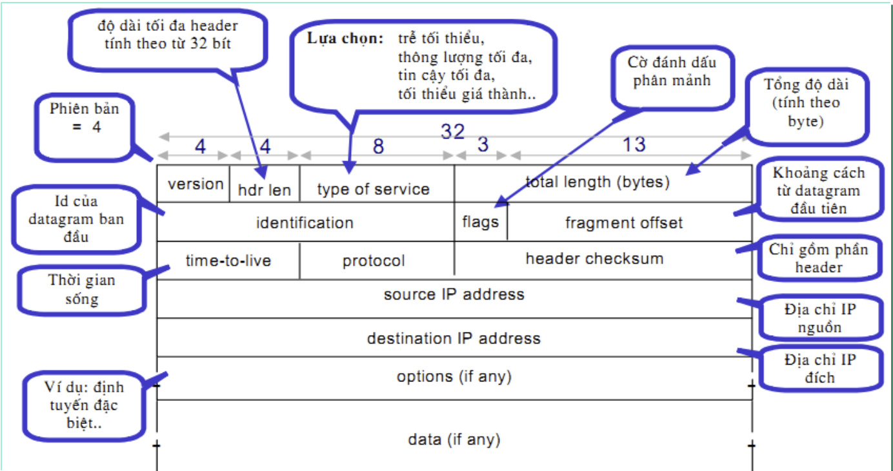
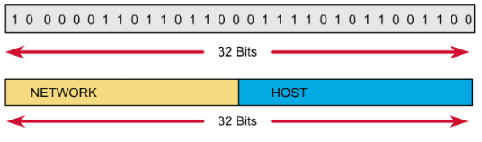
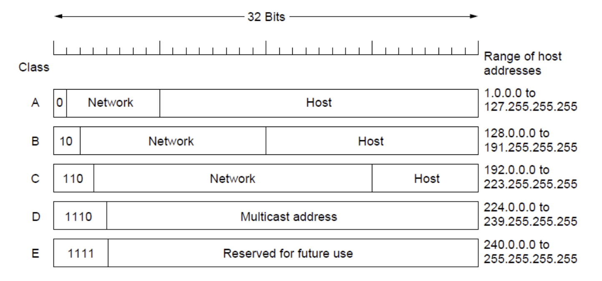
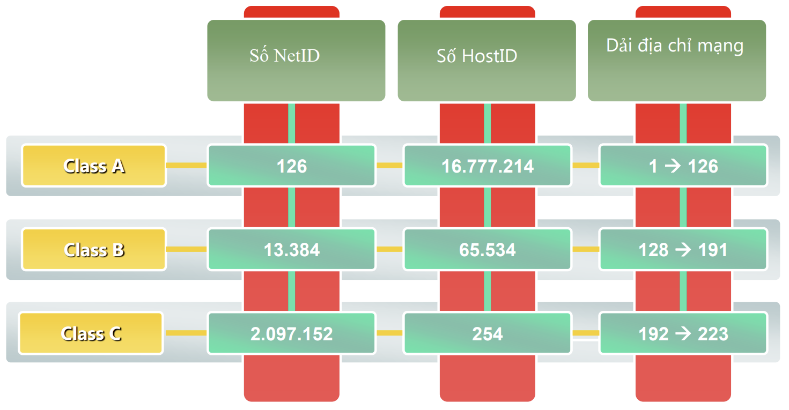
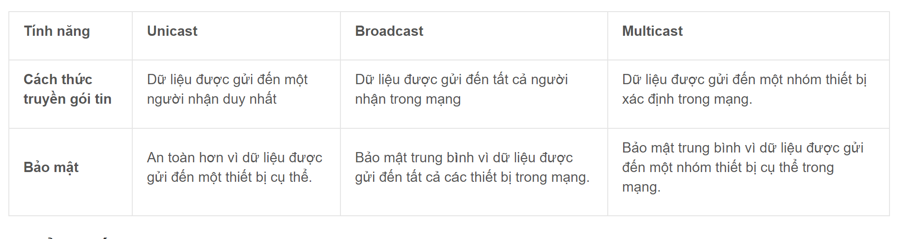
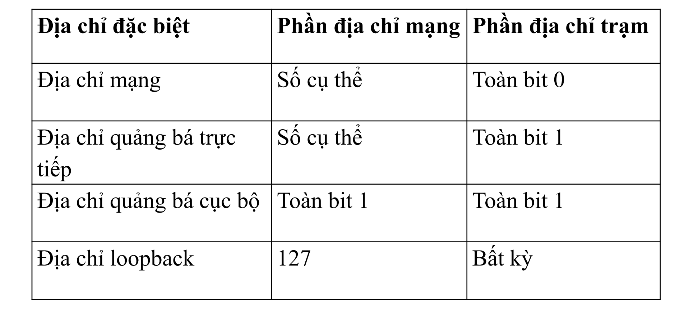
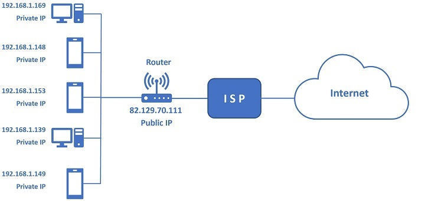
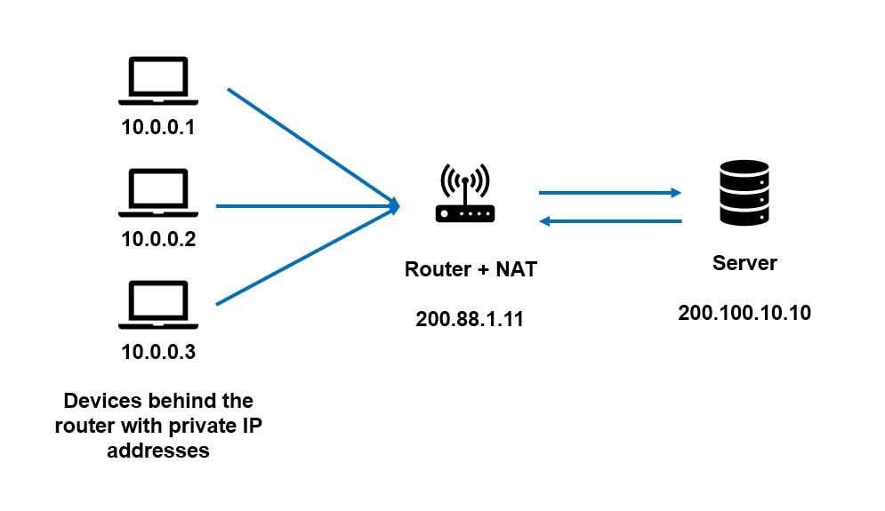

# IPv4 OVERVIEW


## MỤC LỤC:

[I. IPv4 LÀ GÌ?](#i-ipv4-là-gì)

[II. TẠI SAO KHÔNG CÓ IP v1,v2,v3,v5?](#ii-tại-sao-không-có-ip-v1v2v3v5)

[III. IP HEADER.](#iii-ip-header)

[IV. CẤU TRÚC CỦA IPv4.](#iv-cấu-trúc-của-ipv4)

[V. PHÂN LỚP ĐỊA CHỈ IP.](#v-phân-lớp-địa-chỉ-ip)

[VI. PUBLIC IP VÀ PRIVATE IP.](#vi-public-ip-và-private-ip)

[VII. MỘT SỐ BÀI TẬP](#vii-bài-tập)

[VIII. KẾT LUẬN](#viii-kết-luận)


## I. IPv4 LÀ GÌ?

Ipv4 viết tắt cho Internet Protocol Version 4, dịch ra có nghĩa là giao thức Internet phiên bản thứ 4. Ipv4 đã được bộ quốc phòng Hoa Kỳ chuẩn hóa trong bản MIL-STD-1777. Giao thức Internet IP đã trải qua nhiều phiên bản khác nhau và phiên bản Ipv4 là phiên bản đầu tiên được sử dụng rộng rãi trên toàn thế giới và hiện vẫn còn đang là nòng cốt của Internet trên toàn thế giới.


IPv4 được ứng dụng trong các hệ thống chuyển mạch gói. Vai trò của nó là định hướng dữ liệu truyền đi. Khi truyền đi các gói tin, giao thức này chỉ đảm bảo phần truyền tải mà không để ý đến thứ tự truyền gói tin hoặc vấn đề gói tin có đến đích hay không, có lặp lại ở máy đích hay không. Vấn đề này sẽ được giải quyết ở tầng cao hơn của hệ thống TCP/IP. Một điều mà IPv4 đảm bảo được đó là tính toàn vẹn dữ liệu bằng cách sử dụng kết quả của việc chạy thuật toán Checksum để kiểm tra.


## II. TẠI SAO KHÔNG CÓ IP v1,v2,v3,v5?

Giờ đây, Giao thức Internet (IP) ban đầu không được thiết kế như một phương pháp quản lý địa chỉ trên mạng. Nó được dự định là một công nghệ để phân chia ngăn xếp mạng ban đầu với Giao thức điều khiển truyền tải (TCP) ở lớp bốn và IP ở lớp ba. Vào thời điểm đó, thiết kế cho TCP đang cố gắng giải quyết hai vấn đề cùng một lúc: làm cách nào để chúng tôi đóng gói dữ liệu và làm cách nào để gửi dữ liệu đó đến một nơi nào đó? Đó là cách chúng tôi đến với IPv4.

TCP phiên bản 1 được thiết kế vào năm 1973. Điều này đã được ghi lại thông qua RFC 675. Phiên bản TCP 2 được ghi lại vào tháng 3 năm 1977. Vào tháng 8 năm 1977, Jon Postel nhận ra rằng họ đã đi sai hướng với giao thức. “Chúng tôi đang làm hỏng việc thiết kế các giao thức internet bằng cách vi phạm nguyên tắc phân lớp. Cụ thể, chúng tôi đang cố gắng sử dụng TCP để thực hiện hai việc: Phục vụ như một giao thức đầu cuối cấp máy chủ và phục vụ như một giao thức định tuyến và đóng gói internet. Hai thứ này nên được cung cấp theo cách nhiều lớp và mô-đun. Tôi đề xuất rằng cần có một giao thức liên mạng riêng biệt mới và TCP đó được sử dụng nghiêm ngặt như một giao thức đầu cuối cấp máy chủ.”

Tại thời điểm này, TCP và IP đã được tách ra, cả hai đều là phiên bản số 3 vào mùa xuân năm 1978. Tính ổn định đã được thêm vào trong phiên bản thứ tư và đó là cách chúng tôi có được IPv4. Điều gì đã xảy ra với IPv5? Đó là một nỗ lực thất bại trong việc mở rộng và giải quyết một số vấn đề của IPv4.

IPv4 được xây dựng để hỗ trợ phân phối hiệu quả các luồng gói tới một hoặc nhiều đích, yêu cầu tốc độ dữ liệu được đảm bảo và độ trễ được kiểm soát. Nói cách khác, nó đang cố gắng giải quyết các vấn đề về chất lượng dịch vụ từ Giao thức Internet ban đầu. Với IPv5, các nhà khoa học máy tính đang cố gắng tìm cách truyền giọng nói qua các mạng chuyển mạch gói. Ban đầu, IP không được thiết kế vào thời điểm trước khi các bộ định tuyến được yêu cầu duy trì thông tin trạng thái. Khi ý tưởng truyền phát video và các phương tiện mới khác trở thành hiện thực, RFC 1190 đã được đệ trình để triển khai chính thức IPv5. Apple, Sun, IBM và một vài người khác đã cố gắng triển khai IPv5, nhưng cuối cùng, những cải tiến chung về băng thông, ứng dụng và khả năng nén đã cho phép mạng hiện đại phát triển xung quanh các vấn đề của IPv4.


## III. IP HEADER.



<p style="text-align:center">Hình: cấu trúc bản tin IPv4</p>


- Version number (4-bits): 

    - chỉ ra phiên bản hiện hành của IP đang được dùng, có 4 bit. Nếu trường này khác với phiên bản IP của thiết bị nhận, thiết bị nhận sẽ từ chối và loại bỏ các gói tin này.


- Header length (4-bits):

   - Chỉ ra độ dài của tiêu đề gói tin (không tính đến dữ liệu) theo các từ 32 bit.

   - Độ dài tối thiểu là 5 từ = 20 bytes, tối đa là 15 từ nếu trường options được sử dụng

   - Độ dài tối đa của dữ liệu Option là 40 bytes 

   - Độ dài tối đa cho IHL=15


- Type-of-service (8-bits):

  - Chỉ ra tầm quan trọng được gán bởi một giao thức lớp trên đặc biệt nào đó


- otal length (16-bits): Chỉ ra chiều dài của toàn bộ gói tính theo byte, bao gồm dữ liệu và header

- Identification (16-bits): Chứa một số nguyên định danh hiện hành, có 16 bit. Đây là chỉ số tuần tự.


- DF, MF, Fragment offset (13-bits):
  - Ba trường này được sử dụng cho việc phân mảnh và ghép các gói dữ liệu. 

  - Mỗi phân mảnh phải chứa toàn bộ thông tin của tiêu đề gói dữ liệu ban đầu cộng với một phần dữ liệu. 

  - Tất cả các phân đoạn của một gói dữ liệu sẽ có cùng địa chỉ IP nguồn và đích.

  - DF: 0 nghĩa là có cho phân đoạn, 1 nghĩa là không cho phân đoạn

  - MF:1 nghĩa là phân mảnh vẫn còn, 0 nghĩa là gói cuối cùng 

  - Fragmented Offset: xác định vị trí của gói hiện tại trong gói dữ liệu (theo đơn vị 64bit)

- Time-to-live: TTL (8-bits): Chỉ ra số chặng (hop) mà một gói có thể đi qua. Con số này sẽ giảm đi một khi một gói tin đi qua một router. Khi bộ đếm đạt tới 0 gói này sẽ bị loại. Đây là giải pháp nhằm ngăn chặn tình trạng lặp vòng vô hạn của gói nào
đó.

- Protocol (8-bits): Chỉ ra giao thức lớp trên, chẳng hạn như TCP
hay UDP


- Header Checksum (16-bits):

  - Được sử dụng cho việc phát hiện lỗi, được tính toán trên tiêu đề IP(không bao gồm phần dữ liệu)

  - Được tính toán lại tại mỗi router do trường TTL bị giảm đi khi qua mỗi router đó.

- Source address (32-bits): Địa chỉ của bên gửi, đây là địa chỉ IP, không phải địa chỉ MAC

- Destination address (32-bits): Địa chỉ của bên nhận

- Padding – Các số 0 được bổ sung vào field này để đảm bảo IP Header luôn la bội số của 32 bit

- IP Options:Lưu giữ chọn lựa của người gửi. Có độ dài thay đổi. Có một số tuỳ chọn:

  - Source Routing: Cho phép định tuyến theo đường đã định trước.

  - Route Recording: Ghi lại tuyến đường của gói số liệu. 

  - Time Stamping: Thêm nhãn thời gian khi qua mỗi thiết bị định tuyến trung gian.

  - Security: Gồm có các tuỳ chọn về an ninh.


## IV. CẤU TRÚC CỦA IPv4.

Địa chỉ IP gồm 32 bit nhị phân, chia thành 4 cụm 8 bit (gọi là các octet). Các octet được biểu diễn dưới dạng thập phân và được ngăn cách nhau bằng các dấu 
chấm.



<p style="text-align:center">Hình : Thành phần của IP</p>

- Phần network (NetID) : 

  - số duy nhất xác định 1 mạng. Các máy tính trong cùng mạng có cùng NetID

  - Tất cả các bits đồng thời không được bằng 0

- Phần host (HostID): 

  - số duy nhất được gán cho host trong mạng.

  - Tất cả các bits bằng 0: gọi là địa chỉ mạng

  - Tất cả các bits bằng 1: gọi là địa chỉ broadcast


## V. PHÂN LỚP ĐỊA CHỈ IP.

Địa chỉ IP gồm 5 lớp: A,B,C,D,E. trong đó:
- Địa chỉ lớp D là lớp địa chỉ Multicast(một dịch vụ mà trong đó gói tin được gửi từ một máy chủ đến nhiều máy nhận( truyền điểm-đa điểm))
- Địa chỉ lớp E là lớp địa chỉ được để nghiên cứu
- Chỉ sử dụng 3 lớp A, B, C.



<p style="text-align:center">Hình : Phân lớp của đại chỉ IP</p>

### 5.1. LỚP A.

- Định dạng: NetID.HostID.HostID.HostID

- Địa chỉ IP lớp A từ 1.0.0.0 đến 126.0.0.0

- Bit đầu tiên của byte đầu tiên phải là bit 0. Dạng nhị phân của octet này là 0xxxxxxx

- Phần NETID, bỏ đi bit 0 đầu tiên, ta sẽ có được 128 (=2 mũ
7 ) mạng lớp A khác nhau. Bỏ tiếp đi hai trường hợp đặc biệt là 0 và 127. Kết quả là lớp A chỉ còn 126 địa chỉ mạng, 1.0.0.0 đến 126.0.0.0.

- Phần HOSTID chiếm 24 bit, nghĩa là có 2
24 = 16777216 host khác nhau trong mỗi mạng. Bỏ đi hai trường hợp đặc biệt (phần host_id chứa toàn các bit 0 và bit 1). Còn lại: 16777214 host

- 127.0.0.0 là địa chỉ loopback( locohost)

### 5.2 LỚP B.

- Định dạng : NetID.NetID.HostID.HostID

- Địa chỉ IP lớp B từ  128.0.0.0 đến 191.255.0.0  

- Hai bit đầu tiên của byte đầu tiên phải là 10. Dạng 
nhị phân của octet này là 10xxxxxx

- Phần network_id chiếm 16 bit bỏ đi 2 bit làm ID cho 
lớp, còn lại 14 bit cho phép ta đánh thứ tự 16384 
(=2 mũ 14) mạng khác nhau (128.0.0.0 đến 191.255.0.0).

- Phần host_id dài 16 bit hay có 65536 (=2 mũ
16) giá trị khác nhau. Trừ đi 2 trường hợp đặc biệt còn lại 65534 host trong một mạng lớp B


### 5.3. LỚP C.

- Định dạng : NetID.NetID.NetID.HostID

- Ba bit đầu tiên của byte đầu tiên phải là 110. Dạng 
nhị phân của octet này là 110xxxxx

- Phần network_id chiếm 24 bit bỏ đi 2 bit làm ID cho 
lớp, còn lại 22 bit cho phép ta đánh thứ tự 2 mũ 22 mạng khác nhau (192.0.0.0 đến 223.255.255.0)

- Phần host_id dài 8 bit hay có 2 mũ 8 giá trị khác nhau. Trừ đi 2 trường hợp đặc biệt còn lại 2 mũ 8
-2 host trong một mạng lớp C.



<p style="text-align:center">Hình : Tóm tắt phân lớp IP</p>


### 5.4. LỚP D.

- Lớp D có 4 bit đầu tiên luôn là 1110.

- Lớp này sẽ có địa chỉ từ 224.0.0.0 đến 239.255.255.255

- Lớp D được dành cho phát các thông tin (multicast/broadcast).


Địa chỉ Unicast sẽ gửi dữ liệu từ một thiết bị đến một nơi nhận duy nhất. 

Địa chỉ Multicast sẽ gửi dữ liệu đến 1 nhóm (tập hợp) host được xác định trước.

 Địa chỉ Broadcast sẽ gửi dữ liệu đến tất cả các thiết bị kết nối cùng mạng.



<p style="text-align:center">Hình : phân biệt mulyicat và broadcast</p>


### 5.5. LỚP E.

- Lớp E có 4 bit đầu tiên luôn là 1111. 

- Nó sẽ có địa chỉ từ 240.0.0.0 đến 254.255.255.255.

- Lớp E được dành riêng cho việc nhiên cứu. 


### 5.6. MỘT SỐ DẠNG ĐỊA CHỈ IP ĐẶC BIỆT.


<p style="text-align:center">Hình : Đại chỉ IP đặc biệt</p>

- Địa chỉ quảng bá(broadcast): là địa chỉ broadcast sẽ đại diện cho tất cả các thiết bị kết nối cùng mạng. Do đó, khi một gói tin được gửi đến địa chỉ broadcast, toàn bộ các thiết bị trong mạng đều nhận được.

- Địa chỉ IP loopback:  là địa chỉ được sử dụng để ping hoặc truy cập nhằm kiểm tra đường truyền đến mạng đích. Khi bạn truy cập đến địa chỉ này, nếu địa chỉ nhận được tín hiệu từ máy của bạn thì sẽ phản hồi và cho biết những vấn đề trên đường truyền. Về bản chất, địa chỉ IP loopback là loại địa chỉ được áp dụng trong mạng nội bộ. Vì vậy địa chỉ này sẽ không có giá trị đối với mạng internet hoặc một mạng khác. Bạn có thể truy cập địa chỉ này thông qua mạng LAN hoặc WAN nhưng chỉ có thể áp dụng cho mạng cục bộ được phân quyền. 


## VI. PUBLIC IP VÀ PRIVATE IP.


<p style="text-align:center">Hình : Minh họa public,private IP</p>


### 6.1. PUBLIC IP.

Public IP là địa chỉ được ISP (nhà cung cấp dịch vụ Internet) cấp và có thế được "nhìn thấy" và truy cập từ Internet. Giống như địa chỉ nhà dùng để nhận thư tín, bưu phẩm vậy. Mỗi public IP chỉ tồn tại độc nhất trên mạng Internet cho cả toàn cầu, vì đó không thể tồn tại hai thiết bị (server, máy tính, router,...) có cùng địa chỉ public IP.


Một public IP có thể là tĩnh (static) hoặc động (dynamic) tùy theo loại dịch vụ của người dùng. Một địa chỉ public IP tĩnh không thay đổi và thường được dùng cho hosting các trang web, hoặc dịch vụ trên Internet. Mặt khác, địa chỉ động được chọn từ một "hồ chứa" các địa chỉ có sẵn và thay đổi mỗi lần người dùng kết nối đến Internet.Đa số ISPs hiện nay cung cấp địa chỉ IP động cho người dùng!


_Lưu ý: Địa chỉ public phải là duy nhất cho mỗi host tham gia vào Internet_


Ví dụ: Các web server, email server, hay các server game bất kì đa số đều được kết nối trực tiếp từ Internet thông qua địa chỉ public IP. Hoặc ở các mạng gia đình, ký túc xá,... thì router giữ public IP để kết nối trực tiếp đến Internet. Các máy tính, smartphones,... và các thiết bị "đằng sau" của router chỉ sử dụng các địa chỉ private IP để kết nối đến router. Router bây giờ hoạt động như một người trung gian, forward lưu lượng dữ liệu đến các địa chỉ IP cục bộ theo yêu cầu, và đảm bảo dữ liệu gửi/nhận đến các địa chỉ chính xác!


### 6.2 PRIVATE IP.

Ý nghĩa của địa chỉ private: được sử dụng để bảo tồn địa chỉ IP public đang dần cạn kiệt

Được quy định trong RFC 1918. Private IP là địa chi dùng để xác định máy tính của bạn trên một mạng riêng nào đó, như mạng nội bộ của các công ty, trường học …. Các địa chỉ Public IP được cung cấp bởi ISP, còn Private IP thì sẽ được người điều hành gán cho mỗi máy tính trong mạng riêng của mình, người điều hành này được quyền gán bất kỳ địa chỉ IP nào tuỳ thích miễn là nằm trong dãy IP được quy định sẵn cho mạng

Các địa chỉ IP đó phải nằm trong dãy IP sau:
```
10.0.0.0 – 10.255.255.255 (Có tổng cộng 16,777,216 địa chỉ)

172.16.0.0 – 172.31.255.255 (Có tổng cộng 1,048,576 địa chỉ)

192.168.0.0 – 192.168.255.255 (Có tổng cộng 65,536 địa chỉ)
```


### 6.3. NAT-KỸ THUẬT CHUYỂN ĐỔI TỪ PRIVATE IP SANG PUBLIC IP.


<p style="text-align:center">Hình : Minh họa NAT</p>

Kỹ thuật NAT (Network Address Translation) được sử dụng để chuyển đổi giữa IP private và IP public.

**NAT hoạt động** bằng cách chọn các cổng gateway nằm giữa mạng nội bộ và mạng bên ngoài. Một số địa chỉ IP bên ngoài hợp lệ được chỉ định cho cổng Gateway. Cổng Gateway này làm cho các Outbound Traffic đi từ hệ thống bên trong trông như thể nó đến từ một trong những địa chỉ IP hợp lệ đó. Đồng thời Gateway sẽ nhận các Incoming Traffic từ các địa chỉ IP bên ngoài hợp lệ đó, và gửi nó đến đúng với hệ thống bên trong. Điều này sẽ giúp đảm bảo an ninh. Vì mỗi yêu cầu gửi đi hoặc gửi đến đều phải trải qua một quy trình dịch để kiểm tra và xác thực các luồng và đối sánh chúng với các yêu cầu gửi đi.

**Các loại NAT**

- NAT tĩnh (Static NAT): Là phương thức NAT one-to-one. Nghĩa là một địa chỉ IP cố định trong LAN sẽ được ánh xạ ra một địa chỉ IP Public cố định trước khi gói tin đi ra Internet. Static NAT sẽ rất hữu ích trong trường hợp các thiết bị có địa chỉ cố định để truy cập internet từ bên ngoài.

- NAT động – Dynamic NAT: NAT động (Dynamic NAT) là một giải pháp tiết kiệm IP Public cho NAT tĩnh. Thay vì ánh xạ từng IP cố định trong LAN ra từng IP Public cố định. LAN động cho phép NAT cả dải IP trong LAN ra một dải IP Public cố định ra bên ngoài.

- NAT Overload – PAT: NAT overload hay còn gọi là PAT (Port Address Translation) là giải pháp được dùng nhiều nhất. PAT là kết hợp IP Public và số hiệu cổng (port) trước khi đi ra Internet. Lúc này mỗi IP trong LAN khi đi ra Internet sẽ được ánh xạ ra một IP Public kết hợp với số hiệu cổng.


## VII. BÀI TẬP.


**BÀI 1:** Cho biết địa chỉ nào sau đây có thể dùng cho host: 

• 150.100.255.255 

• 175.100.255.18 

• 195.234.253.0 

• 100.0.0.23 

• 188.258.221.176 

• 127.34.25.189 

• 224.156.217.73

giải:
```
A. 150.100.255.255 : địa chỉ lớp B, host =1 => địa chỉ broadcast => không dùng cho host
B. 175.100.255.18 : địa chỉ lớp B, có thể dùng cho host
C. 195.234.253.0 : địa chỉ lớp C, host =0 => địa chỉ mạng => không dùng cho host
D. 100.0.0.23 : địa chỉ lớp A, có thể dùng cho host
E. 188.258.221.176: k tồn tại địa chỉ này
F. 127.34.25.189: k thuộc lớp nào=> k dùng cho host
G. 224.156.217.73: địa chỉ lớp D(Multicast) => không dùng cho host
```


## VIII. KẾT LUẬN.

Địa chỉ IPv4 đóng vai trò quan trọng trong việc xác định và định vị các thiết bị kết nối Internet. Với tổng cộng 4,3 tỷ địa chỉ có thể sử dụng, IPv4 đã đáp ứng nhu cầu kết nối trong nhiều năm qua. Tuy nhiên, việc tăng trưởng không ngừng của Internet đã dẫn đến tình trạng cạn kiệt địa chỉ IPv4.

Để đáp ứng nhu cầu kết nối ngày càng tăng, IPv6 đã được phát triển với một không gian địa chỉ rộng hơn và khả năng hỗ trợ hàng tỷ thiết bị. Mặc dù IPv6 đang dần trở nên phổ biến, IPv4 vẫn tiếp tục tồn tại và được sử dụng rộng rãi, và việc hiểu về nó là quan trọng trong việc quản lý mạng.

Trên hết, việc nắm vững cấu trúc và nguyên tắc hoạt động của địa chỉ IPv4 sẽ giúp chúng ta hiểu rõ hơn về quy trình kết nối mạng và vấn đề liên quan đến địa chỉ IP. Địa chỉ IPv4 không chỉ là một con số, mà là một phần quan trọng của cơ sở hạ tầng Internet mà chúng ta sử dụng hàng ngày.

Trong tương lai, việc chuyển đổi từ IPv4 sang IPv6 sẽ tiếp tục diễn ra, và việc hiểu về cả hai phiên bản sẽ trở nên ngày càng cần thiết. Việc sử dụng địa chỉ IPv4 và IPv6 một cách hiệu quả và bảo vệ chúng khỏi các vấn đề bảo mật là một thách thức đối với các nhà quản trị hệ thống và mạng.

Tóm lại, địa chỉ IPv4 đóng vai trò quan trọng trong việc xác định và kết nối các thiết bị trên mạng Internet. Việc hiểu về cấu trúc và quản lý địa chỉ IPv4 là một phần thiết yếu để đảm bảo sự liên lạc và kết nối hiệu quả trong thế giới kỹ thuật số ngày nay.


---
*Danh mục tài liệu tham khảo*

<p>[1] http://thietbibk.com/cau-truc-cua-goi-tin-ipv4/</p>

<p>[2] https://securityzone.vn/t/bai-5-tim-hieu-dia-chi-ipv4.97/</p>

<p>[3] https://linuxteamvietnam.blogspot.com/2018/02/tim-hieu-ve-trien-khai-ia-chi-ipv4.html</p>

<p>[4] Slide "kỹ thuật mạng truyền thông-Phạm Anh Thư-PTIT"</p>

<p>[5] https://bkaii.com.vn/tin-nganh-2/132-khai-niem-co-ban-ve-ip-ip-public-va-ip-private </p>

<p>[6] https://www.alertlogic.com/blog/where-is-ipv1-2-3-and-5/ </p>

<p>[7] https://cunghoidap.com/cho-biet-dia-chi-nao-sau-day-co-the-dung-cho-host </p>

<p>[8] https://wifi.fpt.net/nat-network-address-translation-la-gi-nhung-dieu-can-biet-ve-nat/ </p>

<p>[9] https://vnpro.vn/thu-vien/chuong-1-dia-chi-ipv4-chia-subnet-vlsm-summary-4108.html</p>

<p>[10] https://www.alertlogic.com/blog/where-is-ipv1-2-3-and-5/</p>


