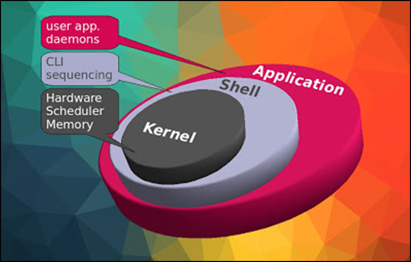

# TỔNG QUAN VỀ HỆ ĐIỀU HÀNH LINUX.

## I. LINUX LÀ GÌ?

## II. CÁC PHIÊN BẢN CỦA LINUX.

## III. CẤU TRÚC HỆ ĐIỀU HÀNH.

### 3.1. Kernel

Hay được gọi là phần Nhân vì đây là phần quan trọng nhất trong máy tính bởi chứa đựng các module hay các thư viện để quản lý, giao tiếp giữa phần cứng máy tính và các ứng dụng.

###  3.2. Shell

Shell là phần có chức năng thực thi các lệnh (command) từ người dùng hoặc từ các ứng dụng yêu cầu, chuyển đến cho Kernel xử lý. Shell chính là cầu nối để kết nối Kernel và Application, phiên dịch các lệnh từ Application gửi đến Kernel để thực thi.

**Các loại shell:**

- Sh (the Bourne Shell): đây là shell nguyên thủy của UNIX được viết bởi Stephen Bourne vào năm 1974. Đến nay shell sh vẫn sử dụng rộng rãi.

- Bash(Bourne-again shell): đây là shell mặc định trên linux.

- csh (the C shell): shell được viết bằng ngôn ngữ lập trình C, được viết bởi Bill Joy vào năm 1978.

- Ngoài ra còn có các loại shell khác như: ash (the Almquist shell), tsh (the TENEX C shell), zsh (the Z shell)

****

### 3.3. Application

Đây là phần quen thuộc với chúng ta nhất, phần để người dùng cài đặt ứng dụng, chạy ứng dụng để người dùng có thể phục vụ cho nhu cầu của mình.

## IV. CẤU TRÚC HỆ THỐNG FILE.

--- 
*Danh mục tài liệu tham khảo*

[1] https://www.thegioididong.com/hoi-dap/he-dieu-hanh-linux-la-gi-uu-nhuoc-diem-cua-he-dieu-hanh-1312530

[2] giáo trình LPI- NEWSTAR

