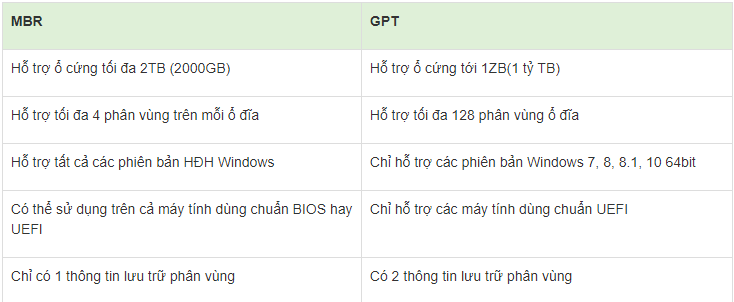

# TÌM HIỂU MBR VÀ GPT

MBR và GPT được xem là 2 tiêu chuẩn định dạng phổ biến trên ổ cứng di động hiện nay. Điểm khác biệt cơ bản giữa hai định dạng này là về cách thức nhập xuất dữ liệu, sắp xếp và phân vùng ổ đĩa.

## 1.1. TARGET SYSTEM.

TARGET SYSTEM: phần mềm/chương trình được tích hợp với phần cứng, khởi động cùng PC trước khi hệ điều hành máy tính khởi động lên. chịu trách nhiệm đánh thức phần cứng của máy tính

PHÂN LOẠI: 

- BIOS
- UEFI

####1.1.1. BIOS.

BIOS là viết tắt của Basic Input/Output System - Hệ thống Đầu vào/Đầu ra Cơ bản. Đó là phần mềm cấp thấp tích hợp trong một con chip trên bo mạch chủ của máy tính.

ĐẶC ĐIỂM: 

- giới hạn 4 phân vùng cho mỗi ổ đĩa và kích thước đĩa có thể 
khởi động chỉ đạt 2.2 TB
- chỉ xử lý ở mức 16 bit và địa chỉ hóa bộ nhớ là 1 MB.
- gặp sự cố khi khởi chạy nhiều thiết bị phần cứng cùng lúc.
- chuẩn ổ cứng thích hợp là MBR.

### 1.1.2. UEFI.

UEFI viết tắt của Unified Extensible Firmware Interface (Giao diện firmware mở rộng hợp nhất), đây là một chuẩn mới (2005) được phát triển để giải quyết những điểm yếu của BIOS (1975) đang tỏ ra dần lỗi thời.

ĐẶC ĐIỂM:

- dùng bảng phân vùng GUID và sử dụng Globally Unique ID để địa chỉ những phân vùng +> số lượng phân vùng là rất lớn.
- kích thước ổ cứng khả dụng lên tới 9.4 Zb.
- có chức năng xử lý 32 bit và 64 bit, cho phép sử dụng nhiều RAM hơn để địa chỉ hóa xử lý nhiều công việc phức tạp.

- hỗ trợ cả ổ cứng chuẩn MBR lẫn GPT.

## 1.2. 

### 1.2.1. MBR.

MBR, viết tắt cụm từ Master Boot Record( bản ghi quản lý động ) cũng là tên của boot sector đầu tiên của ổ đĩa, sector này có đứa boot loader được cài đặt trên hệ điều hành và các thông tin về phân vùng logical của ổ cứng. (Boot loader này là một đoạn mã nhỏ để tải boot loader lớn hơn từ phân vùng khác trên ổ đĩa máy tính).

ĐẶC ĐIỂM:

- Thường sử dụng với hệ thông BIOS.

- MBR chỉ hỗ trợ 4 phân vùng chính (MUỐN NHIỀU HƠN PHẢI CHUYỂN SNAG PHÂN VÙNG MỞ RỘNG).

- dữ liệu phân vùng và dữ liệu khởi động được lưu trữ ở một vị trí. VÌ VẬY KHI GHI ĐÈ DỮ LIỆU DỮ LIỆU SẼ BỊ HỎNG.

- hỗ trợ hầu hết các hệ điều hành.

### 1.2.2. GPT.

GPT là viết tắt của GUID Partition Table. Đây là một chuẩn mới, đang dần thay thế chuẩn MBR.

ĐẶC ĐIỂM:

- thường sử dụng với hệ thống UEFI.

- nó cũng cho phép không giới hạn phân vùng nên bạn không cần phải tạo phân vùng mở rộng.

- GPT lưu trữ nhiều bản sao của các dữ liệu này trên đĩa, do đó bạn có thể khôi phục các dữ liệu nếu các dữ liệu này bị lỗi.

- chỉ hỗ trợ vài hệ điều hành mới. bản 64 bit thì hỗ trợ.

