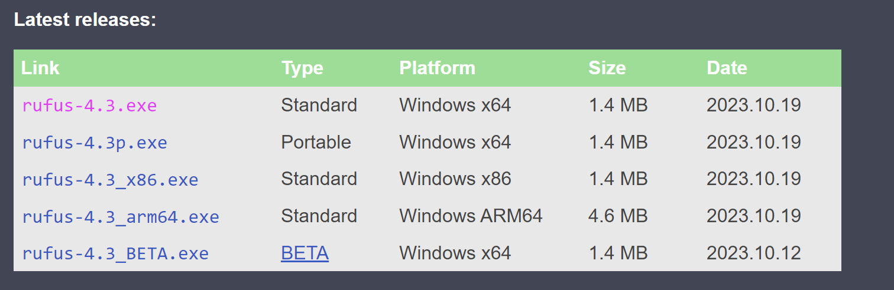
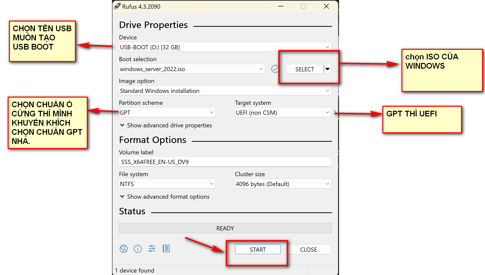
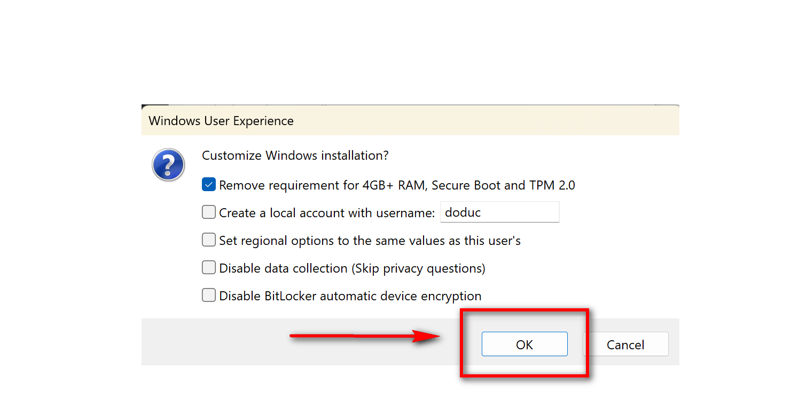
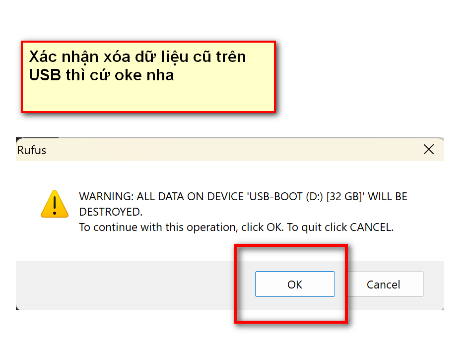
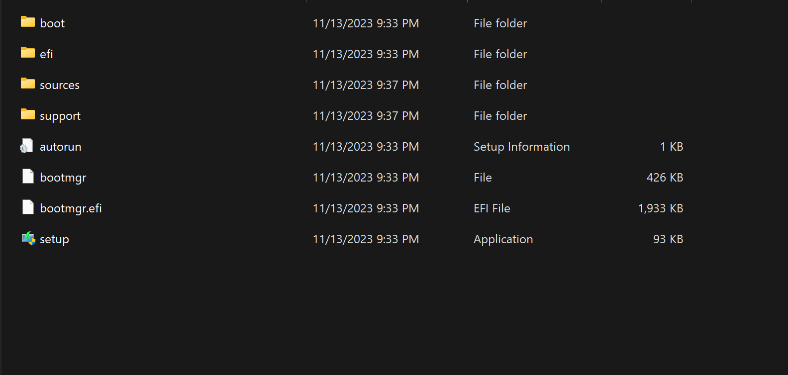

#  TẠO ĐĨA KHỞI ĐỘNG BẰNG PHẦN MỀM RUFUS.

## I. 1 VÀI KHÁI NIỆM.

### 1.1. USB BOOT LÀ GÌ?

 USB Boot chính là một thiết bị Boot hay còn được gọi là Boot Device. Nó tương tự như một ổ cứng để chứa hệ điều hành (OS) và khi quá trình Boot này diễn ra

## II. TẠO USB BOOT BĂNG RUFUS.

TA SẼ TẠO USB BOOT CHO HỆ ĐIỀU HÀNH WINDOWS VÀ UBUNTU.

### 2.1. CHUẨN BỊ.

- 1 chiếc usb (size >8gb)
- phần mềm rufus.
- file iso của 2 hệ điều hành muốn tạo.( ở THƯ MỤC SETUP ĐÃ HƯỚNG DẪN TẢI FILE ISO VỀ RỒI NHA )

### 2.2. CÀI ĐẶT RUFUS

LINK TẢI: https://rufus.ie/en/ 

TẢI VỀ CHẠY LÀ NÓ LÊN THÔI. CỰC NHẸ.

### 2.3. TẠO USB BOOT.

#### BƯỚC 1: CẮM USB VÀO MÁY NHA. NHỚ GHI NHỚ XEM TÊ USB LÀ CÁI NÀO TÍ CHỌN.
 
#### BƯỚC 2: SAU ĐÓ KHỞI ĐỘNG PHẦN MỀM RUFUS VÀ ĐIỀN THEO NHƯ HÌNH.

#### BƯỚC 3: HOÀN TẤT VÀ KIỂM TRA.

SAU KHI QUÁ TRÌNH COPY ISO HOÀN THÀNH, NÓ LẠI XUẤT HIỆN TRỞ LẠI HỘP THOẠI, TA TIẾP TỤC ẤN   CLOSE.

VÀO LẠI Ổ USB TRÊN MÁY TÍNH. THẤY NÓ XUẤT HIỆN NHƯ NÀY LÀ OKE.

