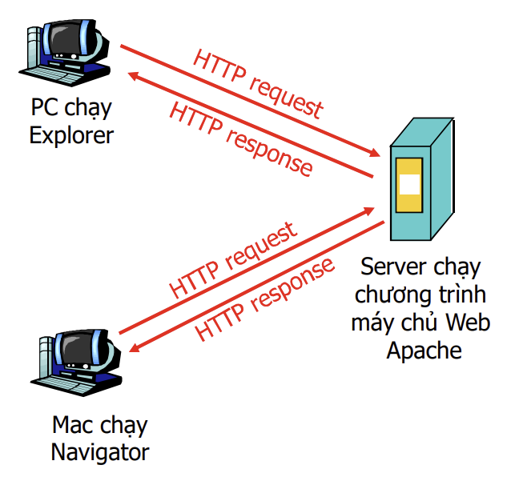
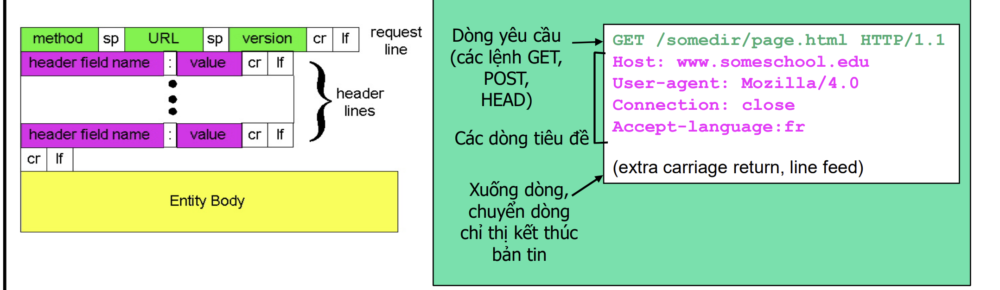
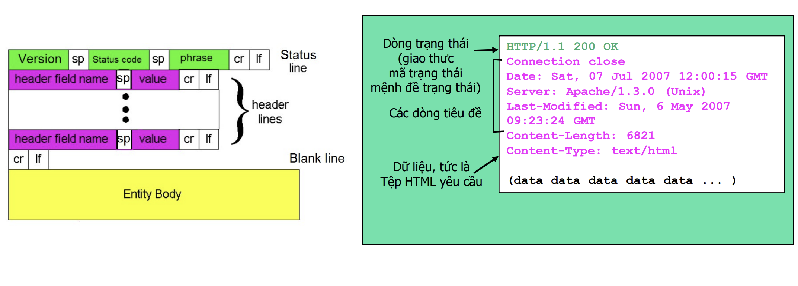
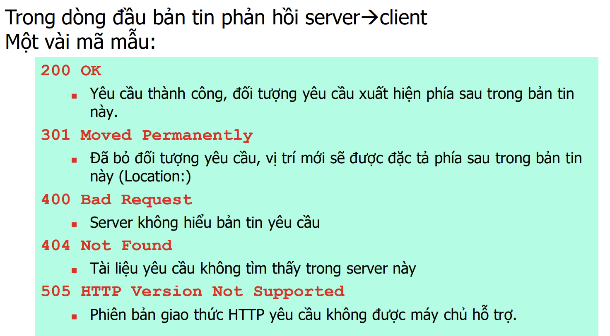

# LÝ THUYẾT HTTP.

## I. HTTP LÀ GÌ?

Giao thức truyền siêu văn bản (HTTP) - giao thức lớp ứng dụng của Web - là trái tim của ứng dụng
Web. Nó được định nghĩa trong RFC 1945 và RFC 2616. HTTP được thực hiện trong hai chương trình:
chương trình máy khách và chương trình máy chủ. Chương trình máy khách và chương trình máy chủ
thực hiện trên các hệ thống đầu cuối khác nhau, giao tiếp với nhau bằng cách trao đổi các bản tin
HTTP. HTTP định nghĩa cấu trúc của các bản tin và phương thức máy khách và máy chủ trao đổi các
bản tin. Trước khi trình bày chi tiết về HTTP chúng ta xem xét một số thuật ngữ Web.

## II. ĐẶC TRƯNG.

- Là giao thức lớp ứng dụng của Web.

-  HTTP sử dụng TCP (Transmission Control Protocol) làm giao thức lớp giao vận. Khi máy khách muốn kết nối với máy chủ, nó khởi tạo một kết nối TCP. HTTP thường sử dụng port 80.

-  HTTP không duy trì thông tin về trạng thái của máy khách giữa các yêu cầu. Nếu máy khách gửi nhiều yêu cầu, máy chủ không nhớ thông tin từ yêu cầu trước đó.

=>  Vì máy chủ không duy trì trạng thái của máy khách, HTTP được mô tả như một "giao thức phi trạng thái."

## III. CÁC KẾT NỐI CỦA HTTP.

có 2 loại kết nối mà HTTP sử dụng:

- kết nối ổn định.
- kết nối không ổn định.

### 3.1. KẾT NỐI KHÔNG ỔN ĐỊNH.

####  NHƯỢC ĐIỂM

Các kết nối không liên tục có một số thiếu sót:

-  Đầu tiên, là phải thiết lập và duy trì kết nối mới cho
mỗi đối tượng được yêu cầu. Đối với mỗi một trong những kết nối này, phải cấp phát bộ đệm TCP và
phải duy trì các biến TCP trên cả máy khách và máy chủ. Điều này có thể áp đặt tải trọng lên máy chủ
Web, do nó có thể phải phục vụ yêu cầu cho hàng trăm máy khách khác nhau đồng thời. 
- Thứ hai, như
chúng ta đã thấy mỗi đối tượng sẽ chịu một thời gian trễ chuyển phát 

## IV. KIẾN TRÚC HTTP.

HTTP tuân theo mô hình khách chủ (client/server) 
-  client: trình duyệt yêu cầu
(request), nhận, hiển thị các đối
tượng Web 
- server: Server Web gửi các đối
tượng để đáp ứng (response) lại
yêu cầu của client 

## REQUEST VÀ RESPONE.

### REQUEST.

#### BẢN TIN REQUEST.

#### BẢN TIN RESPONE.

## MÃ TRẠNG THAI BẢN TIN HTTP.

