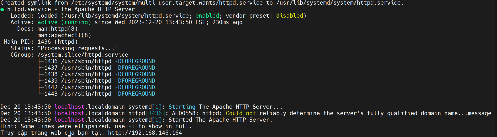

# CÀI ĐẶT APACHE.

## I. LÝ THUYẾT APACHE SERVER.

## II. CÀI ĐẶT APACHE.

### 2.1. CENTOS7.

#### BƯỚC 1: Chạy lệnh sau để cài đặt Apache:

`sudo yum install httpd`: lệnh cài đặt apache

#### BƯỚC 2: Sau khi cài đặt hoàn tất, bạn có thể khởi động dịch vụ Apache bằng lệnh:

`sudo systemctl start httpd`: khởi động apache.

`sudo systemctl enable httpd`: khơi động apache cùng hệ thống.

#### BƯỚC 3: Kiểm tra trạng thái của Apache để đảm bảo nó đang chạy mà không có lỗi:

`sudo systemctl status httpd`: lệnh kiểm tra

### 2.2. UBUNTU.

#### BƯỚC 1: Cập nhật danh sách gói:
Chạy lệnh sau để cập nhật danh sách gói trước khi cài đặt:

`sudo apt update`

#### BƯỚC 2: Cài đặt Apache:

Sử dụng lệnh sau để cài đặt Apache:

`sudo apt install apache2`

#### BƯỚC 3: Sau khi cài đặt hoàn tất, bạn có thể khởi động dịch vụ Apache bằng lệnh:

`sudo systemctl start httpd`: khởi động apache.

`sudo systemctl enable httpd`: khơi động apache cùng hệ thống.

#### BƯỚC 4: Kiểm tra trạng thái Apache:

Sau khi cài đặt, dịch vụ Apache sẽ tự động khởi động. Bạn có thể kiểm tra trạng thái của Apache bằng lệnh:

`sudo systemctl status apache2`

