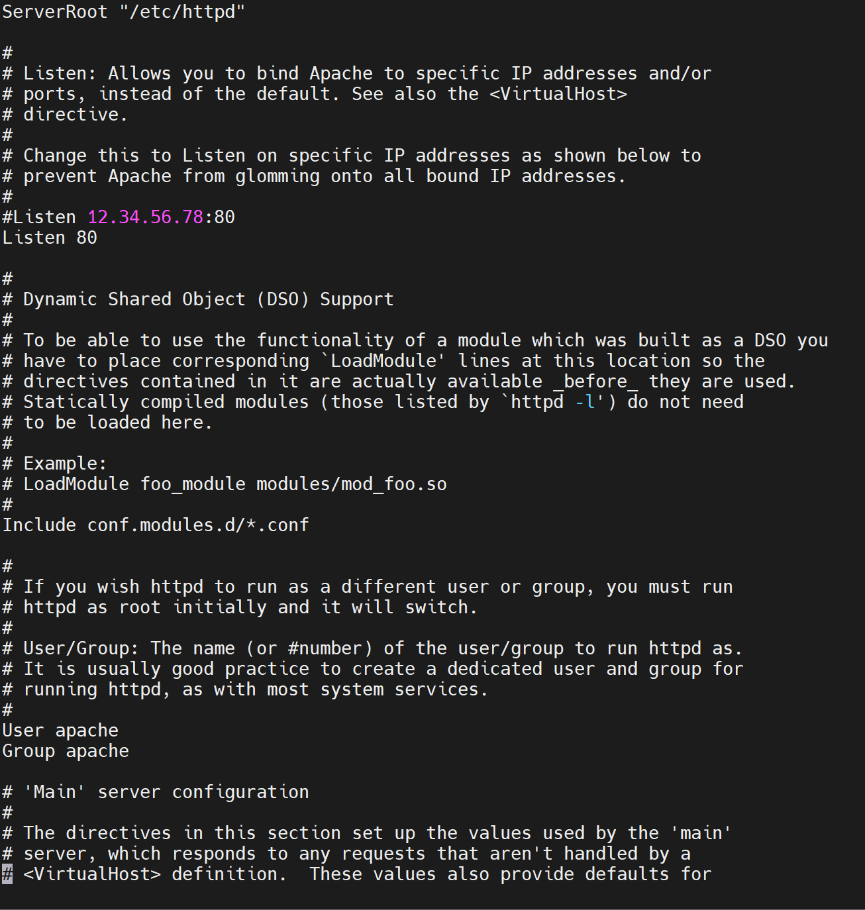

# FILE CONFIG HTTP.


## I. TÌM HIỂU FILE CONFIG HTTP. 

CENTOS7: `/etc/httpd/conf/httpd.conf`: nơi ghi file config.




### 1.1. ServerRoot.

Xác định thư mục gốc của cài đặt Apache. Thường là /etc/httpd hoặc /etc/apache2.


```
ServerRoot "/etc/httpd"
```


### 1.2. Listen

Xác định cổng mà Apache sẽ lắng nghe các kết nối đến. Mặc định là cổng 80.

```
Listen 80
```

### 1.3. ServerAdmin

Địa chỉ email của người quản trị máy chủ.
```
ServerAdmin webmaster@your-domain.com

```
### 1.3. ServerName.

Địa chỉ và cổng mặc định của máy chủ:

```
ServerName www.your-domain.com:80

``` 


### 1.4. DocumentRoot.

Thư mục gốc chứa các tệp và thư mục được phục vụ bởi máy chủ.

```
DocumentRoot "/var/www/html"

```


### 1.5. Directory

Cấu hình thư mục cụ thể, bao gồm quyền truy cập, quyền thực thi CGI, v.v.
```
<Directory "/var/www/html">
    Options Indexes FollowSymLinks
    AllowOverride None
    Require all granted
</Directory>

```

### 1.6. AllowOverride.

Cho phép hoặc ngăn chặn sử dụng tệp .htaccess.
```
AllowOverride None

```

### 1.7. ErrorLog và CustomLog.

Định nghĩa tệp log lỗi và log truy cập.

```
ErrorLog "/var/log/httpd/error_log"
CustomLog "/var/log/httpd/access_log" combined

```

### 1.8. Include

Cho phép bao gồm các tệp cấu hình bổ sung từ các thư mục khác.
```
IncludeOptional conf.d/*.conf

```

### 1.9. SSL Configuration.

Nếu sử dụng SSL, có các cấu hình riêng cho SSL.

```
<IfModule mod_ssl.c>
    SSLCertificateFile /path/to/certificate.crt
    SSLCertificateKeyFile /path/to/private/key.key
    SSLCertificateChainFile /path/to/chainfile.pem
</IfModule>

```


## II. ĐỔI PORT HTTP.


