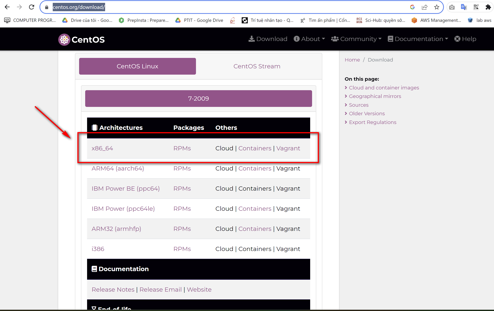
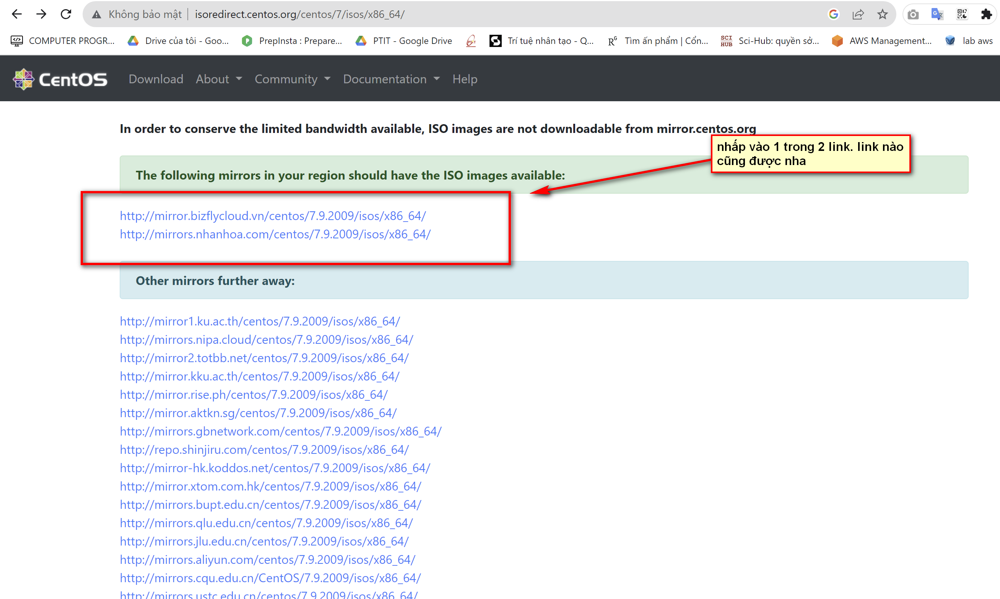
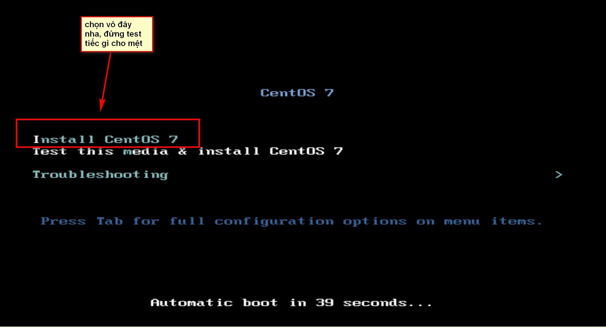
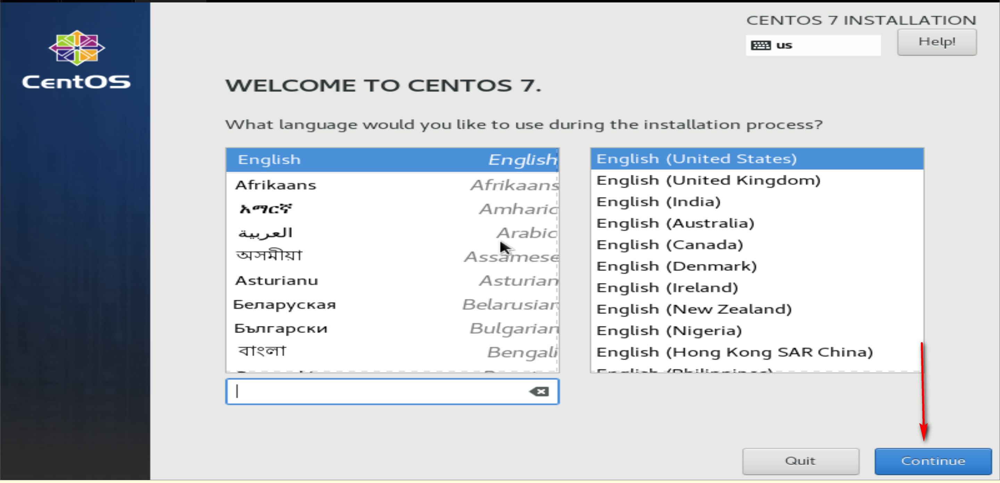
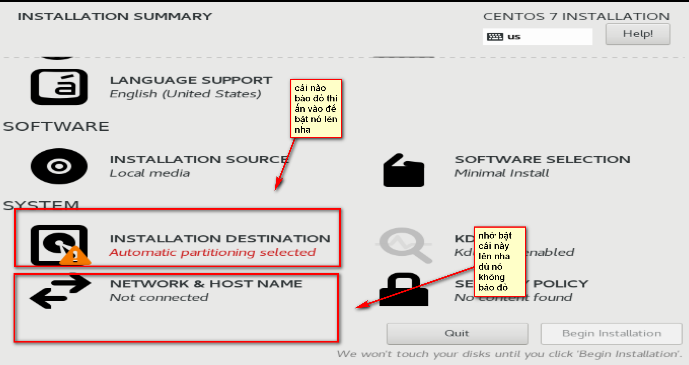
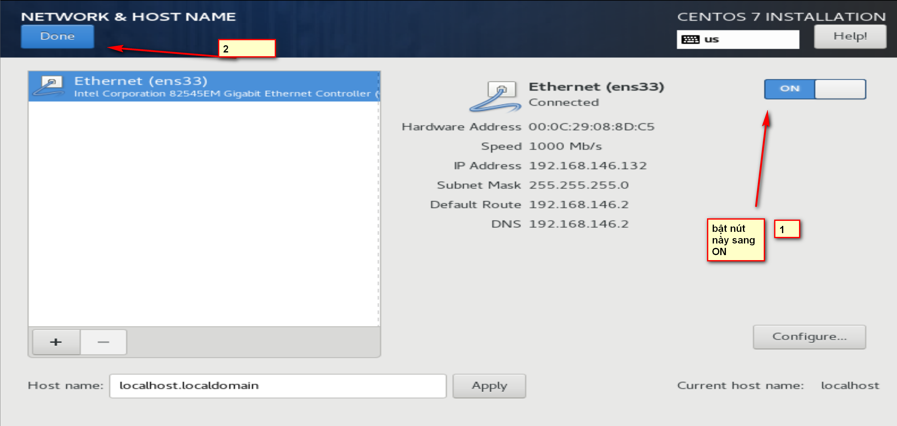
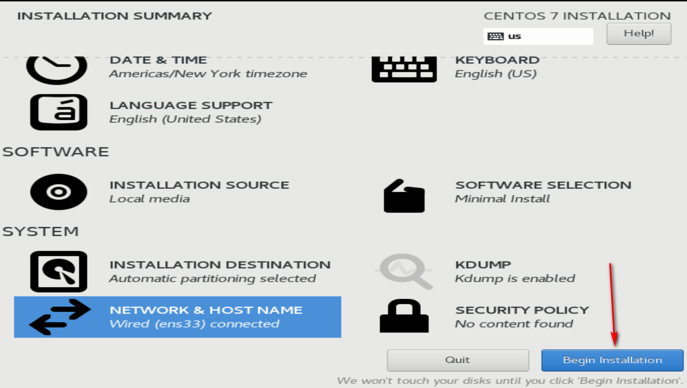
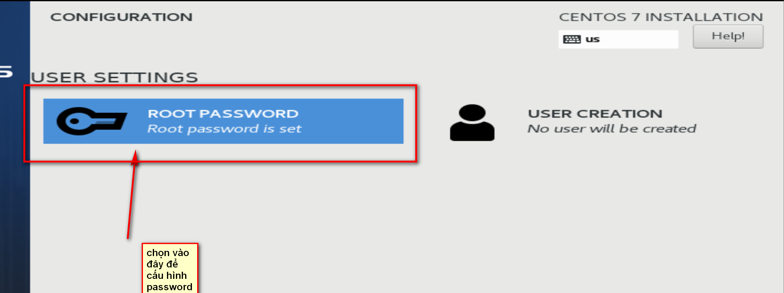
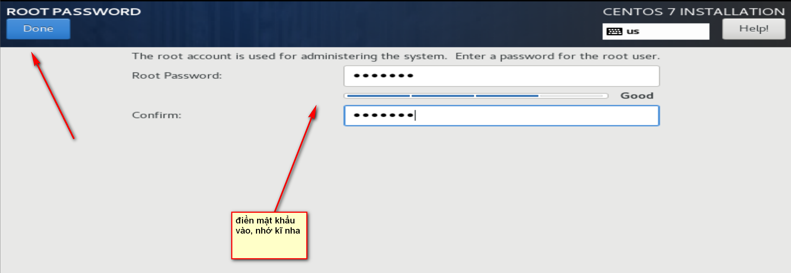
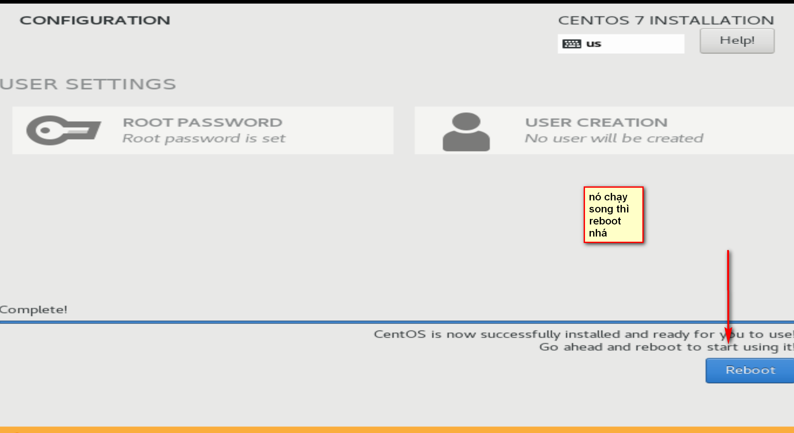

# SETUP CENTOS TẠI VMWARE.

## BƯỚC 1: TẢI ISO VỀ MÁY.

Truy cập: https://www.centos.org/download/

## BƯỚC 2: TẠO MÁY ẢO( TƯƠNG TỰ VỚI UBUNTU)

## BƯỚC 3: SETUP KHI ĐÃ TẠO MÁY ẢO SONG
.
.

.

.
.
.
.
.
.

.

