## CÀI ĐẶT UBUNTU LÊN VMWARE 

## BƯỚC 1: TẢI ISO UBUNTU VỀ MÁY.
 
truy cập: https://ubuntu.com/download/desktop

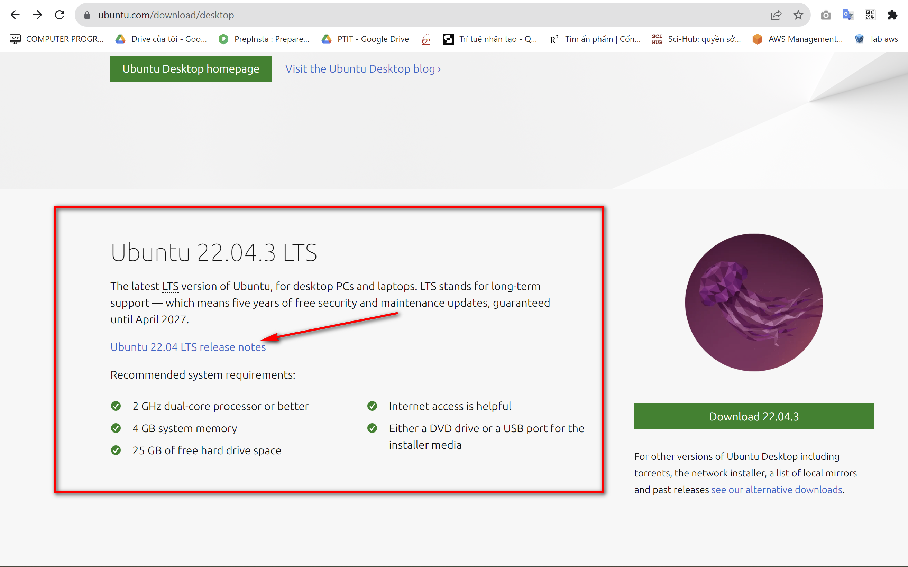.

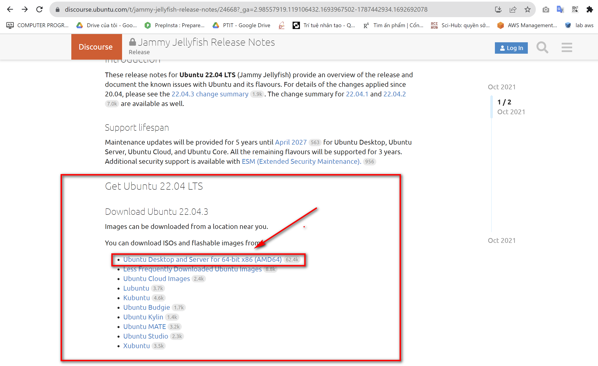.

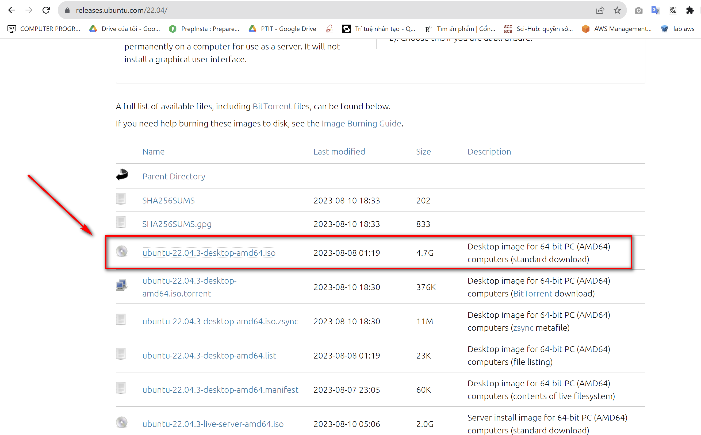.

## BƯỚC 2: CÀI ĐẶT ISO UBNUNTU TẠI VMWARE.

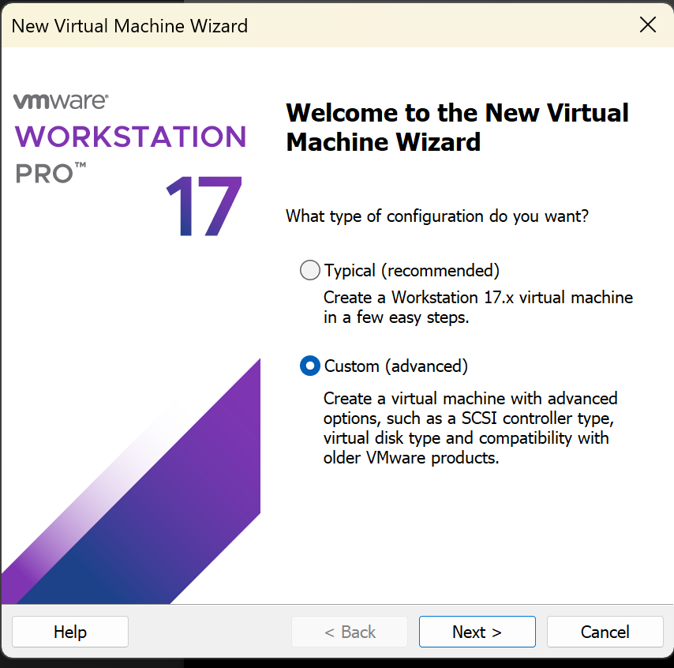.
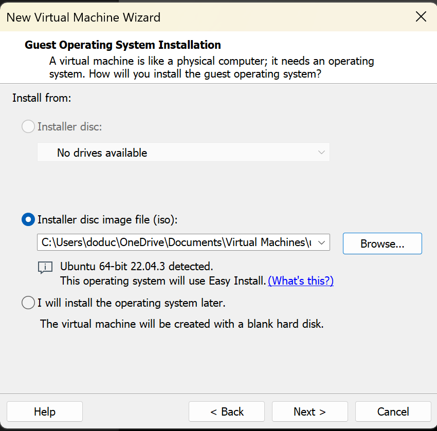.
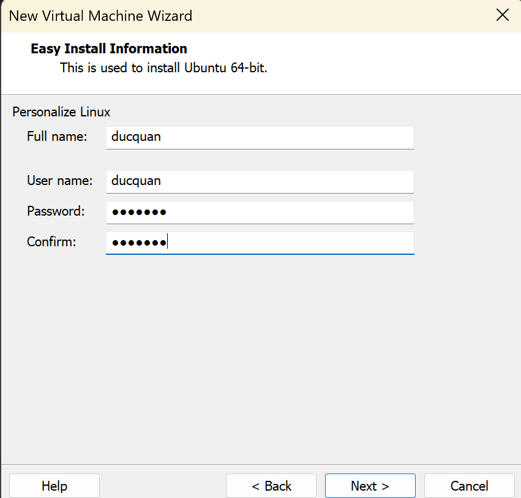.
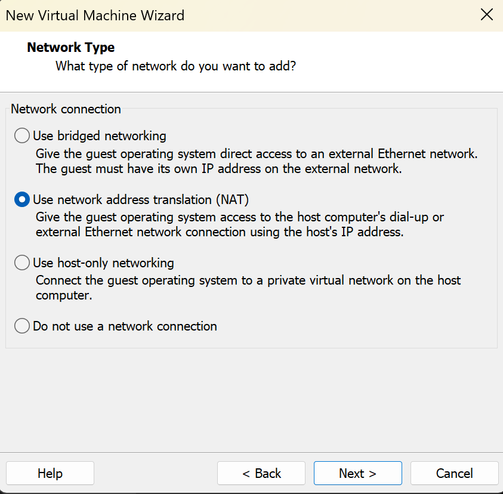.

## BƯỚC 3: SETUP UBUNTU

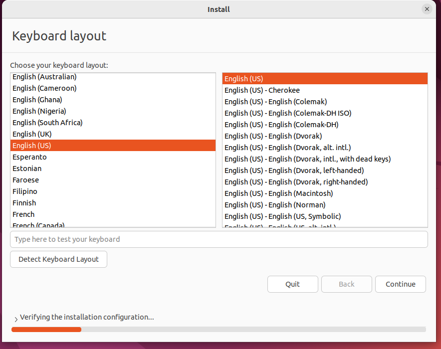.
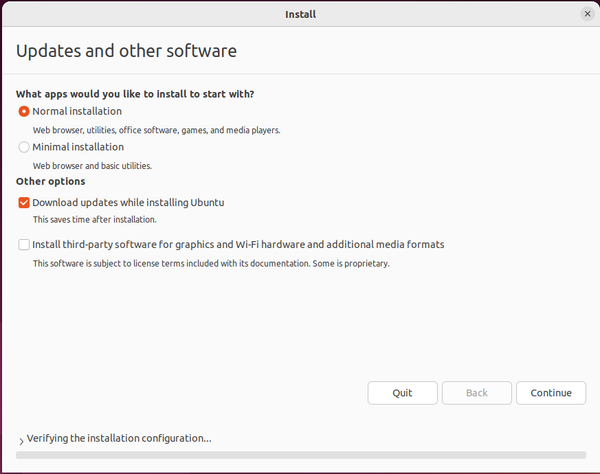.

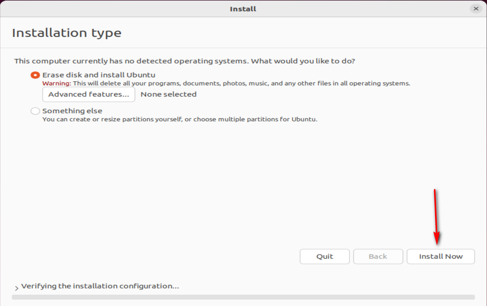.
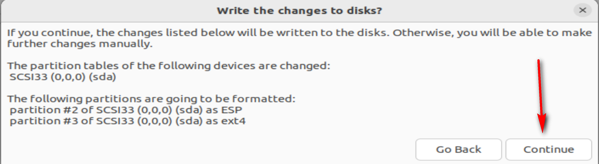.
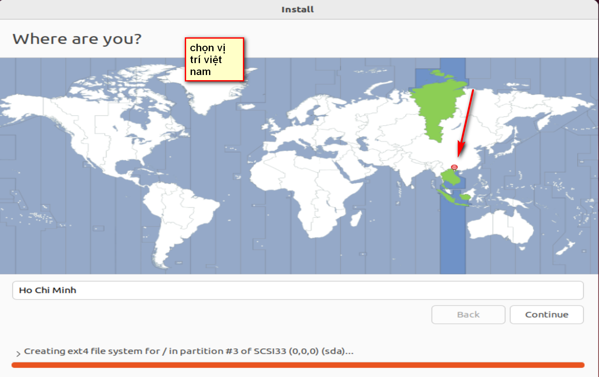.
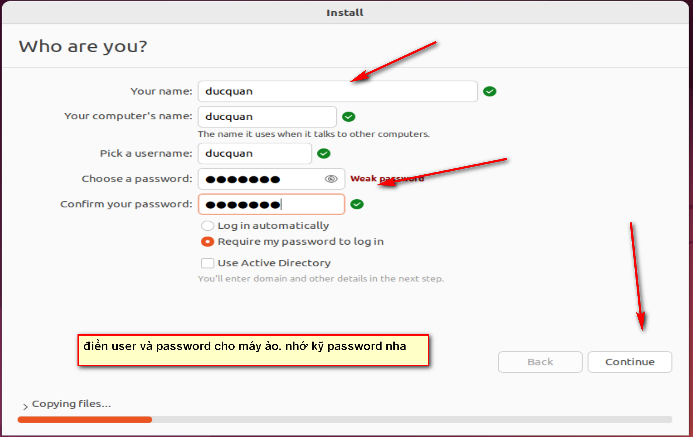.
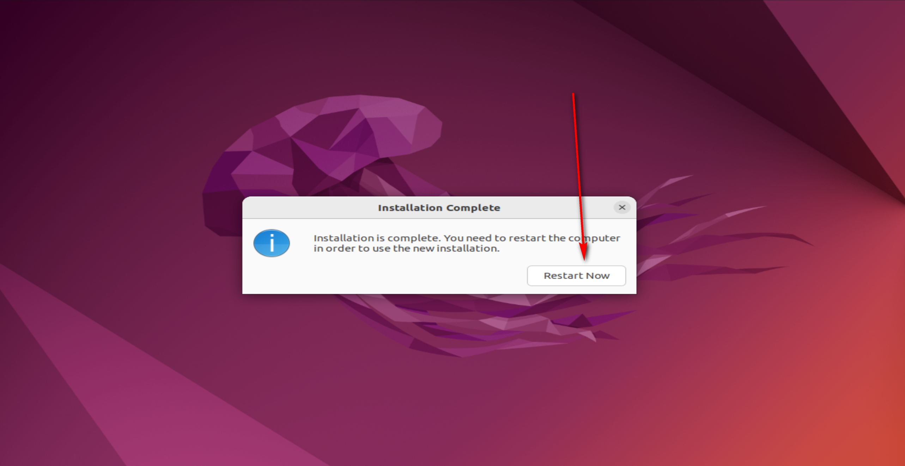.

