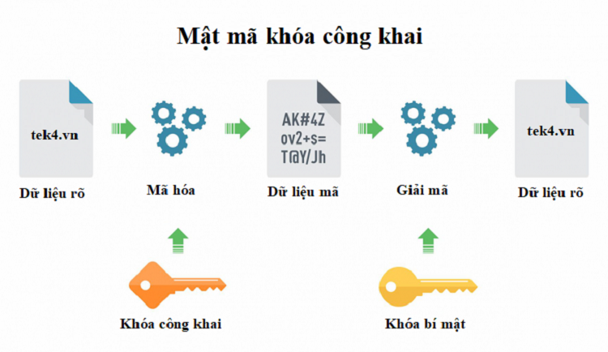

# CHI TIẾT VỀ MÃ HÓA.

## MỤC LỤC:

Có 2 công nghệ mã hóa khác nhau được SSH sử dụng:
- Mã hóa đối xứng
- Mã hóa bất đối xứng.

## I. MÃ HÓA ĐỐI XỨNG.

### 1.1. KHÁI NIỆM.

**Mã hóa đối xứng** là một hình thức mã hóa trong đó khóa bí mật được sử dụng cho cả mã hóa và giải mã tin nhắn của cả máy khách và máy chủ. Thực tế, bất kỳ ai sở hữu khóa đều có thể giải mã tin nhắn đang được chuyển.

Để sử dụng mã hóa đối xứng trong SSH, một khóa đối xứng sẽ được tạo ra khi máy khách kết nối đến máy chủ, và sau đó được sử dụng để mã hóa và giải mã dữ liệu truyền qua kết nối. Khóa đối xứng sẽ được tạo ra bằng cách sử dụng các thuật toán mã hóa bất đối xứng, như RSA hoặc DSA, để tạo ra các khóa đối xứng.

Mã hóa đối xứng là một phương thức mã hóa hiệu quả và nhanh chóng, đảm bảo tính bảo mật và toàn vẹn cho dữ liệu truyền tải trong kết nối SSH.

Trong SSH, các thuật toán mã hóa đối xứng được sử dụng bao gồm:
 - AES (Advanced Encryption Standard)
 - Blowfish
 - 3DES (Triple Data Encryption Standard).
 - mã khối.

 ### 1.2. MÃ AES.

 #### Khóa và Kích Thước Khối:

- AES sử dụng các khóa có kích thước là 128, 192 hoặc 256 bit.
- Dữ liệu được chia thành các khối có kích thước 128 bit để thực hiện quá trình mã hóa.
#### Phương Pháp Mã Hóa:

- AES sử dụng một loạt các phép toán như thay thế byte (SubBytes), trộn cột (ShiftRows), trộn dòng (MixColumns) và thêm khóa (AddRoundKey).
- Quá trình này được lặp lại theo các vòng (rounds) tùy thuộc vào kích thước khóa: 10 vòng cho khóa 128-bit, 12 vòng cho khóa 192-bit, và 14 vòng cho khóa 256-bit.
#### An Toàn và Hiệu Quả:

- AES được thiết kế để cung cấp mức độ bảo mật cao, và đến nay chưa có phương pháp tấn công hiệu quả nào được biết đến khi sử dụng khóa có độ dài an toàn.
- Thuật toán được thực hiện nhanh chóng trên phần lớn các nền tảng phần cứng và phần mềm hiện đại.

#### Chế Độ Mã Hóa:

- AES thường được sử dụng trong các chế độ mã hóa như ECB (Electronic Codebook), CBC (Cipher Block Chaining), và GCM (Galois/Counter Mode) để đáp ứng các yêu cầu cụ thể của ứng dụng.

 ### 1.3. MÃ DES.

#### Kích Thước Khóa:

- DES sử dụng khóa có độ dài 56 bit, nhưng chỉ có 64 bit thực sự được sử dụng, với 8 bit để kiểm soát chẳng hạn như kiểm tra chẵn lẻ và kiểm soát chẳn lẻ.
#### Phương Pháp Mã Hóa:

- DES sử dụng một loạt các phép toán như hoán vị (permutation) và thay thế byte (substitution).
- Dữ liệu được chia thành các khối 64-bit và mã hóa theo từng khối.

#### An Toàn:

DES đã bị bất an toàn với thời gian do kích thước khóa ngắn và sử dụng một số khả năng tấn công như tấn công brute-force.

 ### 1.4. MÃ 3DES.

#### Kích Thước Khóa:

- 3DES sử dụng khóa có độ dài 168 bit, được chia thành ba phần con với mỗi phần có độ dài 56 bit.
- Có thể sử dụng cả khóa 112-bit và 168-bit trong quá trình triển khai.

#### Phương Pháp Mã Hóa:

- Mỗi khối dữ liệu được mã hóa bằng cách sử dụng ba vòng mã hóa DES liên tiếp.
- Phương pháp mã hóa của mỗi vòng bao gồm thay thế byte, hoán vị, và các hoạt động logic.
#### Chế Độ Mã Hóa:

- 3DES thường được sử dụng trong chế độ CBC (Cipher Block Chaining), trong đó mỗi khối mã hóa phụ thuộc vào khối trước đó.
- Chế độ ECB (Electronic Codebook) cũng có thể được sử dụng, nhưng chế độ này có nhược điểm về an toàn khi cùng một khối dữ liệu được mã hóa.
#### An Toàn và Hiệu Suất:

- 3DES cung cấp mức độ bảo mật cao hơn so với DES, nhất là khi sử dụng khóa 168-bit.
- Tuy nhiên, do sự gia tăng về chiều dài khóa, hiệu suất của 3DES thấp hơn so với các thuật toán mới như AES.

## II.  MÃ HÓA BẤT ĐỐI XỨNG.

### 2.1. KHÁI NIỆM.

**Mã hóa bất đối xứng (asymmetric encryption)** là một phương thức mã hóa được sử dụng trong SSH để tạo ra các khóa công khai (public key) và khóa bí mật (private key). Khóa công khai và khóa bí mật là hai khóa liên quan đến nhau, được sử dụng để mã hóa và giải mã thông tin.

Trong mã hóa bất đối xứng, khóa công khai được chia sẻ với mọi người, trong khi khóa bí mật chỉ được giữ bí mật và không được chia sẻ với bất kỳ ai khác. Khi một thông điệp được mã hóa bằng khóa công khai, nó chỉ có thể được giải mã bằng khóa bí mật tương ứng.

Trong SSH, các thuật toán mã hóa bất đối xứng được sử dụng để tạo ra các khóa công khai và khóa bí mật, và cũng được sử dụng để tạo ra các khóa đối xứng dùng trong mã hóa đối xứng. Một trong những thuật toán mã hóa bất đối xứng phổ biến được sử dụng trong SSH là RSA (Rivest-Shamir-Adleman).

Trong quá trình tạo khóa, thuật toán RSA sẽ sử dụng hai số nguyên tố lớn để tạo ra khóa công khai và khóa bí mật. Khóa công khai sẽ được chia sẻ với mọi người, trong khi khóa bí mật sẽ được giữ bí mật bởi chủ sở hữu của nó.

Khi máy khách kết nối đến máy chủ SSH, máy chủ sẽ gửi khóa công khai của nó đến máy khách. Máy khách sẽ sử dụng khóa công khai này để mã hóa thông điệp và gửi nó đến máy chủ. Máy chủ sau đó sẽ sử dụng khóa bí mật của mình để giải mã thông điệp.

Mã hóa bất đối xứng là một phương pháp mã hóa mạnh và an toàn được sử dụng trong SSH để bảo vệ tính bảo mật và toàn vẹn của thông tin truyền qua mạng. 

### 2.2. MÃ RSA.

Thuật toán RSA có một số đặc điểm quan trọng:

***Khóa Công Khai và Khóa Bí Mật***:

- Mỗi người dùng có một cặp khóa: khóa công khai (public key) và khóa bí mật (private key).
- nKhóa công khai dùng để mã hóa thông tin, còn khóa bí mật dùng để giải mã.

***Kích Thước Khóa***:

- Kích thước khóa thường được chọn là 2048 bit hoặc 3072 bit để đảm bảo mức an toàn cao.

***Độ an toàn***:

- An toàn của RSA dựa trên khả năng tính toán khó khăn của một số nguyên lớn thành tích của hai số nguyên tố lớn.
- Việc phân tích một số nguyên thành thừa số nguyên tố là một vấn đề NP-khó nếu số nguyên đó đủ lớn.

