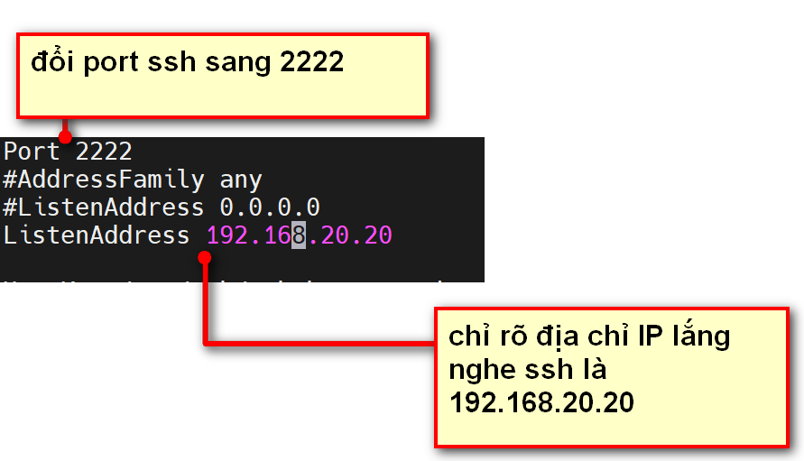

# FILE CONFIG SHH

CÁC BƯỚC ĐỂ TÙY CHỈNH THÔNG SỐ FILE SSH: sử dụng 2 lệnh sau:

`sudo vi /etc/ssh/sshd_config`: tùy chỉnh thông số  file config ssh.

`sudo systemctl restart sshd`: restart sshd sau khi tùy chỉnh song.

## I. FILE CẤU HÌNH.

- `/etc/ssh/sshd_config` : file cấu hình SSH Server
- `/etc/ssh/ssh_config` : file cấu hình SHS Client
- `~/.ssh/` : thư mục chứa nội dung cấu hình SSH của user client trên Linux

## II. CÁC OPTION.

### 1.1. Port & ListenAddress: 
port: Xác định cổng mà dịch vụ SSH lắng nghe. Mặc định là 22. Bạn có thể thay đổi cổng này để tăng cường bảo mật, như sử dụng một cổng không phổ biến khác.

ListenAddress: địa chỉ IP của interface cấu hình lắng nghe kết nối SSH của server, mặc định là lắng nghe tất cả các interface - địa chỉ 0.0.0.0
. Nếu hệ thống có nhiều hơn 1 địa chỉ IP thì tốt nhất nên chỉ định rõ địa chỉ IP nào sẽ lắng nghe port SSH

### 1.2. HostKey.

HostKey: Xác định các khóa chủ (host key) được sử dụng bởi máy chủ SSH. có các khóa RSA, ECDSA, và Ed25519...

***Lưu ý: sau khi đổi port phải restart dịch vụ ssh nha***

### 1.3. SyslogFạclity & Loglevel.

SyslogFacility: Đặt cơ sở syslog mà các thông điệp SSH sẽ được gửi đến.

Loglevel: Loại bản tin log muốn lưu là loại bản tin nào? có thể là bản tin lỗi ERRO, bản tin DEBUG, bản tin INFOR...

### 1.4. Authentication.

- LoginGraceTime: quy định thời gian 1 kết nối SSH đợi cho hoạt động đăng nhập user thành công , nếu sau khoảng thời gian này không đăng nhập được thì ngắt kết nối. mặc định 2 phút.

- PermitRootLogin: xem liệu có cho phép userroot đăng nhập hay không. thường để bảo mật thì không.

- StrictModes: kiểm tra thông tin quyền của thư mục $HomeUser , thư mục .ssh và file authorized_keys chứa key SSH nếu dùng SSH key.Nếu không sử dụng chế độ này ( no ) thì SSH sẽ không kiểm tra cấu hình các quyền khi đăng nhập vào Server -> Ép người quản trị phải cấu hình đúng các phân quyền ( permissions ) cho các thư mục / key dùng để đăng nhập SSH.

- MaxAuthTries: Thiết lập số lần đăng nhập sai tối đa.
- MaxSessions: Số phiên đăng nhập SSH tối đa.

### 1.5. PubkeyAuthentication.

PubkeyAuthentication: Sử dụng chứng thực bằng SSH key , thay vì mật khẩu

### 1.6. AuthorizedKeysFile

AuthorizedKeysFile: Đường dẫn tới file key. 

