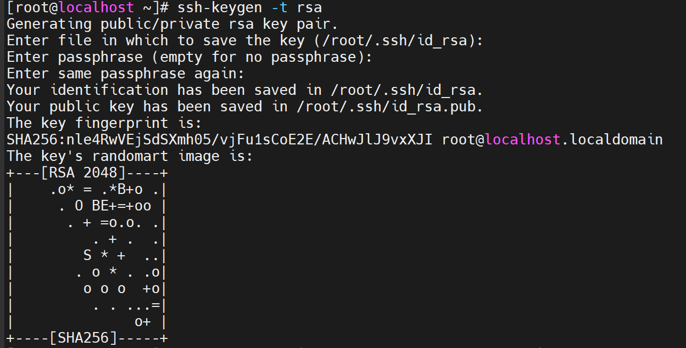
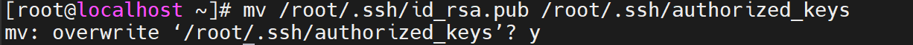
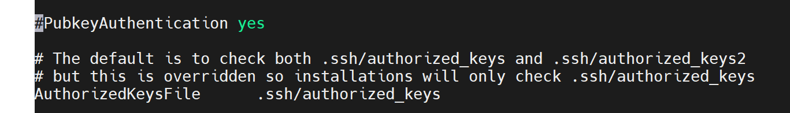
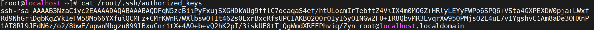
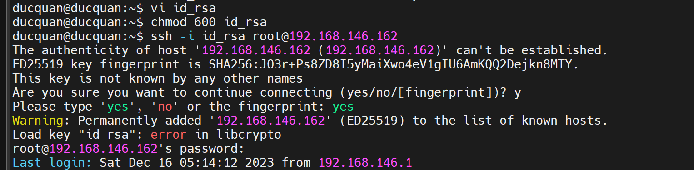
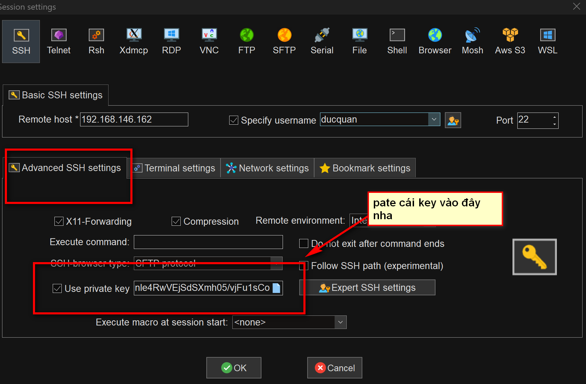

# SSH KEY.


### 1.1. PHÍA SERVER.

- Trên máy chủ, keys thường được lưu trữ trong thư mục /etc/ssh/ hoặc /etc/ssh/sshd_config.

- Các keys mặc định bao gồm ssh_host_rsa_key, ssh_host_dsa_key, ssh_host_ecdsa_key, và ssh_host_ed25519_key.


### 1.1. TẠO KEY.

`ssh-keygen -t rsa`: lệnh tạo key.



### 1.2. PHÂN QUYỀN CHO KEY.

Nếu bạn không chỉnh sửa cấu hình ssh thì bạn phải chuyển public key tới thư mục mặc định (~/.ssh/authorized-keys) thì server mới có thể xác nhận.

Nếu tệp chưa tồn tại, bạn có thể tạo nó bằng lệnh:

```
mkdir -p ~/.ssh
touch ~/.ssh/authorized_keys

```

`mv /root/.ssh/id_rsa.pub /root/.ssh/authorized_keys`: di chuyển lên máy chủ.

`chmod 600 /root/.ssh/authorized_keys`: phân quyền cho key.

`chmod 700 root/.ssh`: Đặt quyền truy cập cho thư mục .ssh.



### 1.3. Vô hiệu hóa mật khẩu cho root login.

`vi /etc/ssh/sshd_config`: truy cập file config ssh.



### 1.4. KHỞI ĐỘNG LẠI SSH SERVICE.

`systemctl restart sshd`: khởi động lại service ssh.

## 1.2. PHÍA CLIENT.

### 1.2.1. MÁY CLIENT LÀ LINUX.

BƯỚC 1: COPY KEY TỪ MÁY SERVER RỒI TẠO FILE CHỨA NÓ.


`vi id_rsa`: lệnh tạo file. tạo song nhớ copy cái key ở máy server vào nha.
BƯỚC 2: PHÂN QUYỀN CHO FILE KEY.

`chmod 600 id_rsa`: phân quyền cho file key.

BƯỚC 3: TRUY CẬP VÀO SERVER.




### 1.2.2. NẾU DÙNG MOBARXTERM.





