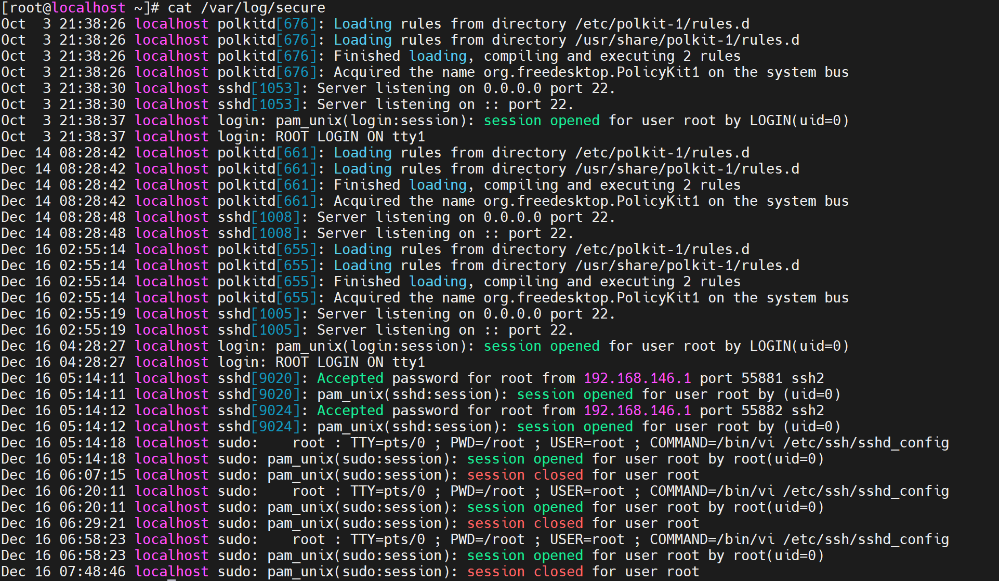
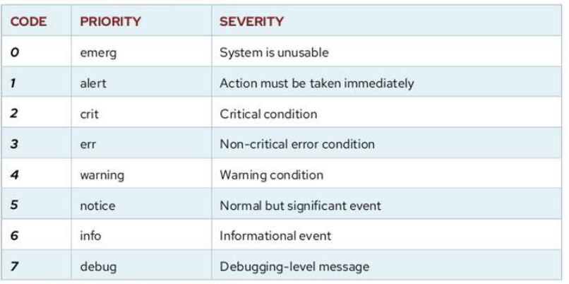

# FILE LOG SSH.

`/var/log/secure`: nơi lưu trữ log của ssh

CÁC LEVEL CỦA LOG.

`grep -i "warning" /var/log/secure`:Lọc theo mức độ cảnh báo (warning)

`grep -i "error" /var/log/secure`: Lọc theo mức độ lỗi (error)

`grep -i "info" /var/log/secure`:Lọc theo mức độ thông tin (info)

`grep -i "debug" /var/log/secure`: Lọc theo mức độ debug

`grep -i "auth" /var/log/secure`: Lọc theo mức độ cụ thể, ví dụ: Auth:

