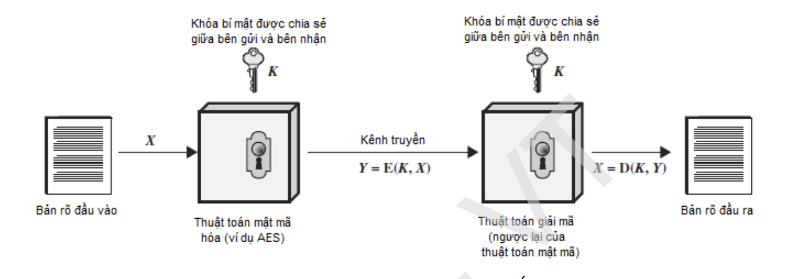

# CHI TIẾT VỀ MÃ HÓA.

Một trong những lợi thế quan trọng của SSH so với các tiền bối của nó như Telnet và rlogin là khả năng cung cấp giao tiếp an toàn giữa máy khách và máy chủ thông qua việc sử dụng mã hóa. Máy chủ (host) được hiểu là máy chủ từ xa mà bạn đang cố gắng truy cập, trong khi máy khách (client) là máy tính mà bạn đang sử dụng để truy cập máy chủ

Có 3 công nghệ mã hóa khác nhau được SSH sử dụng:
- Mã hóa đối xứng

- Mã hóa bất đối xứng.

## I. MÃ HÓA ĐỐI XỨNG.

### 1.1. KHÁI NIỆM.

**Mã hóa đối xứng** là một hình thức mã hóa trong đó khóa bí mật được sử dụng cho cả mã hóa và giải mã tin nhắn của cả máy khách và máy chủ. Thực tế, bất kỳ ai sở hữu khóa đều có thể giải mã tin nhắn đang được chuyển.

Để sử dụng mã hóa đối xứng trong SSH, một khóa đối xứng sẽ được tạo ra khi máy khách kết nối đến máy chủ, và sau đó được sử dụng để mã hóa và giải mã dữ liệu truyền qua kết nối. Khóa đối xứng sẽ được tạo ra bằng cách sử dụng các thuật toán mã hóa bất đối xứng, như RSA hoặc DSA, để tạo ra các khóa đối xứng.

Mã hóa đối xứng là một phương thức mã hóa hiệu quả và nhanh chóng, đảm bảo tính bảo mật và toàn vẹn cho dữ liệu truyền tải trong kết nối SSH.

Trong SSH, các thuật toán mã hóa đối xứng được sử dụng bao gồm:
 - AES (Advanced Encryption Standard)
 - Blowfish
 - 3DES (Triple Data Encryption Standard).
 - mã khối.

 ### 1.2. MÃ AES.

 ### 1.3. MÃ DES.

## II.  MÃ HÓA BẤT ĐỐI XỨNG.

### 2.1. KHÁI NIỆM.

**Mã hóa bất đối xứng (asymmetric encryption)** là một phương thức mã hóa được sử dụng trong SSH để tạo ra các khóa công khai (public key) và khóa bí mật (private key). Khóa công khai và khóa bí mật là hai khóa liên quan đến nhau, được sử dụng để mã hóa và giải mã thông tin.

Trong mã hóa bất đối xứng, khóa công khai được chia sẻ với mọi người, trong khi khóa bí mật chỉ được giữ bí mật và không được chia sẻ với bất kỳ ai khác. Khi một thông điệp được mã hóa bằng khóa công khai, nó chỉ có thể được giải mã bằng khóa bí mật tương ứng.

Trong SSH, các thuật toán mã hóa bất đối xứng được sử dụng để tạo ra các khóa công khai và khóa bí mật, và cũng được sử dụng để tạo ra các khóa đối xứng dùng trong mã hóa đối xứng. Một trong những thuật toán mã hóa bất đối xứng phổ biến được sử dụng trong SSH là RSA (Rivest-Shamir-Adleman).

Trong quá trình tạo khóa, thuật toán RSA sẽ sử dụng hai số nguyên tố lớn để tạo ra khóa công khai và khóa bí mật. Khóa công khai sẽ được chia sẻ với mọi người, trong khi khóa bí mật sẽ được giữ bí mật bởi chủ sở hữu của nó.

Khi máy khách kết nối đến máy chủ SSH, máy chủ sẽ gửi khóa công khai của nó đến máy khách. Máy khách sẽ sử dụng khóa công khai này để mã hóa thông điệp và gửi nó đến máy chủ. Máy chủ sau đó sẽ sử dụng khóa bí mật của mình để giải mã thông điệp.

Mã hóa bất đối xứng là một phương pháp mã hóa mạnh và an toàn được sử dụng trong SSH để bảo vệ tính bảo mật và toàn vẹn của thông tin truyền qua mạng. 

### 2.2. MÃ RSA.

