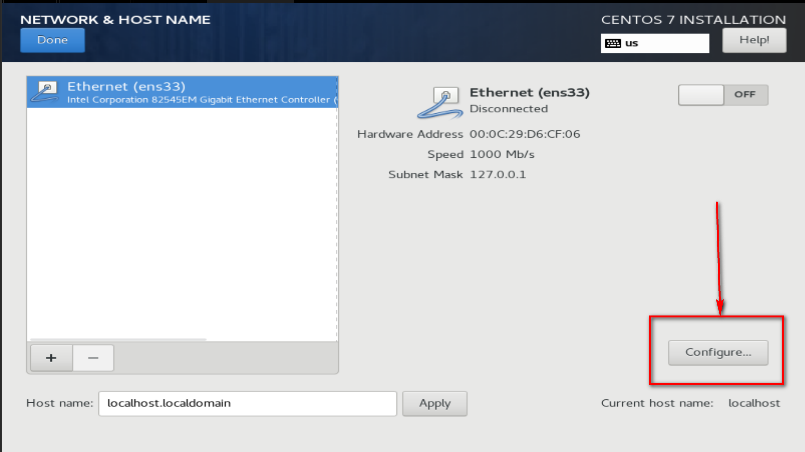
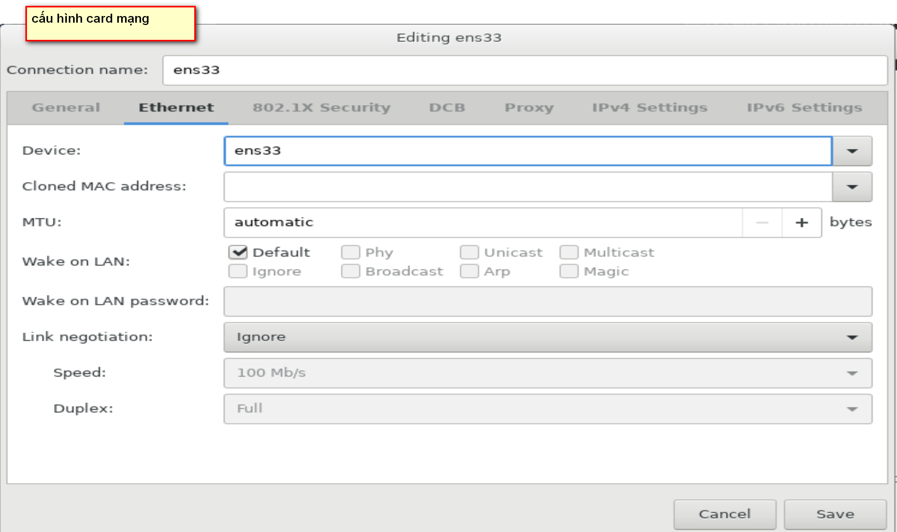
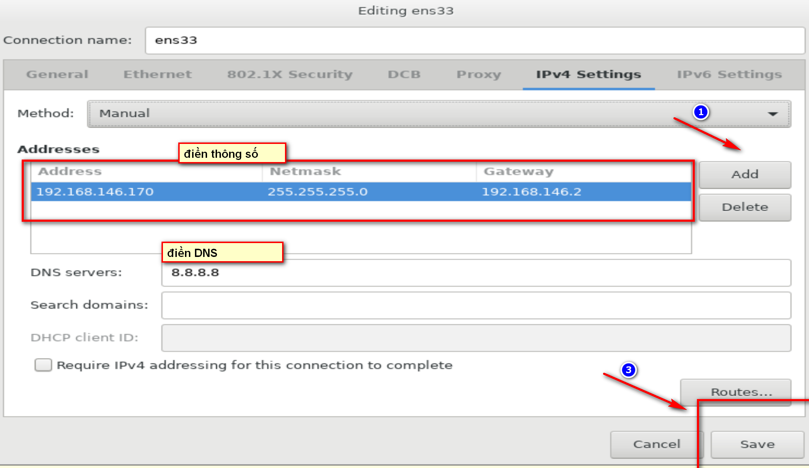
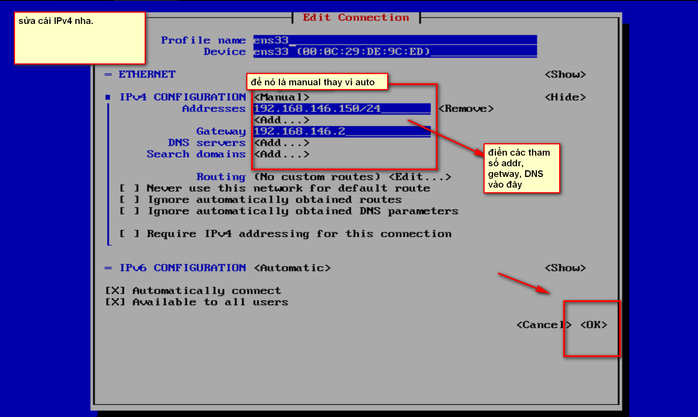
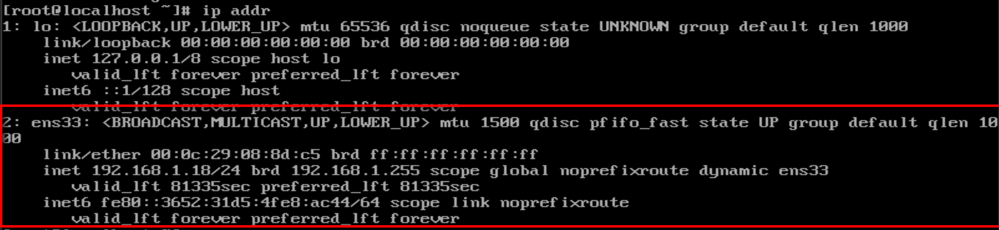
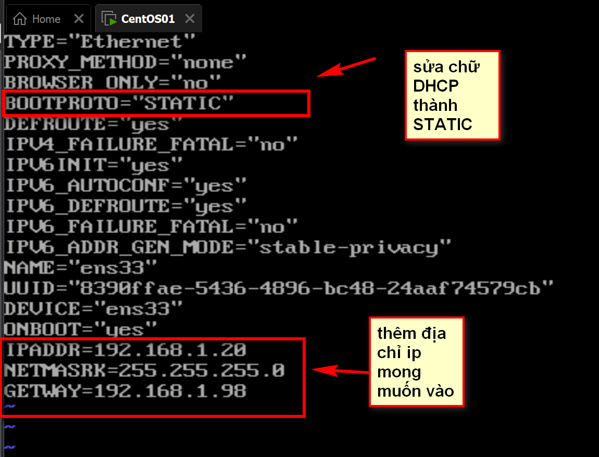

# CẤU HÌNH IP STATIC CHO CENTOS 7.

## MỤC LỤC 

[I. SỬ DỤNG GIAO DIỆN.](#i-sử-dụng-giao-diện)
- [1.1. CONFIG LUÔN LÚC SETUP.](#11-cách-1-config-luôn-lúc-setup)
- [1.2. CONFIG BẰNG FILE CARD CẤU HÌNH MẠNG..](#12-cách-2-config-bằng-file-card-cấu-hình-mạng)

[II. SỬ DỤNG CÂU LỆNH.](#ii-sử-dụng-câu-lệnh)


## I. SỬ DỤNG GIAO DIỆN.

### 1.1. CÁCH 1: CONFIG LUÔN LÚC SETUP.






## 1.2. CÁCH 2: CONFIG BẰNG FILE CARD CẤU HÌNH MẠNG..

`nmtui edit +tên cạc mạng`: dùng để truy cập file config card mạng.




## II. SỬ DỤNG CÂU LỆNH.
## _BƯỚC 1_: KIỂM TRA CARD MẠNG ĐANG SỬ DỤNG LÀ CÁI NÀO.

dùng một trong số các lệnh sau:

- *ip addr*




=> card mạng đang dùng là ens33

## _BƯỚC 2_: KIỂM TRA GETWAY

lệnh : *ip route*

##  _BƯỚC 3_: TRUY CẬP FILE SCRIP CỦA CẠC MẠNG ENS33

*vi /etc/sysconfig/network-scripts/ifcfg-tên cạc mạng*: điền cái tên cạc mạng thêm vào là ens33. ta sẽ đi tới file scrip card mạng. và ta sẽ thay đổi, viết thêm ở đây.

(lưu ý: ấn nút "i" để vào chế độ viết, ấn nút "Esc+:wq" để lưu thay đổi)


 

 ## _BƯỚC 4_: KHỞI ĐỘNG LẠI CẠC MẠNG

 *service network restart*: lệnh khởi dộng lại cạc mạng.


 ```
 #!/bin/bash

# tạo biến thành phần.
IP_ADDRESS=${1-$(hostname -I)} 
NETMASK=${2-"255.255.255.0"}
GATEWAY=${3-$(ip route show default | awk '/default/ {print $3}')} # lấy ra getway


DNS_SERVERS=${4-"8.8.8.8 8.8.4.4"}

# tạo biến đường dẫn tới script card.

ens=$(ip route get 1.1.1.1 | awk '{print $5}') # lấy ra tên card mạng 

PATH_ENS="/etc/sysconfig/network-scripts/ifcfg-$ens"


# thay thế DHCP thành static
sed -i "s/DHCP/static/g" $PATH_ENS

sed -i "s/ONBOOT="no"/ONBOOT="yes"/g" $PATH_ENS

# xóa hết các cái cấu hình thành phần cũ đi
sed -i '/^IPADDR/d' $PATH_ENS
sed -i '/^NETMASK/d' $PATH_ENS
sed -i '/^GATEWAY/d' $PATH_ENS
sed -i '/^DNS/d' $PATH_ENS


# thêm cái mới vào
echo "IPADDR=$IP_ADDRESS" >> $PATH_ENS
echo "NETMASK=$NETMASK" >> $PATH_ENS
echo "GATEWAY=$GATEWAY" >> $PATH_ENS

# thêm DNS nữa nha
echo "DNS1=$DNS_SERVERS" >> $PATH_ENS
echo "DNS2=$DNS_SERVERS" >> $PATH_ENS

# khởi động lại card mạng

service network restart

# thông báo thành công
echo "Configured successfully. My ip is: $IP_ADDRESS"

 
 
 ```


