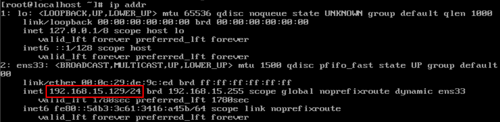
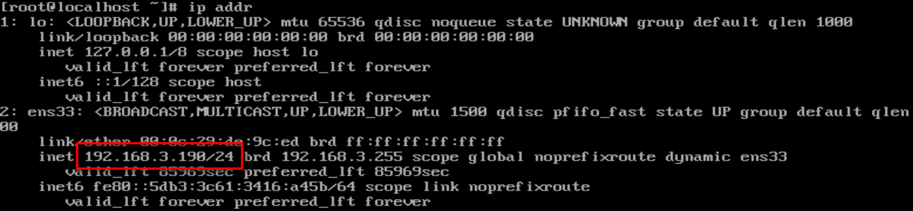
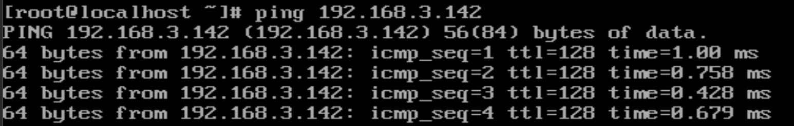

# 3 CHẾ ĐỘ VMNET TRÊN VMWARE

## Mục lục
[I. NAT. (VMNET 8)](#i-nat-vmnet-8)

[II. HOST ONLY(VMNET 1)](#ii-host-onlyvmnet-1)

[III. BRIDGED](#iii-bridged)

Mục đích của VMnet. giúp máy tính thực và ảo kết nối với nhau.

## I. NAT. (VMNET 8)

### 1.1. KHÁI NIỆM

Trong chế độ này, card mạng của máy ảo sẽ được kết nối thông qua một card mạng ảo trên máy chủ VMware, và máy chủ VMware sẽ hoạt động như một bộ định tuyến NAT. Card mạng ảo trên máy chủ VMware sẽ cung cấp địa chỉ IP cho máy ảo và chuyển tiếp các gói tin giữa máy ảo và mạng bên ngoài. Máy ảo có thể truy cập vào Internet và các nguồn tài nguyên bên ngoài, nhưng không thể trực tiếp truy cập vào các máy tính khác trong mạng.

Ưu điểm:
- Bảo mật: NAT ẩn địa chỉ IP nội bộ của các máy ảo và chỉ hiển thị địa chỉ IP của máy chủ vật lý. Điều này giúp bảo vệ mạng nội bộ khỏi các cuộc tấn công từ bên ngoài.
- Chia sẻ kết nối internet: NAT cho phép máy ảo chia sẻ kết nối internet của máy chủ vật lý.
- Thiết lập dễ dàng: Cấu hình NAT khá đơn giản và dễ thực hiện trên VMware.

Nhược điểm:

- Giới hạn truy cập từ bên ngoài: Máy ảo được kết nối qua NAT không thể truy cập từ bên ngoài mạng nội bộ.
- Giới hạn số lượng máy ảo: Số lượng máy ảo được kết nối thông qua NAT có thể bị giới hạn bởi các cấu hình mạng

### 1.2. PING RA INTERNET

Kiểm tra ip máy ảo:

Ping ra ngoài intenet:

## II. HOST ONLY(VMNET 1)

### 2.1. KHÁI NIỆM

Trong chế độ này, card mạng của máy ảo chỉ được kết nối với một mạng ảo riêng trên máy chủ VMware. Máy ảo có thể giao tiếp với máy chủ VMware và các máy ảo khác trong cùng mạng ảo, nhưng không thể truy cập vào mạng bên ngoài hoặc các máy tính khác trong mạng vật lý. Chế độ Host-Only thường được sử dụng để tạo ra một mạng riêng trong môi trường phát triển hoặc kiểm thử mà không cần kết nối với mạng bên ngoài.

(tách biệt hoàn toàn với cạc mạng Vật lý. tức máy ảo như 1 máy thật cục bộ rieneg biệt. dải mạng các máy ảo sẽ có chung với dải mạng của máy chủ VMware)

Ưu điểm:

- Bảo mật: Máy ảo kết nối qua Host-Only chỉ có thể truy cập và được truy cập bởi máy chủ vật lý hoặc máy ảo khác trong cùng mạng Host-Only.
- Đơn giản: Cấu hình Host-Only đơn giản và không yêu cầu sự tương tác với các thành phần mạng bên ngoài.

Nhược điểm:

- Hạn chế truy cập mạng ngoại vi: Máy ảo kết nối qua Host-Only không thể truy cập vào các mạng ngoại vi, bao gồm truy cập internet.
- Giới hạn giao tiếp: Máy ảo kết nối qua Host-Only chỉ có thể giao tiếp với máy chủ vật lý và máy ảo khác trong cùng mạng Host-Only.

Mục đích sử dụng: 

### 2.2. PING VITRUAL MACHINE CARD NETWORK HOST ONLY TO VITRUAL MACHINE

kiểm tra ip máy ảo: ip addr

Máy ảo 1:

Máy ảo 2:

Ping máy ảo 2 sang máy ảo 1:

## III. BRIDGED

### 3.1. KHÁI NIỆM

Trong chế độ này, card mạng của máy ảo sẽ được kết nối trực tiếp với mạng vật lý bên ngoài thông qua một card mạng vật lý trên máy chủ VMware hoặc máy tính chủ. Máy ảo sẽ có địa chỉ IP duy nhất trên mạng vật lý và có thể truy cập vào các thiết bị và nguồn tài nguyên trong mạng bên ngoài. Chế độ Bridge cho phép máy ảo tham gia vào mạng như một máy tính riêng biệt và có thể giao tiếp với các máy tính khác trong mạng.

IP public máy ảo được cấp bởi server DHCP trong mạng.

Cạc mạng máy ảo được gắn vào VMnet0.

VMnet0 kết nối trực triếp qua cạc mạng vật lý nên không tạo ra cạc mạng ảo

Kết nối internet thông qua cạc mạng vật lý và có chung lớp mạng với cạc mạng vật lý.

Ưu điểm:

- Truy cập từ bên ngoài: Máy ảo được kết nối qua Bridge có thể truy cập từ bên ngoài mạng nội bộ và có địa chỉ IP riêng.

- Khả năng tương thích: Bridge cho phép máy ảo kết nối trực tiếp với mạng vật lý và nhận địa chỉ IP từ router hoặc DHCP server trong mạng.

- Tích hợp dễ dàng: Máy ảo kết nối qua Bridge có thể được nhìn thấy như các máy tính vật lý trên mạng.

Nhược điểm:

- Bảo mật: Máy ảo kết nối qua Bridge có thể gặp rủi ro bảo mật hơn so với NAT, vì nó có địa chỉ IP riêng và có thể truy cập trực tiếp vào mạng nội bộ.

- Địa chỉ IP công cộng: Máy ảo kết nối qua Bridge cần có một địa chỉ IP công cộng sẵn có trong mạng.

### 3.2. PING VITRUAL MACHINE CARD NETWORK BRIDGED TO PHYSICAL MACHINE.

kiểm tra ip máy ảo: ip addr

kiểm tra ip máy vật lý: ipconfig

ping máy ảo sang máy thật.

---

*Danh mục tài liệu tham khảo*

[1] https://dummytip.com/giai-ngo-virtualization-phan-5-3-che-do-vmware-network-configuration-ma-ban-nhat-dinh-phai-biet/

[2] youtube. https://www.youtube.com/watch?v=yUTJ0cSvNfs

