# CÁCH CHIA ĐỊA CHỈ IP.


## MỤC LỤC.


[I. MỘT SỐ KHÁI NIỆM](#i-một-số-khái-niệm)

[II. CÁCH CHIA ĐỊA CHỈ IP.](#cách-chia-địa-chỉ-ip)

[III. KỸ THUẬT CHIA VLSM.](#iii-kỹ-thuật-chia-vlsm)

[IV. PHÂN HOẠCH CIDR](#iv-phân-hoạch-cidr)

[V. MỘT SỐ BÀI TẬP CHIA MẠNG CON.](#v-một-số-bài-tập-chia-mạng-con)

[VI. KẾT LUẬN.](#vi-kết-luận)


## I. MỘT SỐ KHÁI NIỆM.

_Đặt vấn đề_: Trong khi nguồn tài nguyên IP dần cạn kiệt, mà trong một hệ thống, rất khó sử dụng hết toàn bộ địa chỉ IP khả dụng của một lớp IP. Điều này gây lãng phí không gian địa chỉ rất lớn. Do đó vấn đề đặt ra là phải chia từng lớp mạng này thành những lớp mạng nhỏ hơn có số IP phù hợp với nhu cầu sử dụng hợp lý.Sự phân chia này còn giúp người quản trị dễ dàng hơn trong việc quản lý, bảo mật dữ liệu đồng thời giảm tải cho các thiết bị định tuyến.

### 1.1. KHÁI NIỆM CHIA MẠNG CON SUBNETING.


Subnetting là tổ hợp những kỹ thuật phân chia không
gian địa chỉ của một lớp mạng cho trước thành nhiều
lớp mạng nhỏ hơn bằng cách lấy một số bit ở phần
Host ID để làm địa chỉ mạng cho mạng con (Subnet)

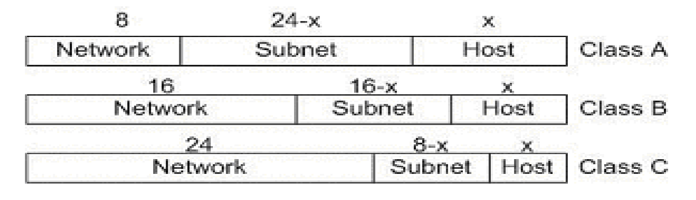
<p style="text-align:center">Hình : Giới thiệu subneting</p>

### 1.2. MỘT SỐ KHÁI NIỆM CẦN BIẾT.


***Prefix length***: Là đại lượng chỉ số bit dùng làm địa chỉ mạng. Chẳng hạn lớp A có prefix length là 8, lớp B là 16, lớp C là 24. Với một địa chỉ IP tiêu chuẩn prefix length là giá trị sau dấu /. Chẳng hạn 192.168.1.1 /24. Ta có bảng tương ứng sau:

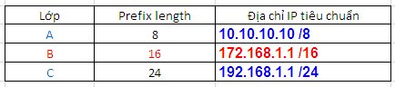
<p style="text-align:center">Hình :prefix</p>


***Subnet Mask***: Giá trị trần của mạng con, là giá trị thập phân tính khi tất cả các bit của prefix length bằng 1 và phần còn lại bằng 0. Như vậy địa chỉ thực của một mạng ( hay địa chỉ mạng ) sẽ là hợp của địa chỉ IP và subnet mask

Một số subnet mask mặc định theo lớp là :

o   Class A : 255.0.0.0 (/8)

o   Class B : 255.255.0.0 (/16)

o   Class C: 255.255.255.0 (/24)

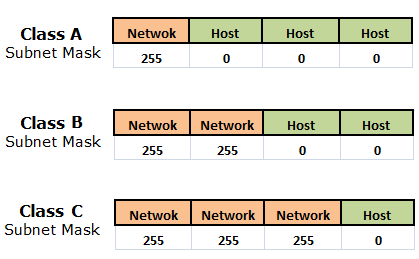
<p style="text-align:center">Hình : subnetmask của lớp A,B,C</p>


***Default Mask (Network Mask)***: là giá trị trần của mỗi lớp mạng A, B, C (D, E không xét đến) và là giá trị thập phân cao nhất (khi tất cả các bit ở Network Address bằng 1 và các bit ở Host Address bằng 0). Như vậy Default Mask của lớp A là 255.0.0.0, của lớp B là 255.255.0.0 và C là 255.255.255.0.Cụ thể:


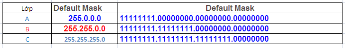
<p style="text-align:center">Hình : defaultmask của lớp A,B,C</p>


***Subnet Address*** của một địa chỉ IP cho trước là giá trị nhỏ nhất của dải địa chỉ mạng con mà IP đó thuộc về. Các thiết bị định tuyến dựa vào địa chỉ này để phân biệt các mạng con với nhau. Giá trị của địa chỉ mạng có thể được tính bằng nhiều cách. Cách cơ bản nhất là dùng phép AND giữa địa chỉ Subnet Mask và IP dưới dạng nhị phân


***Địa chỉ quảng bá (Broadcast Address)*** của một mạng con là địa chỉ IP cao nhất của mạng đó. Subnet Address và Broadcast Address không dùng để gán cho máy chủ. Do đó mới có công thức tính số IP khả dụng là 2n – 2 với n là số bit dùng cho Host Address.


## II. CÁCH CHIA ĐỊA CHỈ IP.

### 2.1 QUY ƯỚC VIẾT ĐỊA CHỈ IP.

Nếu có địa chỉ IP như 172.29.8.230 thì chưa 
thể biết được host này nằm trong mạng nào, 
có chia mạng con hay không và có nếu chia thì 
dùng bao nhiêu bit để chia. Chính vì vậy khi 
ghi nhận địa chỉ IP của một host, phải cho biết 
subnet mask của nó

Ví dụ: 172.29.8.230/255.255.255.0 hoặc 
172.29.8.230/24 (có nghĩa là dùng 24 bit đầu 
tiên cho NetworkID).

### 2.2 CHIA MẠNG CON.

Thực hiện 3 bước:
- Bước 1: Xác định subnet mask.
- Bước 2: Liệt kê ID của các Subnet mới.
- Bước 3: Xác định các vùng địa chỉ cho host.


### 2.3 MỘT SỐ DẠNG BÀI TẬP.

**DẠNG 1**: Cho một mạng lớn và số bit mượn. Xác định :
- Số subnet 
- Số host/subnet 
- Địa chỉ mạng của mỗi subnet. 
- Địa chỉ host đầu của mỗi subnet. 
- Địa chỉ host cuối của mỗi subnet. 
- Địa chỉ broadcast của mỗi subnet. 
- Subnet mask được sử dụng
```
Cách tính: 
- Gọi n là số bit mượn và m là số bit host còn lại. Ta có: 
 + Số subnet có thể chia được: 
       2^n nếu có hỗ trợ subnet – zero. 
       2^n– 2 nếu không hỗ trợ subnet – zero. 
Luật subnet – zero: nếu hệ điều hành trên host không bật tính năng subnet – zero, khi chia subnet ta phải bỏ đi không dùng hai mạng con ứng với các bit subnet bằng 0 hết và các bit subnet bằng 1 hết. 
Ngược lại nếu hệ điều hành bật tính năng subnet – zero , ta có quyền sử dụng hai mạng con này. Nhìn chung, các hệ điều hành ngày nay đều bật tính năng subnet – zero một cách mặc định, do đó nếu không thấy nói gì thêm trong yêu cầu, ta sử dụng cách chia có hỗ trợ subnet – zero. 
 + Số host có thể có trên mỗi subnet: 2^m – 2 (host/subnet).

 - Với mỗi subnet chia được: 
+ Địa chỉ mạng có octet bị chia cắt là bội số của bước nhảy (Octet bị chia cắt là octet vừa có các bit thuộc phần mạng vừa có các bit thuộc phần host). Bước nhảy tương ứng với số bit mượn có thể được tra trong bảng dưới đây. 
+ Địa chỉ host đầu = địa chỉ mạng + 1 (cần hiểu cộng 1 ở đây là lùi về sau một địa chỉ). 
+ Địa chỉ broadcast = địa chỉ mạng kế tiếp – 1 (cần hiểu trừ 1 ở đây là lùi về phía trước một địa chỉ). 
+ Địa chỉ host cuối = địa chỉ broadcast – 1 (cần hiểu trừ 1 ở đây là lùi vềphía trước một địa chỉ).

 - Để tính ra subnet mask được sử dụng, ta sử dụng cách nhớ: phần mạng của địa chỉ chạy đến đâu, các bit 1 của subnet mask chạy đến đó

```

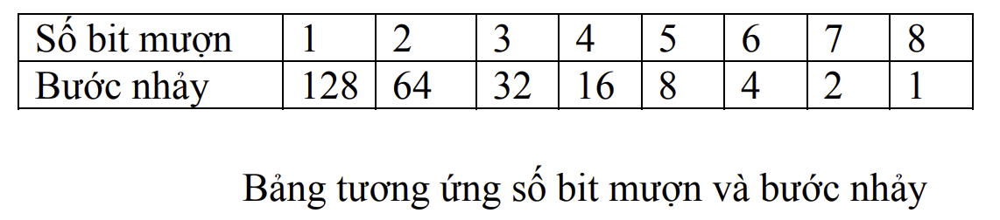


**DẠNG 2**: Cho một địa chỉ host. Xác định xem host thuộc mạng nào?

VD1: Cho địa chỉ host 192.168.1.158/28. Hãy cho biết, host này thuộc về subnet nào? 
Giải: /28 => có 28 bit mạng. Octet bị chia cắt là octet thứ 4 => só bit mượn của octet này là 4 => bước nhảy là 16. Lấy octet thứ 4 của địa chỉ host là 158 chia cho 16 được 9 và còn dư. Ta lấy 16 nhân với 9 được 144. Host này thuộc mạng 192.168.1.144/28


## III. KỸ THUẬT CHIA VLSM.


VLSM (Variable Length Subnet Mask): là kỹ thuật chia nhỏ một mạng thành các mạng có độ dài khác nhau (sẽ có các subnet mask khác nhau).

_**Ví dụ**_: Dùng địa chỉ 192.168.1.0 /24 để triển 
khai 3 network sau: HCM 100 máy, Cần Thơ 50 
máy, Hà Nội 50 máy. Hỏi phải đặt IP như thế 
nào?

```
bước 1: Xét các mạng theo thứ tự số host từ cao xuống thấp
- Đầu tiên , xét mạng nhiều host nhất: 100 host, ta phải xem mượn bao nhiêu bit thì đủ cho mạng này. Ta giải hệ: 
    2^m – 2 ≥ 101 
    m + n = 8 (mượn bit ở octet thứ 4).Với m: số bit host, n: số bit mượn 
- Ta được m = 7, n = 1. Vậy ta mượn 1 bit và dành mạng 192.168.1.0/25 để gán cho mạng có 100 host. Mỗi mạng /25 có 27 – 2 = 126 host => đáp ứng đủ cho mạng 100 host. 
- Vậy mạng được chia ra làm 2 mạng: Net0 từ 192.168.1.0 đến 192.168.1.127, Net1: từ 192.168.1.128 -> 192.168.1.255. 
- Chọn Net0 cho HCM, lúc đó một máy ở HCM sẽ có IP dạng 192.168.1.x (x chạy từ 1 đến 126), netmask: 255.255.255.128.

bước 2: Tiếp theo chia net1 ra làm 2 bằng cách mượn thêm 1 bit nữa: /26 (255.255.255.192) 

bước 3: Sẽ có 2 net mới, mỗi net có 62 host (64 - 2): net1a có địa chỉ từ 192.168.1.128 đến 192.168.1.191, và net1b có địa chỉ từ 192.168.1.192 đến 192.168.1.255

bước 4: Chọn net1a cho Cần Thơ và net1b cho Hà Nội

kết luận: Như vậy tại HCM giá trị subnetmask là /25, cần thơ và hà nội là /26 nên ta gọi là variable lenght subnet mask –VLSM. Và 192.168.1.0 là supernet của HCM, HN và CT. 


```


## IV. PHÂN HOẠCH CIDR.

### 4.1 KHÁI NIỆM.

Định tuyến liên miền không phân lớp (CIDR) là phương pháp phân bổ địa chỉ IP có khả năng cải thiện hiệu quả việc định tuyến dữ liệu trên Internet. Mỗi máy, máy chủ và thiết bị người dùng cuối kết nối với Internet đều đi kèm với một mã số duy nhất, được gọi là địa chỉ IP. Các thiết bị tìm và giao tiếp với nhau bằng cách sử dụng các địa chỉ IP này. Các tổ chức sử dụng CIDR để phân bổ địa chỉ IP một cách linh hoạt và hiệu quả trong mạng của họ.

Các nhà cung cấp dịch vụ được cấp phát những 
block các địa chỉ IPv4 

Nhà cung cấp này sau đó dùng CIDR để cấp 
phát lại địa chỉ cho khách hàng theo những 
chính sách riêng của họ. Ví dụ, nếu mạng con 
yêu cầu nhiều hơn 254 địa chỉ host, có thể gán 
cho mạng đó một địa chỉ /23 thay vì phung phí 
toàn bộ cả địa chỉ lớp B, hỗ trợ đến 65,534 
host.


Các nhà cung cấp dịch vụ được cấp phát những 
block các địa chỉ IPv4 


Ví dụ cho địa chỉ mạng CIDR: 192.168.54.0/23

### 4.2 LỢI ÍCH.


- Giảm thiểu lãng phí địa chỉ IP

CIDR cung cấp sự linh hoạt khi bạn xác định mạng và mã định danh máy chủ gán trên một địa chỉ IP. Bạn có thể sử dụng CIDR để cung cấp số lượng địa chỉ IP cần thiết cho một mạng cụ thể và giảm thiểu lãng phí. Bên cạnh đó, CIDR cũng giảm thiểu số lượng mục bảng định tuyến và đơn giản hóa việc định tuyến gói dữ liệu. 

- Truyền dữ liệu nhanh

CIDR cho phép các bộ định tuyến tổ chức địa chỉ IP thành nhiều mạng con một cách hiệu quả hơn. Một mạng con là một mạng nhỏ hơn tồn tại trong một mạng lớn hơn. Ví dụ: tất cả các thiết bị được kết nối với một bộ định tuyến đều nằm trong cùng một mạng con và có cùng tiền tố địa chỉ IP.

Với CIDR, tổ chức của bạn có thể tạo ra và hợp nhất nhiều mạng con. Điều này cho phép dữ liệu đến được địa chỉ đích mà không cần đi qua các đường dẫn không cần thiết. 

- Tạo một Đám mây riêng ảo

Đám mây riêng ảo (VPC) là một không gian kỹ thuật số riêng được lưu trữ trong đám mây. VPC cho phép tổ chức của bạn cung cấp khối lượng công việc trong một môi trường biệt lập và an toàn. Một VPC sẽ sử dụng địa chỉ IP CIDR khi truyền các gói dữ liệu giữa các thiết bị được kết nối. 

- Tạo các siêu mạng một cách linh hoạt

Một siêu mạng là một nhóm các mạng con có tiền tố mạng giống nhau. CIDR cho phép tạo các siêu mạng một cách linh hoạt, điều này không thể thực hiện được trong kiến trúc mặt nạ thông thường. Ví dụ: tổ chức của bạn có thể kết hợp các địa chỉ IP thành một khối mạng duy nhất bằng cách sử dụng ký hiệu như sau:

  - 192.168.1 /23 
  - 192.168.0 /23

Ký hiệu này áp dụng mặt nạ mạng con 255.255.254.0 vào địa chỉ IP, mặt nạ mạng con này trả về 23 bit đầu tiên là địa chỉ mạng. Bộ định tuyến sẽ chỉ cần một mục bảng định tuyến để quản lý các gói dữ liệu giữa các thiết bị trong mạng con.


## V. MỘT SỐ BÀI TẬP CHIA MẠNG CON.

**bài 1:**Cho mạng và số bit mượn. Giả sử có hỗ trợ subnet zero. Hãy xác định : 
- Số subnet có thể có. 
- Số host/subnet. 
- Với mỗi subnet, hãy xác định: địa chỉ mạng, địa chỉ host đầu, địa chỉ host cuối, địa chỉ broadcast (nếu số lượng mạng quá nhiều chỉ cần ghi ra một vài mạng đầu và mạng cuối cùng), subnet mask và số prefix.

a) 192.168.2.0/24 mượn 5 bit. 

b) 192.168.12.0/24 mượn 3 bit. 

c) 172.16.2.0/24 mượn 2 bit 

d) 172.16.0.0/16 mượn 3 bit 

e) 172.16.0.0/16 mượn 12 bit. 

f) 10.0.0.0/8 mượn 5 bit. 

g) 10.0.0.0/8 mượn 10 bit. 

h) 10.0.0.0/8 mượn 18 bit.

GIẢI:

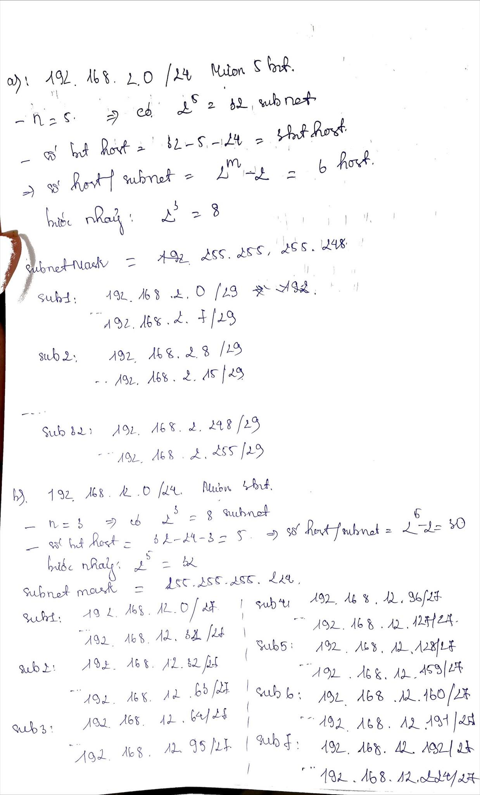
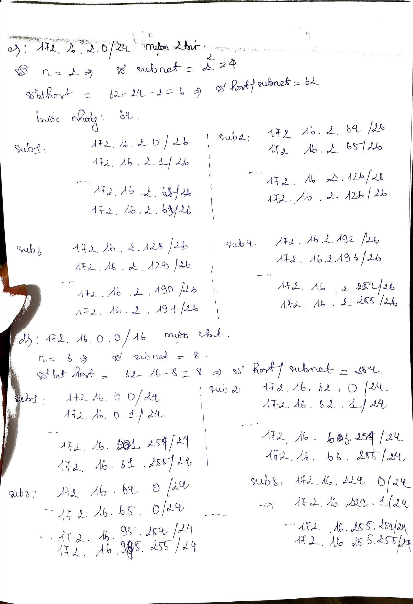
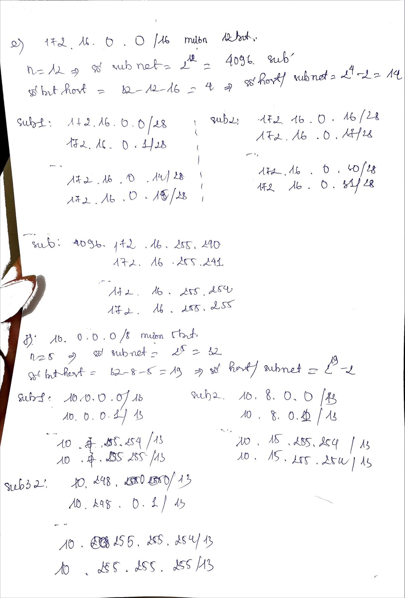
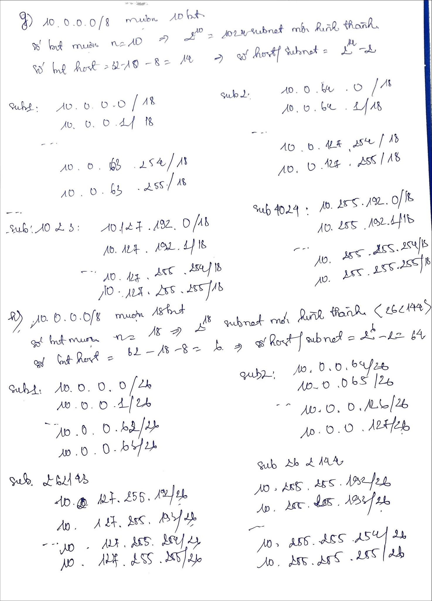


**BÀI 2:**  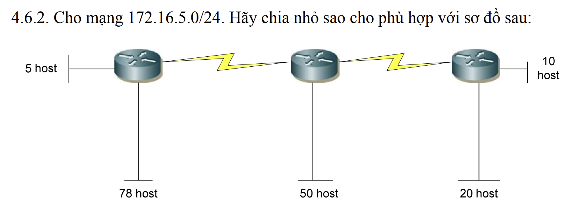

GIẢI:

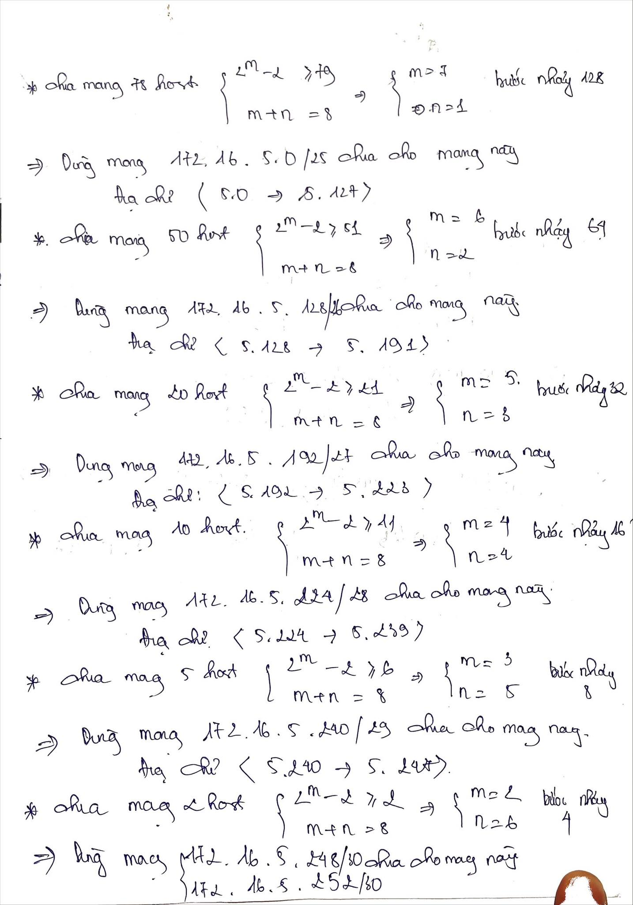
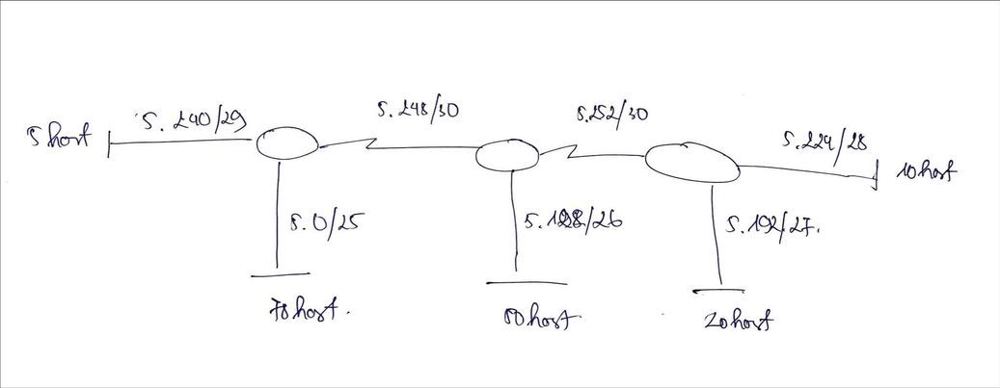

**BÀI 3**: Cho các địa chỉ host sau đây. Hãy xác định các địa chỉ subnet tương ứng và 
cho biết địa chỉ này có thể dùng đặt cho host được không: 
a) 192.168.1.130/29 

b) 172.16.34.57/18 

c) 203.162.4.191/28 

d) 1.1.1.1/30 

e) 10.10.10.89/29 

f) 70.9.12.35/30

```
GIẢI:

a) được

subnetmask: 255.255.255.248

b)  được

subnetmask: 255.255.192.0

c) được

subnetmask: 255.255.255.240

d) được

subnetmask: 255.255.255.252

e) được

subnetmask: 255.255.255.248

f) được

subnetmask: 255.255.255.252

```

**BÀI 4**: Hãy tóm tắt các địa chỉ mạng sau đây về thành một địa chỉ mạng đại diện: 

a) 192.168.0.0/24 

 192.168.1.0/24 

 192.168.2.0/24 

 192.168.3.0/24 

b) 172.16.16.0/24 

 172.16.20.0.24 

 172.16.24.0/24

 172.16.28.0/24

 ```
 giải:

 a) 4 subnet => 2^n=4 =>n=2 => số bit mượn =2
 
   192.168.0.0/22

 b) tương tự: 172.16.16.0/22.
 
 ```

## VI. KẾT LUẬN.

Trên hết, việc chia địa chỉ IPv4 và chia subnet là một khía cạnh quan trọng trong quản lý mạng và viễn thông. Trong bài viết này, chúng ta đã tìm hiểu về quá trình chia địa chỉ IPv4 thành các mạng con nhỏ hơn, cũng như cách sử dụng subnet mask để xác định địa chỉ mạng và địa chỉ máy con.

Tuy nhiên, việc chia địa chỉ IPv4 và chia subnet cũng có thể gặp phải một số thách thức. Sự thiếu hụt địa chỉ IPv4 đã gây ra sự cần thiết chuyển sang IPv6, với không gian địa chỉ rộng hơn và khả năng hỗ trợ nhiều thiết bị hơn. Điều này đòi hỏi sự chuyển đổi và quản lý song song của cả hai phiên bản.

Tóm lại, việc chia địa chỉ IPv4 và chia subnet đóng vai trò quan trọng trong việc tạo ra các mạng con và quản lý mạng hiệu quả. Việc hiểu và áp dụng các khái niệm chia subnet giúp chúng ta tận dụng tối đa không gian địa chỉ và tạo ra mạng con linh hoạt và bảo mật. Trong tương lai, với sự phát triển của IPv6, việc chia địa chỉ và quản lý subnet sẽ tiếp tục đóng vai trò quan trọng trong việc xây dựng và duy trì hạ tầng mạng.


---
*Danh mục tài liệu tham khảo*


<p>[1] https://timkiemtuonglai.wordpress.com/2016/12/22/subnetting-chia-ma%CC%A3ng-con/ </p>

<p>[2] https://vnpro.vn/thu-vien/chuong-1-dia-chi-ipv4-chia-subnet-vlsm-summary-4108.html</p>

<p>[3] bài giảng chia IP- trung tâm tin học VNPRO </p>


