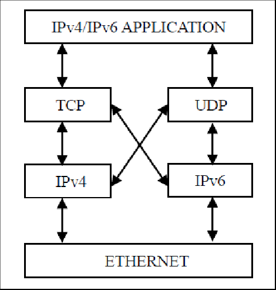
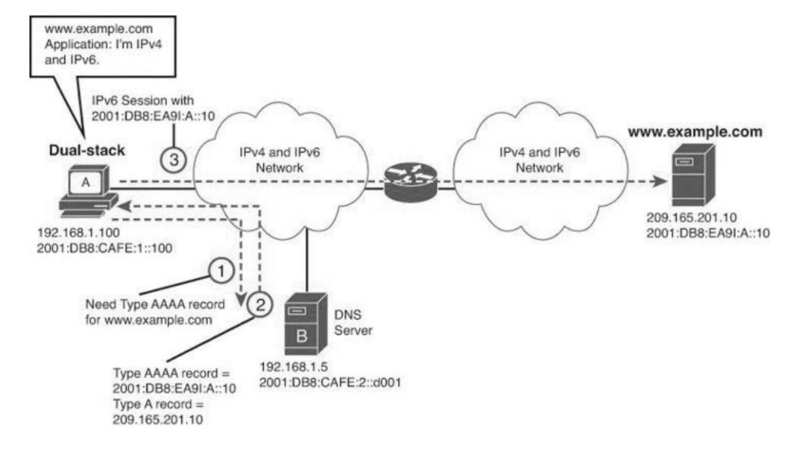
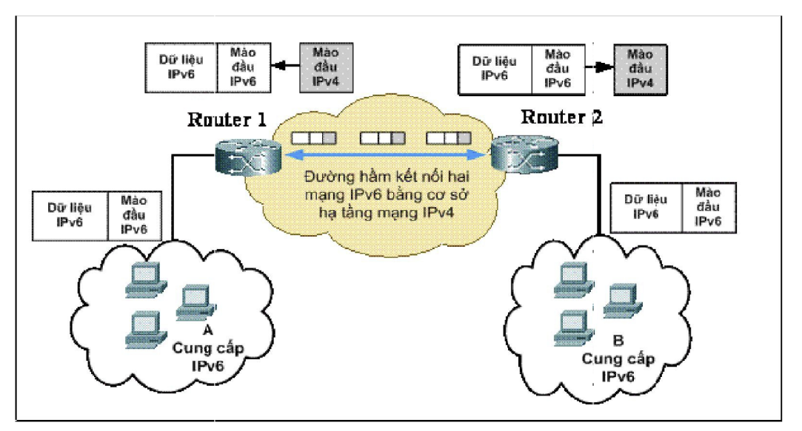

# CHUYỂN ĐỐI IPv6.

## MỤC LỤC:

[I. DUAL STACK.](#i-dual-stack)

[II. TRUYỀN THÔNG IPV6 VS IPV6 TRÊN HẠ TẦNG CỦA IPV4.](#ii-truyền-thông-ipv6-vs-ipv6-trên-hạ-tầng-của-ipv4)

---

 Do số lượng IPv6 rất lớn cũng như thói quen, cách dùng IPv4 đã quá phổ biến, vì vậy việc chuyển đối từ IPv4 sang IPv6 không được đột ngột và phải làm sao không để sảy ra bất kỳ xung đột của hệ thống nào.

## I. DUAL STACK.

Người ta khuyến nghị, trước khi chuyển đổi sang hoàn toàn IPv6, các host nên hỗ trợ đồng thời cả IPv4 và IPv6.

Để làm được điều này, host cần truy vấn DNS. nếu DNS trả về IPv4 thì host gửi IPv4, nếu DNS gửi về IPv6 thì host gửi ra IPv6.

### 1.1. NGUYÊN TẮC HOẠT ĐỘNG.

Như đã trình bày ở trên, cơ chế Dual-stack hoạt động dưới sự trợ giúp của dịch vụ phân giải tên miền DNS. Các máy chủ Chồng hai giao thức sẽ có bản ghi địa chỉ khai báo trong các DNS Server, do vậy DNS Server phải hỗ trợ IPv6. Khi đó sẽ có một bản ghi (record table) A lưu trữ một địa chỉ IPv4 và một bản ghi AAAA lưu trực một địa chỉ IPv6. Mỗi bản ghi này có thể trỏ đến một địa chỉ IPv4 hoặc IPv6. Trong trường hợp kết quả tìm thấy là một bản ghi AAAA trỏ đến địa chỉ IPv4 (compatible IPv6) và một bản ghi A trỏ đến địa chỉ IPv4 tương ứng thí kết quả trả về có giá trị sau:

- Trả lại duy nhất địa chỉ IPv6
- Trả lại duy nhất địa chỉ IPv4
- Trả lại cả hai địa chỉ IPv4 và IPv6

Việc lựa chọn loại địa chỉ nào được trả về phụ thuộc vào từng trường hợp. Trong trường hợp cả hai loại địa chỉ trả về thì trật tự sắp xếp các loại địa chỉ liên quan đến luồng IP của Host đó. Nếu một địa chỉ IPv6 được trả về, Nút mạng đó giao tiếp với Nút mạng địch và gói tin được đóng theo chuẩn IPv6. Tương tự, nếu địa chỉ IPv4 được trả về, nút mạng đó giao tiếp với một host IPv4 và lúc này gói tin được đóng gói theo chuẩn IPv4

Ví dụ:

Bước 1  máy chủ xếp chồng kép A gửi truy vấn DNS cho bản ghi AAA có tên miền www.example.com
Bước 2, máy chủ DNS trả về phản hồi truy vấn DNS chứa cả bản ghi quad-A và A cho www.example.com. bản ghi chính là địa chỉ IP của www.example.com

Bước 3: Máy chủ A sử dụng bản ghi quad-A để bắt đầu liên lạc với máy 
chủ www.example.com. 

### 1.2. ƯU-NHƯỢC ĐIỂM.

***ƯU ĐIỂM***:

- Hỗ trợ trên nhiều nền tảng LINUX, WINDOWN...

- cho phép duy trì cả 2 giao thức khi IPv6 chưa thực sự triển khai.

***NHƯỢC ĐIỂM***:

- Khả năng mở rộng kém vì phải sử dụng IPv4.

## II. TRUYỀN THÔNG IPV6 VS IPV6 TRÊN HẠ TẦNG CỦA IPV4.

Thật ra IPv4 đã quá phổ biến và hạ tầng IPv4 đã vô cùng hoàn thiện và vững chăc. nên khó có thể triển khai IPv6 only được. buộc phải triển khai trên hạ tầng của IPv4. Ngay cả khi IPv6 ping IPv6 thì vẫn phải ping qua hạ tầng của IPv4.

### 2.1. CƠ CHẾ HOẠT ĐỘNG.

Công nghệ đường hầm là một phương pháp sử dụng cơ sở hạ tầng sẵn có của mạng IPv4 để thực hiện các kết nối IPv6 bằng cách sử dụng các thiết bị mạng có khả năng hoạt động dual-stack tại hai điểm đầu và cuối nhất định. Các thiết bị này “bọc” gói tin IPv6 trong gói tin IPv4 và truyền tải đi trong mạng IPv4 tại điểm đầu và gỡ bỏ gói tin IPv4, nhận lại gói tin IPv6 ban đầu tại điểm đích cuối đường truyền IPv4.

### 2.2. ƯU ĐIỂM.

Ưu điểm:
- Các nút mạng không bắt buộc phải dùng địa chỉ IPv6 kiểu tương thích IPv4 như đường hầm tự động.
- Không cần nhiều cấu hình đặc biệt như đường hầm có cấu hình.
- Không bị ảnh hưởng bởi các hệ thống tường lửa của mạng, chỉ cần routercủa mạng có địa chỉ IPv4 toàn cục có thể định tuyến. Nhược điểm:
- Chỉ thực hiện với một lớp địa chỉ mạng đặc biệt.
Có nguy cơ bị tấn công theo kiểu của đường hầm tự động nếu phần địa chỉ

---
*Danh mục tài liệu tham khảo*:

[1] https://quangnam.gov.vn/webcenter/portal/ubnd/pages_tin-tuc/chi-tiet?dDocName=PORTAL174180

[2] 

