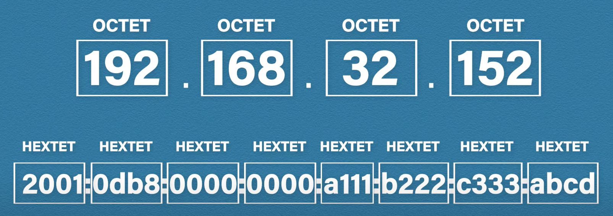
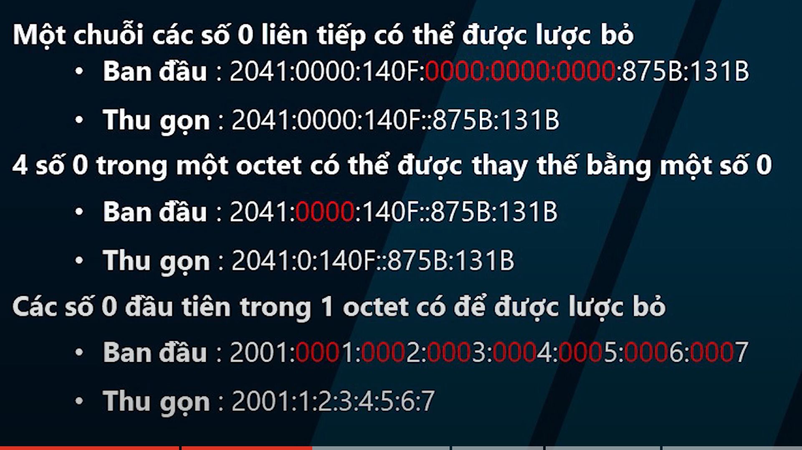
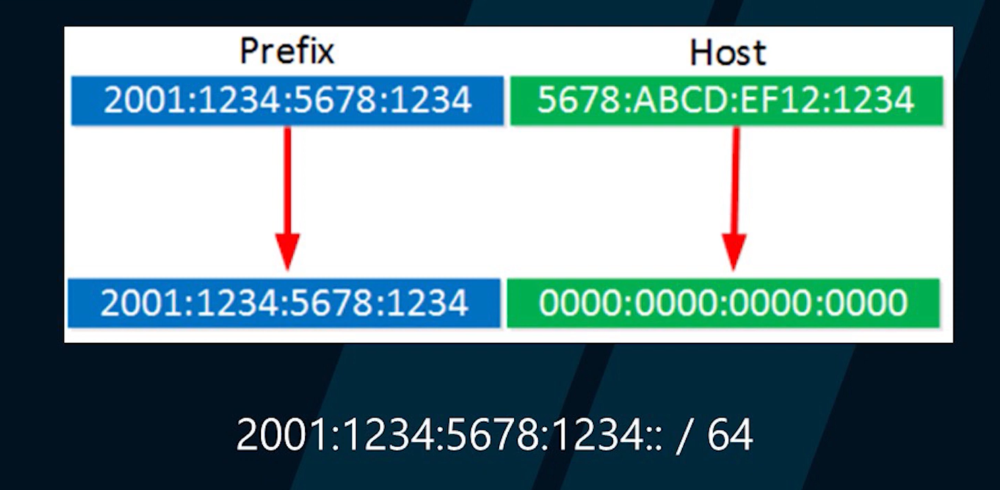
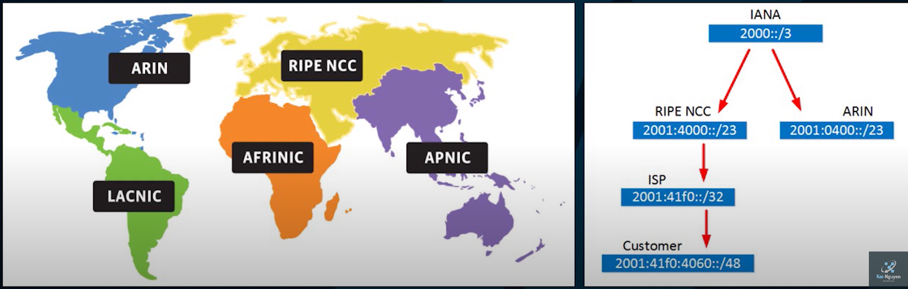
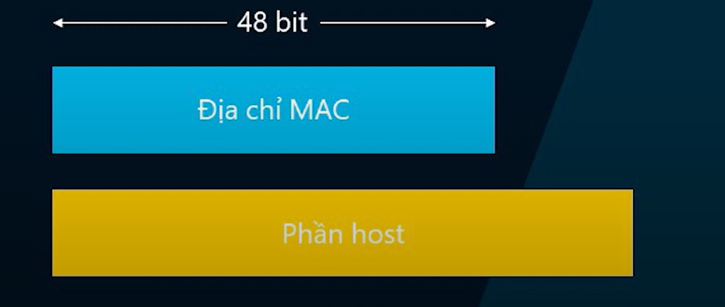
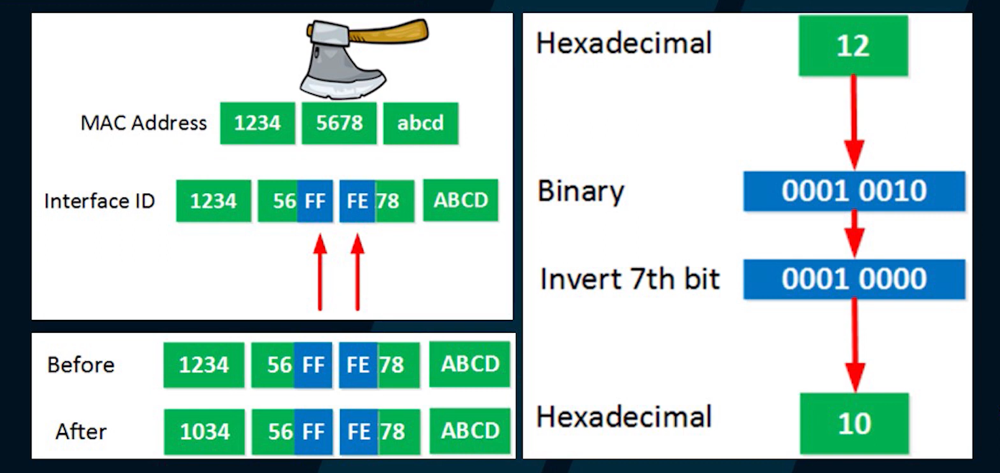
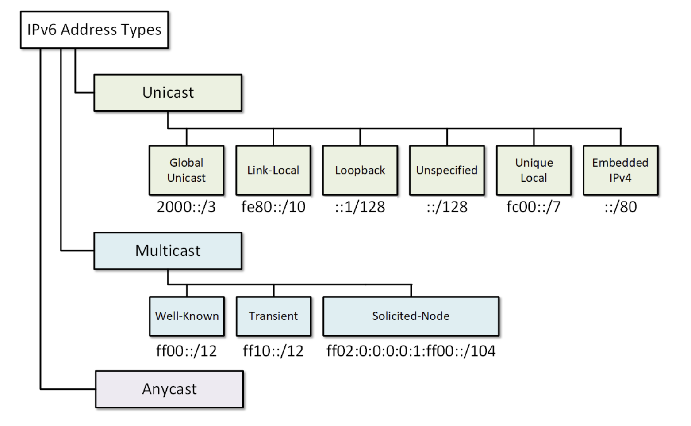

# TÌM HIỂU VỀ IP VERSION 6

## MỤC LỤC.

[I. IPv6 LÀ GÌ?](#i-ipv6-là-gì)

[II. MỤC ĐÍCH TẠO RA IP V6.](#ii-mục-đích-tạo-ra-ip-v6)

[III. LỢI ÍCH KHI SỬ DỤNG IP V6.](#iii-lợi-ích-khi-sử-dụng-ip-v6)

[IV. CẤU TRÚC IPv6.](#iv-cấu-trúc-ipv6)

- [4.1. BIỂU DIỄN IP V6.](#41-biểu-diễn-ip-v6)

- [4.2. THÀNH PHẦN IP V6.](#42-thành-phần-ip-v6)

[V. CÁC LOẠI ĐỊA CHỈ IPv6.](#v-các-loại-địa-chỉ-ipv6)

## I. IPv6 LÀ GÌ?

IPv6 là phiên bản tiếp theo của giao thức Internet Protocol (IP), mà được sử dụng để điều hướng gói tin trên mạng Internet. Nó được thiết kế để thay thế cho IPv4, giao thức hiện tại được sử dụng rộng rãi nhất trên thế giới.

## II. MỤC ĐÍCH TẠO RA IP V6.

IPv6 được sử dụng để giải quyết vấn đề về _hạn chế số lượng địa chỉ IP có sẵn trong IPv4_. Vì IPv4 chỉ có khoảng 4,3 tỷ địa chỉ khả dụng, nên không thể đáp ứng được nhu cầu của các thiết bị mới đang liên tục được kết nối vào Internet. IPv6 cung cấp hàng tỷ lượng địa chỉ IP khổng lồ hơn, do đó có thể đáp ứng tốt hơn nhu cầu của thiết bị mới và các hệ thống không dây.

## III. LỢI ÍCH KHI SỬ DỤNG IP V6.

Để hình dung rõ hơn lợi ích IPv6 mang lại, chúng ta sẽ đến với những công dụng sau đây của IPv6:

- IPv4 chỉ có 32 bit nên chỉ có thể cung cấp 4 tỷ địa chỉ IP. Còn IPv6 có đến 128 bit nên có thể cung cấp đến 2128 địa chỉ IP. Đây là một con số khổng lồ có thể đáp ứng tốt hơn nhu cầu của các thiết bị mới đang liên tục được kết nối vào Internet.

- Giúp cho việc truyền dữ liệu trên mạng được nhanh hơn, vì nó có thể xử lý các gói tin nhanh hơn so với IPv4.

- Cung cấp các tùy chọn bảo mật tăng cường như IPSec, giúp cho mạng được bảo vệ tốt hơn khỏi các tấn công.
Hỗ trợ tính năng multicast và anycast, giúp cho việc truyền tin trên mạng được hiệu quả hơn.

- Giúp cho việc triển khai các dịch vụ mạng mới và nâng cao hiệu suất mạng hiệu quả hơn.

- Hỗ trợ các thiết bị không dây và các hệ thống không dây, giúp cho việc kết nối và trao đổi dữ liệu trên mạng không dây được thuận tiện hơn.

## IV. CẤU TRÚC IPv6.

###     4.1. BIỂU DIỄN IP V6.

IP v6 gồm 128 bit được chia thành 8 HEXTET. mỗi HEXTET là 16 bit ngăn cách nhau bởi dấu ":".

**CÁCH THU GỌN ĐỊA CHỈ IP V6**:
 - Một chuuỗi số 0 liên tiếp có thể được lược bỏ. điều này chỉ có thể làm một lần

 - 4 số 0 trong một octet có thể viết bằng một con số 0

 - các số 0 đầu tiên trong một octet có thể được lược bỏ

 ví dụ:

 

### 4.2. THÀNH PHẦN IP V6.

IP V6 cũng giồm 2 phần: NET VÀ HOST.

#### 4.2.1. PHẦN NET ID.

phần net ID này do nhà mạng cấp, nhà mạng sẽ quy hoạch phần này như sau:

- /32 bít đầu là bit của nhà mạng ISP
- /48 tới /64 đây là của nhà mạng ISP sẽ cấp cho bạn
- bạn sẽ mang cái dải mạng này về để chia cho các máy trong phòng mình.

- lúc này bạn chỉ cần quan tâm tới phần host là cái attach nó vào máy.

#### 4.2.2. PHẦN HOST ID.

đây là cái hay nhất của IPV6 bởi IPv6 không có private IP, mà tất cả địa chỉ IPv6 đều là public IP.

đề làm được điều này, phần host id phải là duy nhất. IPv6 dùng một cơ chế EUI-64. cơ chế này sẽ chuyển đổi địa chỉ MAC của máy host thành chính địa chỉ HOST ID.

**CƠ CHẾ CHUYỂN ĐỔI ĐỊA CHỈ MAC THÀNH HOST ID**:

- 1. chia đôi địa chỉ MAC
- 2. chèn thêm FFFE vào giữa 2 phần chia đôi ( vì địa chỉ mac chỉ có 48 bit, mà host id cần 64 bít nên cần chèn vào để cho đủ 64 bit)
- 3. đảo giá trị bit thứ 7 trong host id (ví dụ bit thứ 7 là 0 sẽ đảo ngược lại thành 1)

ví dụ: 

## V. CÁC LOẠI ĐỊA CHỈ IPv6.

Có 3 loại địa chỉ IPv6:

- Unicast( truyền điểm điểm): là địa chỉ cho một giao tiếp. Một gói dữ liệu được gửi đến một địa chỉ Unicast sẽ được phân phối tới cổng giao tiếp được chỉ ra bởi địa chỉ đó.

- Anycast ( truyền ): là địa chỉ cho tập hợp các cổng giao tiếp. Các tập này thông thường thuộc về các node khác nhau. Một gói dữ liệu được gửi đến một địa chỉ anycast sẽ được phân phối đến cổng giao tiếp gần nhất hay đầu tiên trong nhóm anycast.

- Multicast ( truyền điểm- đa điểm): địa chỉ cho một tập hợp các cổng giao tiếp (thông thường thuộc về các node khác nhau). Khi một gói được gửi đến một địa chỉ multicast, tất cả các cổng giao tiếp sẽ nhận được gói dữ liệu này.

lưu ý: IPV6 không dùng địa chỉ broadcast và không dùng subnetmask.

---
*Danh mục tài liệu tham khảo*

[1] https://bkhost.vn/blog/ipv6/

[2] https://www.totolink.vn/article/75-cau-truc-ipv6-va-cac-loai-dia-chi-ipv6.html

[3] https://www.youtube.com/watch?v=1RrV4wHke18