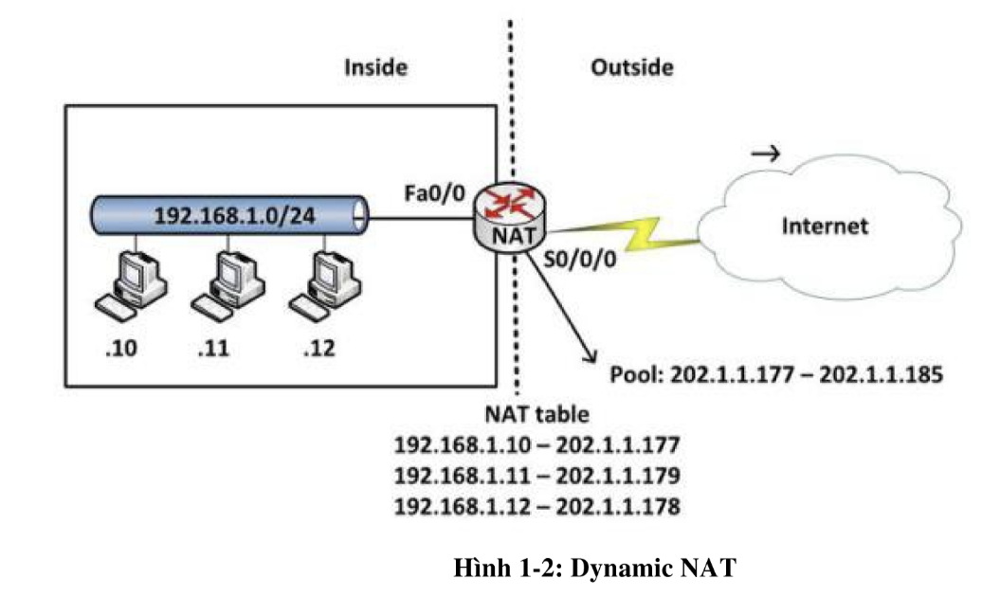

# TÌM HIỂU VỀ NAT.

## I. NAT LÀ GÌ?

### 1.1. NAT LÀ GÌ?

Biên dịch địa chỉ mạng (NAT-Network Address Translation) là quá trình ánh xạ địa chỉ giao thức internet (IP) sang địa chỉ khác bằng cách thay đổi tiêu đề của các gói IP trong khi truyền qua bộ định tuyến. Điều này giúp cải thiện bảo mật và giảm số lượng địa chỉ IP mà tổ chức cần.

NAT giống như một router, thực hiện chuyển tiếp gói tin ip giữa 2 lớp mạng khác nhau. Thông thường chuyển đổi từ IP private sang IP public

NAT cũng khá giống một firewall cơ bản. Nó duy trì một bảng thông tin IP gửi qua nó. Ví dụ Khi máy tính kết nối với 1 websize ngoài internet.  Header của ip máy đó được đổi thành một ip public được config sẵn trên NAT. Sau khi gói tin trở về NAT chỉ cần so sánh với bản ghi đã lưu mà thay đổi lại ip header thành ip của máy nguồn ban đầu.

## II. PHÂN LOẠI.

### 2.1. SNAT.

LÀ phương thức ánh xạ NAT 1-1. Tức 1 địa chỉ IP private sẽ ánh xạ với một địa chỉ IP public.

NAT tĩnh được sử dụng khi thiết bị cần truy cập từ mạng bên ngoài

### 2.2. DNAT.

Ánh xạ địa chỉ IP này sang một địa chỉ IP khác một cách tự động. Bất kì IP Public nằm trong bảng định tuyến  NAT đều có thể sử dụng để gán vào IP private.

