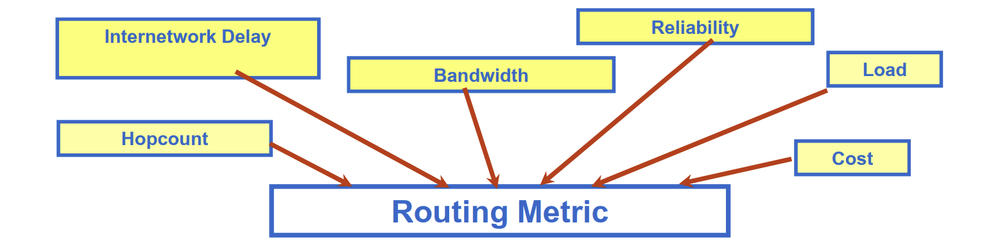
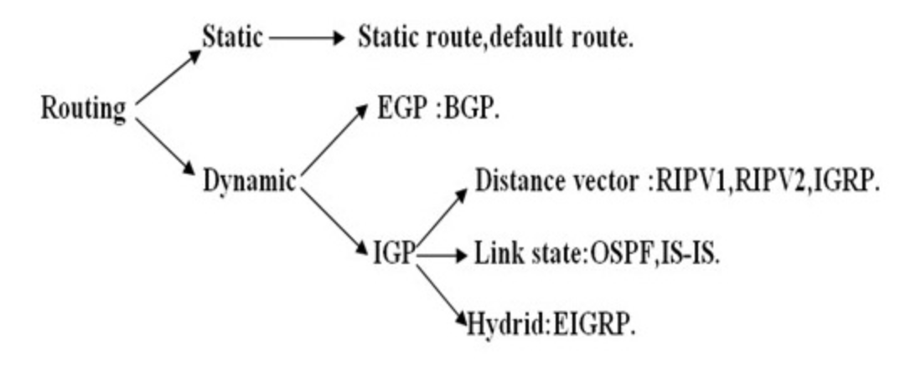
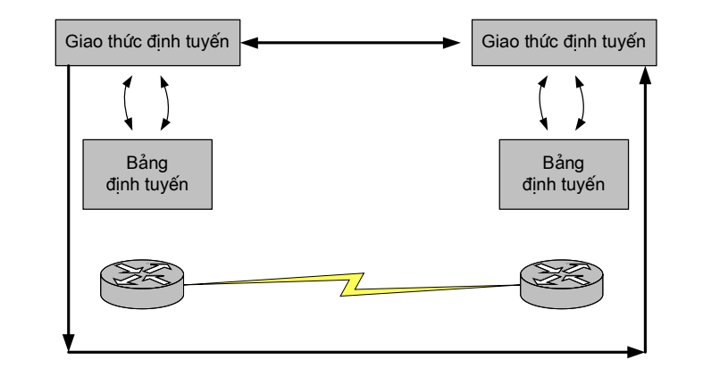
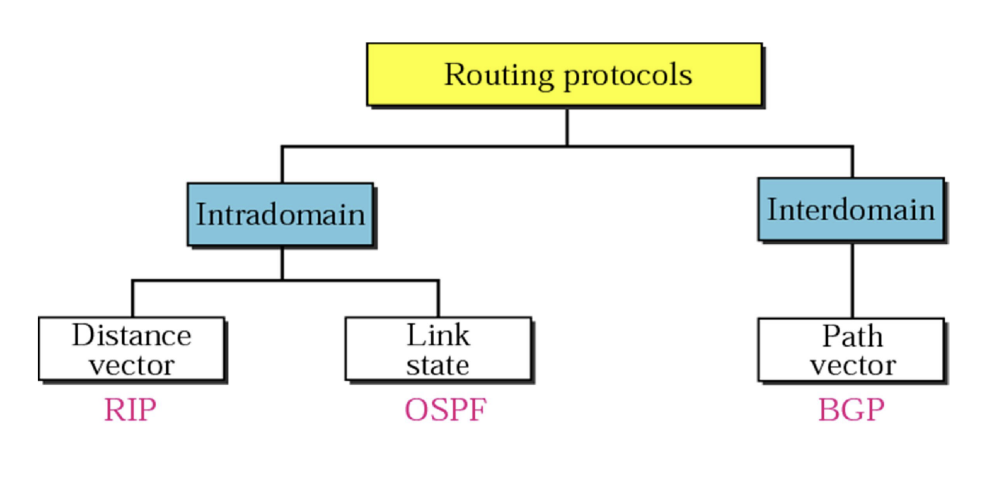

# ROUTING-OVERVIEW.

## I. CÁC KHÁI NIỆM.

### 1. ĐỊNH TUYẾN LÀ GÌ?

Định tuyến là một tiến trình lựa chọn con đường cho thực thể thông tin chuyển 
qua mạng. Nó được xem như là khả năng của một node trong vấn đề lựa chọn 
đường dẫn cho thông tin qua mạng

### 2. YÊU CẦU ĐỐI VỚI ĐỊNH TUYẾN.

- Chính xác.
- Đơn giản.
- Đáp ứng sự đột biến (lỗi).
- Ổn định.
- Công bằng.
- Tối ưu (hiệu quả).

### 3. CÁC THAM SỐ ĐỊNH TUYẾN (METRIC).

Các giải thuật định tuyến sử dụng nhiều metric để xác định tuyến tốt nhất. Các
giải thuật phức tạp có thể chọn tuyến dựa trên nhiều metric bằng cách kết hợp chúng
thành một metric phức hợp. Các metric được sử dụng phổ biến gồm:

- **Chiều dài đường đi**: là metric định tuyến phổ biến nhất. Một số giải thuật định
tuyến cho phép nhà quản trị mạng tuỳ ý gán giá trị cho mỗi liên kết mạng. Trong
trường hợp này, chiều dài đường đi là tổng các giá được gán cho các liên kết trên
đường đi. Một số giải thuật khác sử dụng tổng số bước nhảy (hop count) làm
metric để chọn tuyến tối ưu. Tổng số bước nhảy là số lượng bộ định tuyến mà một
gói dữ liệu đi qua trước khi đến đích.

- **Độ tin cậy**: trong phạm vi của các giải thuật định tuyến, độ tin cậy thường là tỉ lệ
bit lỗi của mỗi liên kết mạng. Độ tin cậy thường do người quản trị gán.

- **Độ trễ**: chỉ khoảng thời gian cần thiết để chuyển gói dữ liệu từ nguồn đến đích qualiên mạng. Độ trễ phụ thuộc vào nhiều nhân tố, bao gồm: băng thông của các liên
kết mạng trung gian, các hàng đợi cổng tại mỗi bộ định tuyến dọc đường đi, tắc
nghẽn mạng trên tất cả các liên kết mạng trung gian, và khoảng cách vật lý phải đi
qua. Do độ trễ là sự kết hợp nhiều biến số quan trọng nên nó là một metric phổ
biến và hữu ích.

- **Băng thông**: chỉ khả năng lưu lượng sẵn có của một liên kết. Một liên kết Ethernet
10 Mb/s có thể được ưa thích hơn đường thuê riêng 64 Kb/s. Mặc dù băng thông là
cấp thông lượng có thể đạt được trên một liên kết, nhưng tuyến qua các liên kết có
băng thông lớn không phải lúc nào cũng tốt hơn tuyến qua các liên kết chậm. Ví
dụ, nếu một liên kết nhanh hơn nhưng lại thường xuyên bận thì thời gian yêu cầu
thực sự để gửi một gói dữ liệu đến đích có thể lớn hơn.

- **Tải**: chỉ mức độ bận của tài nguyên mạng, chẳng hạn bộ định tuyến. Tải có thể
được tính toán bằng nhiều cách, bao gồm thời gian sử dụng CPU và số lượng gói
được xử lý trong thời gian một giây.

- **Giá truyền thông**: là một metric khá quan trọng, đặc biệt do một số công ty có thể
không quan tâm nhiều tới hiệu suất bằng phí tổn vận hành. Mặc dù độ trễ trên
đường truyền có thể lớn hơn, nhưng họ thích gửi dữ liệu qua những đường truyền
của riêng họ hơn là gửi qua các đường truyền công cộng vì khi đó họ phải trả tiền
sử dụng.

## II. THUẬT TOÁN ĐỊNH TUYẾN.

Thuật toán định tuyến:

- Thuật toán định tuyến tính toán đường đi ngắn nhất trên
thông tin thu nhận được. 

- Thuật toán xác định đâu là thông tin tốt nhất để lưu trong 
bảng định tuyến. 
- Mỗi thuật toán định tuyến xác định thông tin tốt nhất theo 
cách của riêng nó. 

- Thuật toán tạo ra một số (metric, cost) cho mỗi đường đi 
qua mạng (nhỏ-tối ưu).

- Các metric có thể được tính toán dựa trên một đặc 
tính đơn lẻ hoặc kết hợp nhiều đặc tính. 

## III. PHÂN LOẠI ĐỊNH TUYẾN.

có nhiều cách phân loại định tuyến, phổ biến nhất là:

- Định tuyến tĩnh với định tuyến động (PHỔ BIẾN NHẤT)

- định tuyến vector khoảng cách và định tuyến trạng thái liên kết.

- định tuyến trong (IGP) và định tuyến ngoài (BGP)

##  IV. ĐỊNH TUYỄN TĨNH.

Trong phương pháp định tuyến tĩnh, thông tin trong các bảng định tuyến được người quản trị mạng tạo lập trực
tiếp.

**MỘT SỐ TRƯỜNG HỢP SỬ DỤNG**:

- Do định tuyến động có khuynh hướng truyền đạt tất cả các thông tin về một liên mạng nên trong trường hợp chúng ta muốn che dấu một số phần của
liên mạng (vì lý do an toàn) thì sử dụng định tuyến tĩnh là phù hợp nhất.

- Trong trường hợp chỉ có một đường đi duy nhất tới mạng, thì chỉ cần một
tuyến tĩnh tới mạng là đủ. Loại mạng này được gọi là mạng cụt (stub
network). Cấu hình định tuyến tĩnh cho một mạng cụt tránh được lưu lượng
cập nhật định tuyến động. Điều này đặc biệt hữu ích đối với các kết nối
quay số

**ƯU DIỂM**: Khi sử dụng định tuyến tĩnh, không cần tốn băng thông
cho quá trình trao đổi thông tin định tuyến.

**NHƯỢC ĐIỂM**:

- Không thích ứng với sự thay đổi cấu trúc của mạng.

- Các tuyến tĩnh được người quản trị cập nhật và quản lý
nhân công. Trong trường hợp topo mạng thay đổi, người
quản trị phải cập nhật lại tuyến tĩnh một cách thủ công.

## V. ĐỊNH TUYẾN ĐỘNG.

Định tuyến động là phương thức tự động chia sẻ, trao đổi thông tin giữa các thiết bị định tuyến dựa trên các giao thức định tuyến động. Tự động cập nhật thông tin bảng định tuyến nếu hệ thống có sự thay đổi. Tính toán và đưa ra tuyến đường chuyển thông tin tốt nhất.

### 5.1. ƯU ĐIỂM CỦA ĐỊNH TUYẾN ĐỘNG.

### 5.2. HOẠT ĐỘNG CỦA ĐỊNH TUYẾN ĐỘNG.

Sự thành công của định tuyến động phụ thuộc vào hai chức năng cơ bản của bộ
định tuyến:
- Duy trì bảng định tuyến,
- Chia sẻ thông tin cho các bộ định tuyến khác dưới dạng các cập nhật định
tuyến.

Giao thức định tuyến định nghĩa một tập luật mà bộ định tuyến sử dụng khi liên lạc
với các bộ định tuyến hàng xóm. Chẳng hạn, một giao thức định tuyến mô tả:

- Cách gửi cập nhật,
- Thông tin nào chứa trong các cập nhật,
- Khi nào thì gửi cập nhật,
- Bộ định tuyến nào nhận cập nhật.

Khi một giải thuật định tuyến cập nhật bảng định tuyến, mục đích chính của nó là
xác định đâu là thông tin tốt nhất để lưu trong bảng định tuyến. Mỗi giải thuật định
tuyến xác định thông tin tốt nhất theo cách của riêng nó. Giải thuật tạo ra một số, là giá
trị metric, cho mỗi đường đi qua mạng. Thường thì giá trị metric càng nhỏ thì đường
đi càng tối ưu. Các metric có thể được tính toán dựa trên một đặc tính đơn lẻ của
đường đi, hoặc cũng có thể được tính phức tạp hơn bằng cách kết hợp nhiều đặc tính.

### 5.3. CÁC LOẠI GIAO THỨC ĐỊNH TUYẾN ĐỘNG.

#### 5.3.1. GIAO THỨC RIP( ĐỊNH TUYẾN VECTOR KHOẢNG CÁCH).

- Trong giao thức này mỗi node cần duy trì một vecto (bảng) về khoảng
cách tới các node còn lại trên mạng.

- Một node cần biết khoảng cách (giá) của các node hàng xóm với mình tới
một node đích.

- Một node có nhiều hàng xóm tới đích và nó có thể so sánh, xác định
tuyến đường ngắn nhât.

- Thông tin cần trao đổi là giá khoảng cách từ mỗi node hàng xóm tới các
đích nên có thể so sánh và xác định đường đi tới tất cả các node đích.

- Mỗi node chỉ trao đổi thông tin với hàng xóm của mình và theo chu kỳ
(30 giây).

- Thường sử dụng thuật toán Bellman-Ford.

#### 5.3.2. GIAO THỨC OSPF( ĐỊNH TUYẾN TRẠNG THÁI LIÊN KẾT).

- Trong định tuyến trạng thái liên kết mỗi node trong miền sẽ 
có thông tin về topology của toàn miền đó và node dùng 
thuật toán Dijkstra để tính toán bảng định tuyến. 

- Node sẽ lưu trữ thông tin giá của liên kết và trạng thái hoạt 
động hay lỗi, tạo thành cơ sở dữ liệu trạng thái liên kết (tên 
của giao thức).

- Đảm bảo hội tụ mạng.

#### 5.3.3. GIAO THỨC BGP. 

---
*Danh mục tài liệu tham khảo*

[1] https://vnpro.vn/thu-vien/the-nao-la-routing-2042.html

[2] https://thinhcaominh.wordpress.com/2017/06/06/routing-table-bang-dinh-tuyen/

[3] https://aws.amazon.com/vi/what-is/routing/

[4]

[5]

