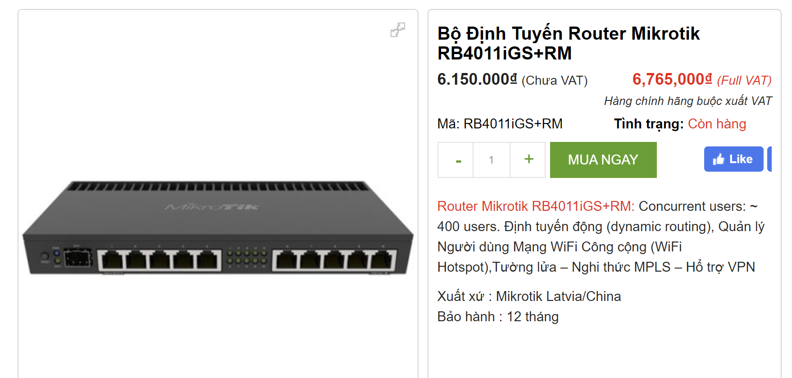
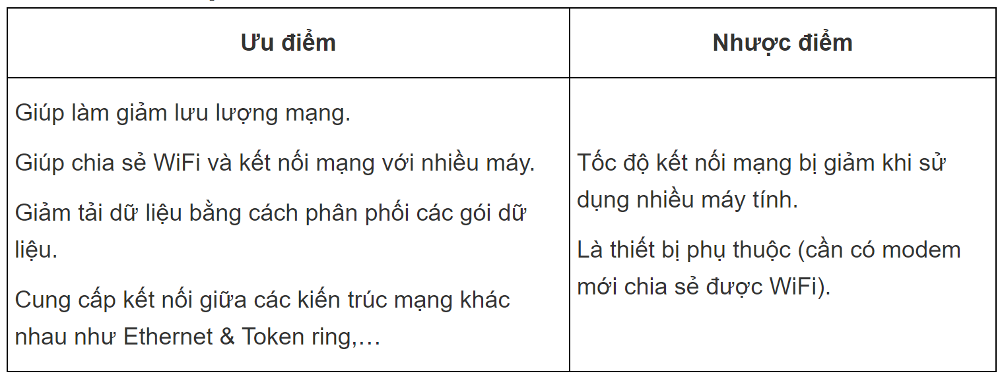
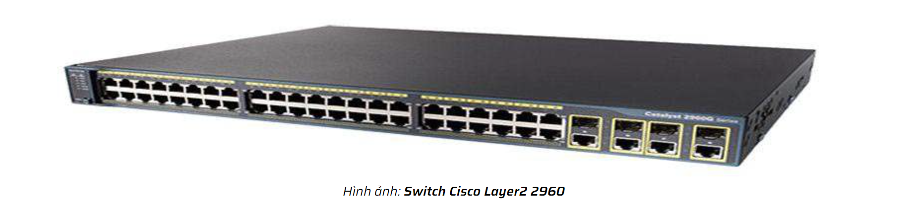
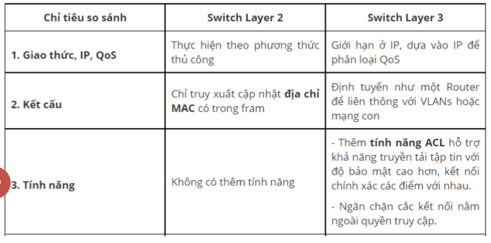
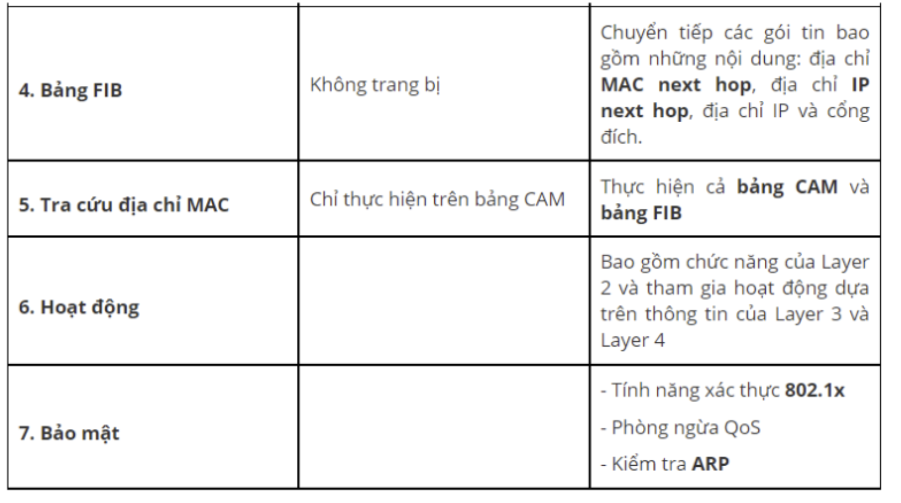
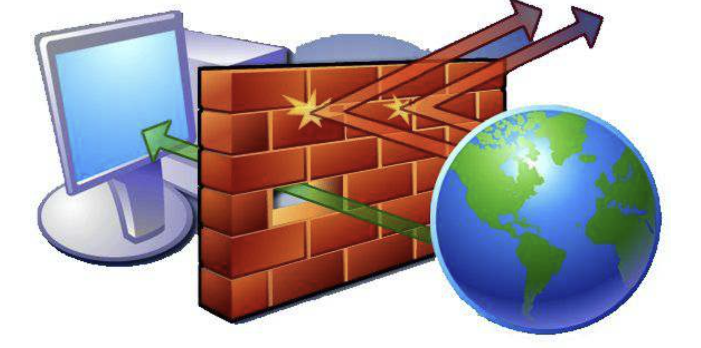
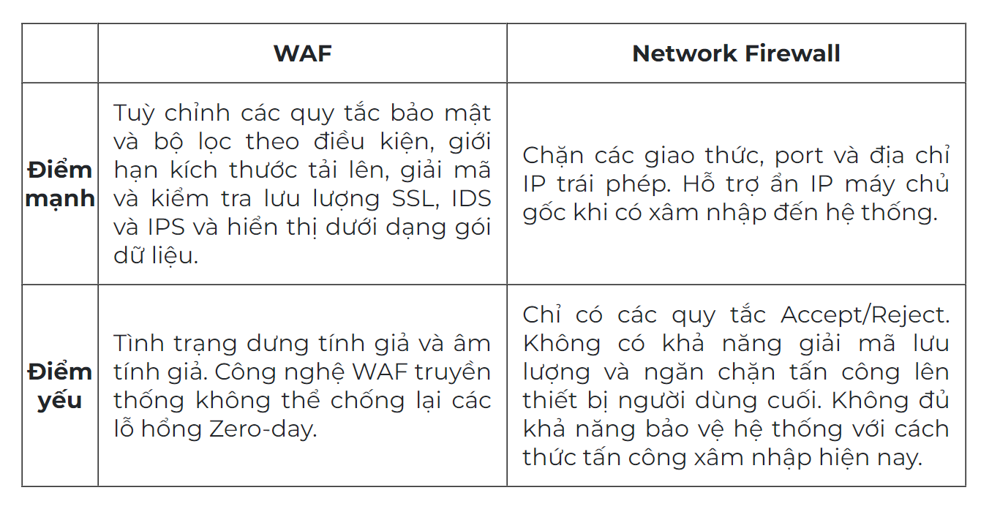

# TÌM HIỂU CÁC THIẾT BỊ MẠNG.

## II. ROUTER.

### 2.1. ROUTER LÀ GÌ?

Router (thiết bị định tuyến hoặc bộ định tuyến) là thiết bị mạng dùng để chuyển các gói dữ liệu đến các thiết bị đầu cuối. Nói một cách dễ hiểu, Router là một thiết bị để chia sẻ Internet tới nhiều các thiết bị khác trong cùng lớp mạng.

### 2.3. CHỨC NĂNG CỦA ROUTER.

Router WiFi giúp biến mạng có dây thành không dây giúp kết nối các thiết bị di động với nhau dễ dàng hơn. Giúp nhiều người trong nhà cùng sử dụng được mạng Internet đồng thời mà không bị giới hạn như mạng có dây. Ngoài ra khi kết nối có dây cũng làm cho nhà bạn trở nên gọn gàng hơn nữa.

### 2.4. ƯU NHƯỢC ĐIỂM.

### 2.5. CÁC LOẠI ROUTER.

**Wired Router (Router có dây)**

- Router có dây kết nối trực tiếp với máy tính thông qua dây cáp. Một cổng kết nối của Router kết nối với Modem để nhận gói dữ liệu Internet và một cổng khác kết nối với máy tính để phân phối gói dữ liệu Internet.

- Router có dây sử dụng tường lửa (SPI) trong quá trình chuyển các gói dữ liệu trong mạng nhằm mục đích bảo mật.

**Wireless router (Router không dây)**

- Router không dây kết nối trực tiếp với Modem thông qua dây cáp để nhận các gói dữ liệu Internet. Thay vì truyền dữ liệu qua cáp đến máy tính, Router không dây phân phối các gói dữ liệu bằng cách sử dụng một hoặc nhiều ăng-ten.

- Router không dây thiết lập mạng cục bộ không dây (WiFi).

**Virtual router (Router ảo)**

- Không như Router có dây hoặc Router không có dây, Router ảo hoạt động như một bộ định tuyến mặc định cho các máy tính cùng chia sẻ mạng.

- Router ảo hoạt động bằng cách sử dụng Giao thức dự phòng bộ định tuyến ảo (VRRP), giao thức này sẽ hoạt động khi Router chính bị lỗi hoặc bị vô hiệu hóa.

## III. SWITCH.

### 3.1. SWITCH LÀ GÌ?

Switch là một thiết bị chuyển mạch tối quan trọng trong mạng, dùng để kết nối các đoạn mạng với nhau theo mô hình hình sao (Star). Trong mô hình này, switch đóng vai trò trung tâm và tất cả các thiết bị vệ tinh khác kể cả máy tính đều được kết nối về đây, từ đó định tuyến tạo đường nối tạm trung chuyển dữ liệu đi. Ngoài ra, Switch được hỗ trợ công nghệ Full Duplex dùng để mở rộng băng thông của đường truyền, điều mà các thiết bị khác không làm được.

### 3.2. SWITCH LAYER 2.

Switch Layer 2 truy xuất cập nhật địa chỉ MAC có trong frame, cho phép các thiết bị có thể truyền tin nhanh chóng cho nhau mà không cần phải kết nối trực tiếp. 

Điểm đặc biệt là Switch Layer 2;

– Không cần chia sẻ băng thông nhưng vẫn truyền dữ liệu một cách nhanh chóng.

– Có khả năng điều chỉnh giới hạn của lưu lượng trưởng ở ngưỡng nào đó.

– Switch Layer 2 còn có khả năng tạo ra mạng ảo VLAN sẽ tối ưu các nhóm trong mạng một cách dễ dàng.

### 3.3. SWITCH LAYER 3.

Switch Layer 3 bao gồm nhiều tính năng hơn Switch Layer 2. Sở dĩ như vậy là bởi vì một số dịch vụ trong đó làm cho switch layer 3 hoạt động tốt hơn switch layer 2 như: bảng CAM, bảng FIB, địa chỉ IP của next hop, địa chỉ MAC,… Chính vì vậy giá thành của switch Layer 3 cao hơn hẳn switch Layer 2.

Hơn nữa, hoạt động của switch layer 3 không những sở hữu các tính năng của Switch layer 2 mà còn tham gia vào một số hoạt động dựa trên thông tin của layer 3 và layer 4.

Điểm đặc biệt là Switch Layer 3;

– Có thể lưu bảng của địa chỉ MAC của thiết bị kết nối.

– Có thêm bảng định tuyến của một Router.

– Mặc dù không có cổng kết nối Wan nhưng nó có chức năng định tuyến như router để có thể liên thông với mạng con hoặc là VLANs.

## III. FIREWALL.

### 1. FIREWALL LÀ GÌ?

Tường lửa hay còn được gọi với cái tên là FireWall thuật ngữ trong chuyên ngành mạng máy tính, nói nôm na có thể gọi là bức tường lửa một hệ thống an ninh mạng, bảo mật an toàn thông tin mạng. Tường lửa tồn tại ở 2 loại phần cứng và phần mềm được tích hợp vào bên trong hệ thống và nó hoạt động như một rào chắn phân cách giữa truy cập an toàn và truy cập không an toàn, chống lại truy cập trái phép, ngăn chặn virus… đảm bảo thông tin nội bộ được an toàn không bị truy cập xấu đánh cắp.

### 2. HOẠT ĐỘNG.

Firewall thiết lập biên giới giữa bên trong và bên ngoài hệ thống mạng máy tính. Nó sử dụng bộ quy tắc được cấu hình sẵn để kiểm tra các gói tin, phân biệt gói tin lành tính và không lành tính. Từ đó đưa ra quyết định cho phép hay ngăn cấm truy cập vào hệ thống mạng mà nó bảo vệ.

Gói tin tức là phần dữ liệu được định dạng để truyền qua Internet. Các gói tin này sẽ chứa những thông tin về dữ liệu như nguồn gốc, nội dung. Dựa vào các thông tin đó để tường lửa xác định xem gói tin đó có tuân theo bộ quy tắc mà nó quy định không. Trường hợp nếu phạm quy tắc thì gói tin sẽ bị cấm truyền vào mạng. Bộ quy tắc mà Firewall xây dựng gồm gồm nguồn đến, điểm đến và nội dung của gói tin.

### 3. LỢI ÍCH KHI DÙNG.

Firewall giúp kiểm soát luồng thông tin giữa Intranet và Internet, chúng phát hiện và phán xét những hành vi được truy cập và không được truy cập vào bên trong hệ thống, đảm bảo tối đa sự an toàn thông tin.

Tính năng chính của dòng thiết bị này có thể được tóm tắt ở những gạch đầu dòng dưới đây:

- Cho phép hoặc vô hiệu hóa các dịch vụ truy cập ra bên ngoài, đảm bảo thông tin chỉ có trong mạng nội bộ.

- Cho phép hoặc vô hiệu hóa các dịch vụ bên ngoài truy cập vào trong.

- Phát hiện và ngăn chặn các cuộc tấn công từ bên ngoài.

- Hỗ trợ kiểm soát địa chỉ truy cập (bạn có thể đặt lệnh cấm hoặc là cho phép).

- Kiểm soát truy cập của người dùng.

- Quản lý và kiểm soát luồng dữ liệu trên mạng.

- Xác thực quyền truy cập.

- Hỗ trợ kiểm soát nội dung thông tin và gói tin lưu chuyển trên hệ thống mạng.

- Lọc các gói tin dựa vào địa chỉ nguồn, địa chỉ đích và số Port ( hay còn cổng), giao thức mạng.

- Người quản trị có thể biết được kẻ nào đang cố gắng để truy cập vào hệ thống mạng.

- Firewall hoạt động như một Proxy trung gian.

- Bảo vệ tài nguyên của hệ thống bởi các mối đe dọa bảo mật.

- Cân bằng tải: Bạn có thể sử dụng nhiều đường truyền internet cùng một lúc, việc chia tải sẽ giúp đường truyền internet ổn định hơn rất nhiều.

### 4. NETWORK FIREWALL(L3)

 Network Firewall sẽ bảo vệ toàn bộ chu vi của hệ thống mạng kết nối bằng cách sử dụng các giao thức định tuyến thông tin (Information Protocol). Người dùng có thể xây dựng và thiết lập các quy tắc bảo mật cho hệ thống dựa trên dải IP, Ports, ICMP (Internet Control Message Protocol),... Hệ thống sẽ giám sát hoạt động của truy cập từ khi bắt đầu kết nối cho đến khi hết phiên hoạt động.

### 5. WEB APPLICATION FIREWALL ((WAF))

WAF - Web Application Firewall với khả năng bảo vệ lớp API và hệ thống website trước lỗ hổng và xâm phạm bảo mật lên trang web. WAF được cấu hình như một proxy ngược, kiểm tra tất cả các truy vấn HTTP trước khi nó đến được máy chủ origin. Phát hiện và ngăn chặn lưu lượng truy cập bất thường đến hệ thống bằng các bài kiểm tra CAPTCHA để đảm bảo rằng truy cập này được gửi từ con người chứ không phải bot.

