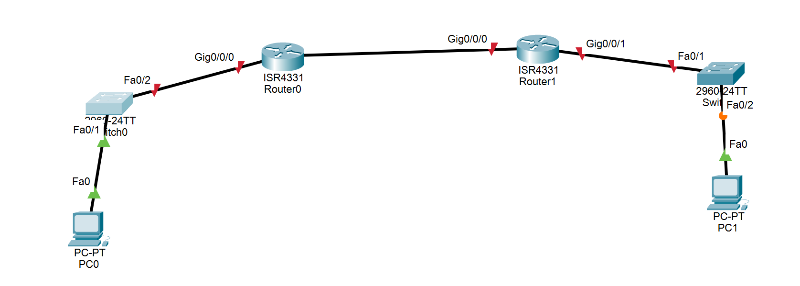

# LAB STATIC ROUTE

## TOPO 

.


Đánh địa chỉ cho R0,R1
```Router R0 :

Router>enable
Router#configure terminal
Router(config)#hostname R1
R1(config)#interface e0/1
R1(config-if)#ip address 10.0.0.1 255.255.255.0
R1(config-if)#no shutdown
R1(config-if)#exit
R1(config)#interface e0/0
R1(config-if)#ip address 192.168.0.1 255.255.255.0
R1(config-if)#no shutdown
R1(config-if)#exit

Router R1:

Router>enable
Router#configure terminal
Router(config)#hostname R2
R2(config)#interface e0/1
R2(config-if)#ip address 11.1.0.1 255.255.255.0
R2(config-if)#no shutdown
R2(config-if)#exit
R2(config)#interface e0/0
R2(config-if)#ip address 192.168.0.2 255.255.255.0
R2(config-if)#no shutdown
R2(config-if)#exit


PC0:
ip 10.0.0.2/24 10.0.0.1

PC1
ip 11.1.0.2/24 11.1.0.1

```

Cấu hình IP tĩnh từ pc0, sang pc1:

```
ip route 11.1.0.0 255.255.255.0 192.168.0.0
```


