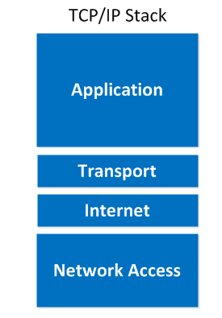
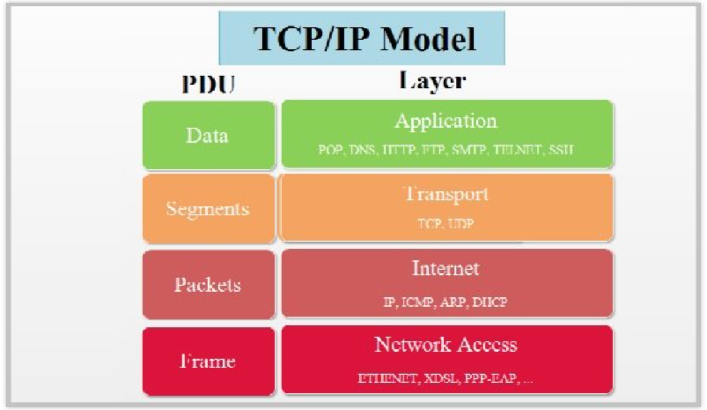
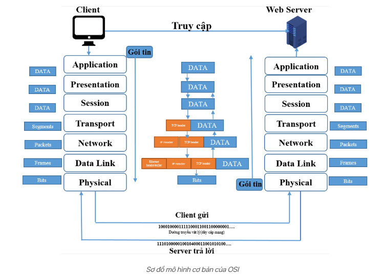
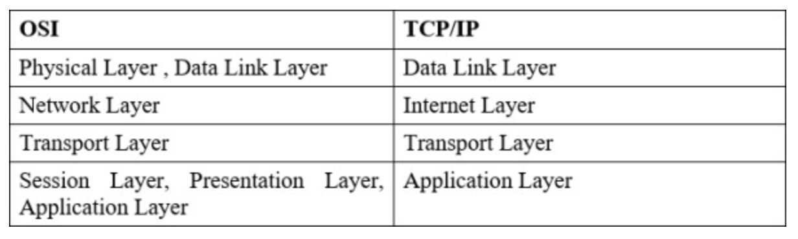
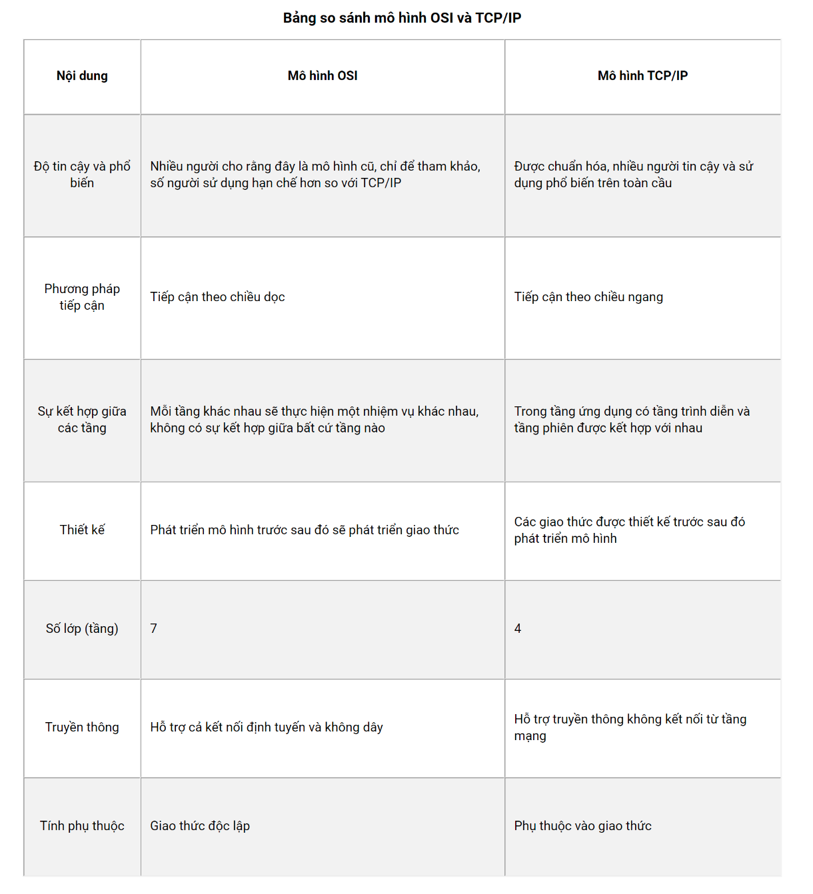

# TCP/IP OVERVIEW

## MỤC LỤC.

[I. TCP/IP LÀ GÌ?](#i-tcpip-là-gì)

[II. CÁC LỚP CỦA MÔ HÌNH TCP/IP.](#ii-các-lớp-của-mô-hình-tcpip)

- [2.4 LỚP ỨNG DỤNG](#21-lớp-ứng-dụng)

- [2.3 LỚP VẬN CHUYỂN](#22-lớp-vận-chuyển)

- [2.2 LỚP MẠNG](#23-lớp-mạng)

- [2.1 LỚP VẬT LÝ](#24-lớp-vật-lý)

[III. SO SÁNH VỚI MÔ HÌNH OSI.](#iii-so-sánh-với-mô-hình-osi)

- [3.1 GIỚI THIỆU QUA VỀ MÔ HÌNH OSI](#31-giới-thiệu-qua-về-mô-hình-osi)

- [3.2 SO SÁNH MÔ HÌNH OSI VÀ TCP/IP](#32-so-sánh-mô-hình-osi-và-tcpip)

- [3.3 NÊN CHỌN OSI HAY TCP/IP](#33-nên-chọn-tcpip-hay-osi)

[IV. CÁCH HOẠT ĐỘNG]()

[V. KẾT LUẬN]()

## I. TCP/IP LÀ GÌ?

TCP/IP là cụm từ viết tắt của Transmission Control Protocol/Internet Protocol hay còn gọi là giao thức điều khiển truyền nhận/ Giao thức liên mạng. Đây là một bộ các giao thức truyền thông được sử dụng để kết nối các thiết bị mạng với nhau trên internet. TCP/IP cũng có thể được sử dụng như một giao thức truyền thông trong mạng máy tính riêng (mạng nội bộ). Trong đó, bộ Giao thức internet – một tập hợp các quy tắc và thủ tục – thường gọi là TCP/IP (TCP/IP Protocol) TCP và IP là hai giao thức chính bên cạnh những giao thức khác trong bộ. Bộ giao thức TCP/IP hoạt động như một lớp trừu tượng giữa các ứng dụng internet và hạ tầng router/switch.TCP/IP chỉ định cách dữ liệu được trao đổi qua internet. Nó thực hiện bằng cách cung cấp thông tin liên lạc đầu cuối. Từ đó xác định cách nó được chia thành các packet, xác định địa chỉ, truyền dẫn, định tuyến và nhận dữ liệu. TCP/IP được thiết kế để đảm bảo độ tin cậy, nó có khả năng khôi phục tự động khi gặp sự cố trong quá trình truyền dữ liệu.

Hình 5: Mô hình TCP/IP

Mô hình TCP/IP tiêu chuẩn bao gồm 4 tầng được chồng lên nhau, bắt đầu từ tầng thấp nhất là:

- Tầng 1: Tầng vật lý (Physical) 
- Tầng 2: Tầng mạng (Internet)
- Tầng 3: Tầng giao vận (Transport)
- Tầng 4: Tầng ứng dụng (Application).

## II. CÁC LỚP CỦA MÔ HÌNH TCP/IP.

Hình 2: lớp của TCP/IP

### 2.1 LỚP ỨNG DỤNG.

Đây là lớp giao tiếp trên cùng của mô hình. Đúng với tên gọi, tầng Ứng dụng đảm nhận vai trò giao tiếp dữ liệu giữa 2 máy khác nhau thông qua các dịch vụ mạng khác nhau (duyệt web, chat, gửi email, một số giao thức trao đổi dữ liệu: SMTP, SSH, FTP,...). 

Dữ liệu khi đến đây sẽ được định dạng theo kiểu Byte nối Byte, cùng với đó là các thông tin định tuyến giúp xác định đường đi đúng của một gói tin.

### 2.2 LỚP VẬN CHUYỂN.

Là lớp gồm cơ chế bảo đảm dữ liệu được vận chuyển một cách tin cậy hoàn toàn không phụ thuộc vào đặc tính của các ứng dụng sử dụng dữ liệu.

Lớp vận chuyển cũng cung cấp các dịch vụ khác như phân đoạn, gộp các phân đoạn, điều khiển lưu lượng, điều khiển lỗi và điều khiển kết nối.

Trong tầng này còn bao gồm 2 giao thức cốt lõi là TCP và UDP. Trong đó, TCP đảm bảo chất lượng gói tin nhưng tiêu tốn thời gian khá lâu để kiểm tra đầy đủ thông tin từ thứ tự dữ liệu cho đến việc kiểm soát vấn đề tắc nghẽn lưu lượng dữ liệu. Trái với điều đó, UDP cho thấy tốc độ truyền tải nhanh hơn nhưng lại không đảm bảo được chất lượng dữ liệu được gửi đi.

### 2.3 LỚP MẠNG.

Lớp Internet trong kiến trúc giao thức TCP/IP là lớp định tuyến, đảm bảo việc đưa các gói tin đến đúng đích trên mạng. Lớp Internet cũng đảm bảo tính toàn vẹn của dữ liệu trong quá trình định tuyến và hỗ trợ việc phân đoạn và gộp các phân đoạn của các gói tin lớn. Lớp này sử dụng giao thức Internet Protocol (IP) để định tuyến các gói tin trên mạng.

Giao thức IP đóng vai trò quan trọng trong việc định tuyến các gói tin, nó phân chia dữ liệu thành các gói tin nhỏ hơn và gắn thêm địa chỉ IP của máy chủ đích và máy chủ nguồn vào đầu gói tin. Khi một gói tin được gửi từ máy tính nguồn đến máy tính đích, lớp Internet sẽ sử dụng địa chỉ IP của máy tính đích để định tuyến gói tin đến đích.

Lớp Internet cũng đảm bảo tính toàn vẹn của dữ liệu trong quá trình định tuyến, bằng cách sử dụng các cơ chế kiểm tra lỗi và điều khiển lỗi trong giao thức IP. Ngoài ra, lớp Internet còn hỗ trợ việc phân đoạn và gộp các phân đoạn (fragmentation and reassembly) của các gói tin lớn để tránh việc giới hạn kích thước gói tin.

### 2.4 LỚP VẬT LÝ.

Là lớp dưới cùng của mô hình TCP/IP. Tầng này chịu trách nhiệm truyền dữ liệu giữa hai thiết bị trong cùng một mạng. Tại đây, các gói dữ liệu được đóng vào khung (gọi là Frame) và được định tuyến đi đến đích đã được chỉ định ban đầu.

Nhiệm vụ của lớp vật lý là định nghĩa các đặc tính cơ bản của việc truyền tải dữ liệu trên một mạng vật lý. Chẳng hạn như tần số, điều chế, tốc độ truyền, độ dài tối đa của tín hiệu và cách thức truyền tải. Lớp vật lý sử dụng các kỹ thuật mã hóa và giải mã để biến đổi tín hiệu thành các bit dữ liệu để gửi qua mạng và ngược lại.

Các chuẩn và giao thức phổ biến trong lớp vật lý bao gồm Ethernet, Token Ring, ATM (Asynchronous Transfer Mode), ISDN (Integrated Services Digital Network), và FDDI (Fiber Distributed Data Interface). Mỗi chuẩn và giao thức này sử dụng các kỹ thuật và thiết bị khác nhau để truyền tải dữ liệu trên mạng vật lý.

## III. SO SÁNH VỚI MÔ HÌNH OSI.

### 3.1 GIỚI THIỆU QUA VỀ MÔ HÌNH OSI.

Mô hình kết nối các hệ thống mở OSI là mô hình căn bản về các tiến trình truyền thông, thiết lập các tiêu chuẩn kiến trúc mạng ở mức Quốc tế, là cơ sở chung để các hệ thống khác nhau có thể liên kết và truyền thông được với nhau. Mô hình OSI tổ chức các giao thức truyền thông thành 7 tầng, mỗi một tầng giải quyết một phần hẹp của tiến trình truyền thông, chia tiến trình truyền thông thành nhiều tầng và trong mỗi tầng có thể có nhiều giao thức khác nhau thực hiện các nhu cầu truyền thông cụ thể.

Hình 3: MÔ HÌNH OSI 

### 3.2. SO SÁNH MÔ HÌNH OSI VÀ TCP/IP.

Hình 4: SO SÁNH MÔ HÌNH OSI & TCP/IP 

Tầng ứng dụng trong mô hình TCP/IP bao gồm luôn cả 3 tầng trên của mô hình OSI. Tầng giao vận trong mô hình TCP/IP không phải luôn đảm bảo độ tin cậy của việc truyền tin như ở trong tầng giao vận của OSI mà cho phép thêm một lựa chọn khác là UDP.

**``sự giống nhau``**:

- OSI và TCP/IP đều có kiến trúc phân lớp.
- OSI và TCP/IP đều có lớp Network và lớp Transport.
- OSI và TCP/IP cùng sử dụng kỹ thuật chuyển Packet.

**``sự khác nhau``**:

Hình 5: SO SÁNH MÔ HÌNH OSI & TCP/IP 

### 3.3. NÊN CHỌN TCP/IP HAY OSI?

Để thiết lập kết nối giữa các thiết bị giao tiếp trên toàn cầu, chúng ta sẽ cần đến OSI (Open Systems Interconnection). OSI cho phép các hệ thống khác nhau có thể giao tiếp được với nhau nhờ cung cấp tiêu chuẩn dưới dạng kiến trúc phân tầng. Mô hình này phù hợp với mọi hệ thống mạng của nó, do đó nó được xem là mã nguồn mở.

Sự khác biệt giữa TCP/IP và OSI nằm ở sự kết hợp giữa các tầng với nhau. Tầng trình diễn của TCP/IP được kết hợp với tầng phiên trong tầng ứng dụng. Đồng thời, mỗi tầng sẽ thực hiện một nhiệm vụ khác nhau. OSI là một chuẩn giao thức độc lập, còn TCP/IP là mô hình phụ thuộc hoàn toàn vào giao thức.

Bên cạnh đó, TCP/IP cung cấp các nguyên tắc chung và cá nhân tôi cho rằng TCP/IP không quá khắt khe đối với người dùng về các quy tắc. Dựa trên nhiều thông kê, tôi nhận định rằng mô hình TCP/IP được nhiều người sử dụng hơn so với OSI. Ngoài ra, sự khác biệt còn nằm ở chỗ OSI tiếp cận theo chiều dọc, còn TCP/IP tiếp cận theo chiều ngang.

Các giao thức TCP/IP sẽ được thiết kế trước, còn mô hình sẽ được phát triển sau đó. Riêng OSI thì ngược lại, mô hình sẽ được phát triển trước rồi các giao thức được phát triển sau đó.

## IV. CÁCH HOẠT ĐỘNG.

***NẾU LÀ TCP***

-  THIẾT LẬP KẾT NỐI.

Bước 1: Client gửi TCP SYN segment 
tới server

Chỉ định seq # ban đầu

 Không có dữ liệu

Bước 2: Server nhận SYN, trả lời với 
SYNACK segment:

Server cấp phát buffer

Server khởi tạo seq. #

Bước 3: Client nhận SYNACK, trả lời 
bằng ACK segment, có thể chứa 
dữ liệu

-  Giai phóng kết nối:

Bước 1: client gửi TCP FIN tới 
server

Bước 2: server nhận FIN, trả lời 
bằng ACK. Đóng kết nối, gửi 
FIN.

***NẾU LÀ UDP***

## V. KẾT LUẬN.

---
*Danh mục tài liệu tham khảo*

[1] https://www.totolink.vn/article/149-mo-hinh-tcp-ip-la-gi-chuc-nang-cua-cac-tang-trong-mo-hinh-tcp-ip.html

[2] https://nghedien.com/kien-thuc/ttcn/kien-truc-giao-thuc-tcp-ip 

[3] https://vietnix.vn/tcp-ip-la-gi/ 

[4] https://viblo.asia/p/tim-hieu-co-ban-ve-mo-hinh-tcpip-RQqKLkJp57z 

[5] vhttps://wiki.matbao.net/tcp-ip-la-gi-uu-va-nhuoc-diem-cua-tcp-ip-so-voi-mo-hinh-osi/ 

 

