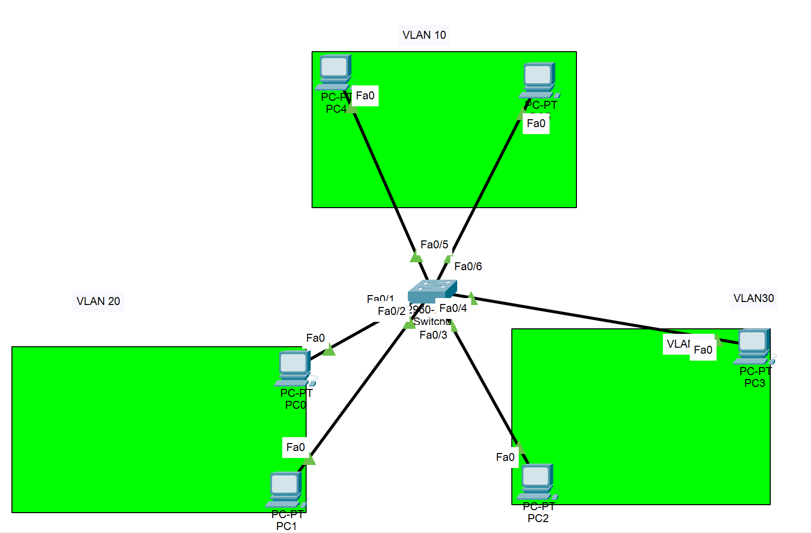
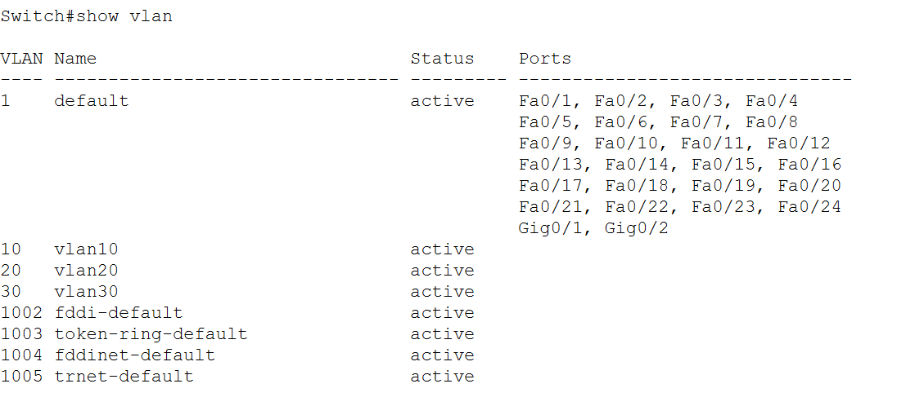

# VLAN-LAB

Topo:


## bước 1: tạo ra 3 vlan 10,20,30:

```
Switch>enable
Switch#conf t

Switch(config)#vlan 10
Switch(config-vlan)#name vlan10
Switch(config-vlan)#ex

Switch(config)#vlan 20
Switch(config-vlan)#name vlan20
Switch(config-vlan)#ex

Switch(config)#vlan 30
Switch(config-vlan)#name vlan30
Switch(config-vlan)#ex

Switch(config)#show vlan
            
```

kiểm tra các vlan bằng lệnh ```show vlan```



## bước 2: gán cổng cho vlan

```
Switch>enable
Switch#conf t

Switch(config)#int f0/1
Switch(config-if)#switchport access vlan 20
Switch(config-if)#ex
Switch(config)#int  f0/2
Switch(config-if)#switchport access vlan 20
Switch(config-if)#ex

Switch(config)#int f0/3
Switch(config-if)#switchport access vlan 30
Switch(config-if)#ex
Switch(config)#int f0/4
Switch(config-if)#switchport access vlan 30
Switch(config-if)#ex

Switch(config)#int f0/5
Switch(config-if)#switchport access vlan 10
Switch(config-if)#ex
Switch(config)#int f0/6
Switch(config-if)#switchport access vlan 10
Switch(config-if)#ex

```

kiem tra: 


