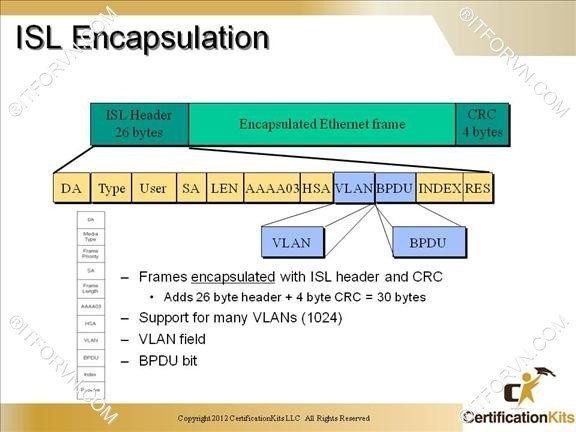
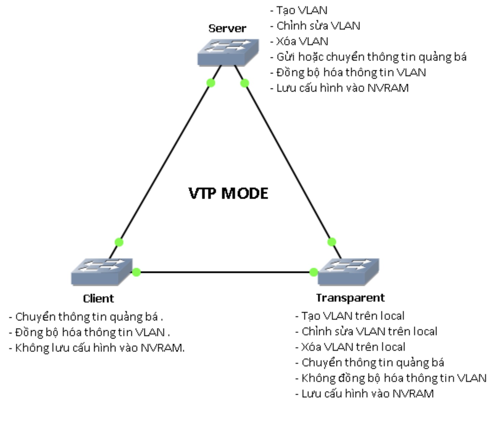

# VLAN TRUNKING-OVERVIEW.

## I. KHÁI NIỆM.

### 1.1. VTP.

VTP (Vlan Trunking Protocol) là giao thức hoạt động ở tầng liên kết dữ liệu trong mô hình OSI. VTP giúp cho việc cấu hình VLAN luôn đồng nhất khi thêm, xóa, sửa thông tin về VLAN trong hệ thống mạng.

## II. CÁC CHUẨN VTP.

### 2.1 CHUẨN DOT1Q (TRUNKING DỰA TRÊN THẺ).

Kỹ thuật trunking DOT1Q thực hiện chèn thêm 4 byte vào sau trường Source MAC của Ethernet Frame trên đường trunk. Thông tin chèn này được gọi là DOT1Q Tag.

Các trường trong 802.1Q VLAN Tag bao gồm:
- Tag Protocol ID (16 bit) nôi dung trường này luôn được set 0x8100 dùng để định danh ra frame này đã đc tag 802.1q để phân biệt với frame untagged trên đường trunk.
- User Priority (3 bit) sử dụng cho kỹ thuật QoS.
- Canonical Format Indicator (1bit) cho biết địa chỉ MAC đang được sử dụng ở định dạng Token Ring hay Ethernet Frame.
- VLAN ID(12bit): cho biết Frame đang chạy trên đường trunk là của VLAN nào.

***HOẠT ĐỘNG:*** 

Khi switch nhận được Frame có tag thông tin 802.1Q, nó sẻ tiến hành đọc thông tin này, xem frame này đến từ VLAN nào. Sau đó nó sẻ xử lí gở bỏ Tag trả lại frame đúng VLAN mà frame thuộc về. Thực chất Tag DOT1Q chỉ được tag trên đường trunk để phân biệt các frame của các VLAN khác nhau. Các End users không nhận biết được rằng frame được Tag và chuyển trên đường trunk. Trunking hoàn toàn transparent với các thiết bị đầu cuối này.

### 2.2. CHUẨN ISL(DÀNH RIÊNG CHO CÁC THIẾT BỊ CISCO),

Chuẩn trunking này là chuẩn độc quyền của Cisco và chỉ chạy trên thiết bị Cisco. Hoạt động đóng Tag trên đường trunk và mở tag ISL cũng hoạt động giống như 802.1Q.

Các trường trong môt ISL Tag bao gồm:

- DA(Destination Address): 40 bit sẻ set ở dạng 0x01-00-0C-00-00″ or “0x03-00-0c-00-00”. Để báo hiệu bên nhận rằng frame được tag ở dạng ISL.
- Type: 4bit chỉ ra type frame được và sử dụng là gì (0000:Ethernet, 0001: Token ring….).
- User: 4bit chỉ ra độ ưu tiên của frame khi đi qua switch(XX00: normal priority, XX01: priority 1, XX10: priority 2, XX11: highest priority).
- SA(Source Address): 48 bit địa chỉ nguồn của gói tin ISL. Tuy nhiên thiết bị nhận có thể bỏ qua địa chỉ này
- LEN(Length): 16bit cho biết kích thước của gói tin thực tế.
AAAA03 là một giá trị 24bit liên tục của  0xAAAA03.
- HSA(High Bits of Source Address):24 bit trường này chứa giá trị “0x00-00-0C.
- BPDU: được set để tất cả gói tin BPDU được tag ISL(hoạt động trên STP).
- INDEX: 16bit chỉ ra chỉ số port nguồn của gói tin tồn tại trên Switch.
- RES: dài 16bit sử dụng khi Token ring hoặc FDDI được đóng gói frame ISL, với frame Ethernet trường RES được set tất cả bit 0.

## III. CÁCH HOẠT ĐỘNG.

### 3.1. MIỀN VTP (VTP DOMAIN).

Thiết bị Switch chia sẻ thông tin VLAN được tổ chức thành các nhóm logic gọi là miền quản lý VTP. Một Switch chỉ có thể có một miền VTP và chia sẻ thông tin VLAN với các Switch khác trong miền. Tuy nhiên các Switch trong các miền VTP khác nhau không chia sẻ thông tin VTP.

Các thông tin VLAN trao đổi giữa các thiết bị Switch trong cùng một tên miền phụ thuộc vào chế độ VTP của Switch. Mỗi Switch chạy giao thức VTP đều phải là thành viên của một miền VTP. Các Switch trong một miền VTP quảng bá một vài thuộc tính đến các miền lân cận như: miền quản lý VTP, số VTP, VLAN và các tham số đặc trưng của VLAN.

Khi một VLAN được thêm vào một Switch trong một miền quản lý thì các Switch khác được cho biết về VLAN mới này qua việc quảng bá VTP. Tất cả Switch trong một miền đều có thể sẵn sàng nhận lưu lượng trên cổng trung kế sử dụng VLAN mới.

Khi truyền đi bản tin VTP tới Switch khác trong mạng , bản tin VTP được đóng gói trong frame theo chuẩn 802.1Q hoặc ISL. Các thông tin sau sẽ được tìm thấy trong bản tin VTP

### 3.2. CÁCH HOẠT ĐỘNG.

VTP gửi thông điệp quảng bá qua “VTP domain” mỗi 5 phút một lần, hoặc khi có sự thay đổi xảy ra trong quá trình cấu hình VLAN. Một thông điệp VTP bao gồm “rivision-number”, tên VLAN (VLAN name), số hiệu VLAN. Bằng sự cấu hình VTP Server và việc quảng bá thông tin VTP tất cả các switch đều đồng bộ về tên VLAN và số liệu VLAN của tất cả các VLAN.

Một trong những thành phần quan trọng trong các thông tin quảng bá VTP là tham số “revision-number”.  Mỗi thành phần VTP server điều chỉnh thông tin VLAN, nó tăng “revision-number” lên 1, rồi sau đó VTP Server mới gửi thông tin quảng bá VTP đi. Khi một switch nhận một thông điệp VTP với “revision-number” lớn hơn, nó sẽ cập nhật cấu hình VLAN.

## IV. CÁC CHẾ ĐỘ HOẠT ĐỘNG.

* _Switch ở chế độ VTP Server_ có thể tạo, chỉnh sử và xóa VLAN. VTP server lưu cấu hình VLAN trong NVRAM của nó. VTP Server gửi thông điệp ra tất cả các cổng” trunk”.

* _Switch ở chế độ VTP client_ không tạo, sửa và xóa thông tin VLAN. VTP Client có chức năng đáp ứng theo mọi sự thay đổi của VLAN từ Server và gửi thông điệp ra tất cả các cổng “trunk” của nó. VTP Client đồng bộ cấu hình VLAN trong hệ thống.

* _Switch ở chế độ transparent_ sẽ nhận và chuyển tiếp các thông điệp quảng bá VTP do các switch khác gửi đến mà không quan tâm đến nội dung của các thông điệp này. Nếu “transparent switch” nhận thông tin cập nhật VTP nó cũng không cập nhật vào cơ sở dữ liệu của nó; đồng thời nếu cấu hình VLAN của nó có gì thay đổi, nó cũng không gửi thông tin cập nhật cho các switch khác. Trên “transparent switch” chỉ có một việc duy nhất là chuyển tiếp thông điệp VTP. Switch hoạt động ở “transparent-mode” chỉ có thể tạo ra các VLAN cục bộ. Các VLAN này sẽ không được quảng bá đến các switch khác.

---
*Danh mục tài liệu tham khảo*

[1] https://vnpro.vn/thu-vien/vlan-trunking-isl-va-8021q-4409.html

[2] https://hocmangcoban.blogspot.com/2014/05/vtp-vlan-trunking-protocol.html

[3] https://itforvn.com/bai-6-vlan-trunking-vtp/