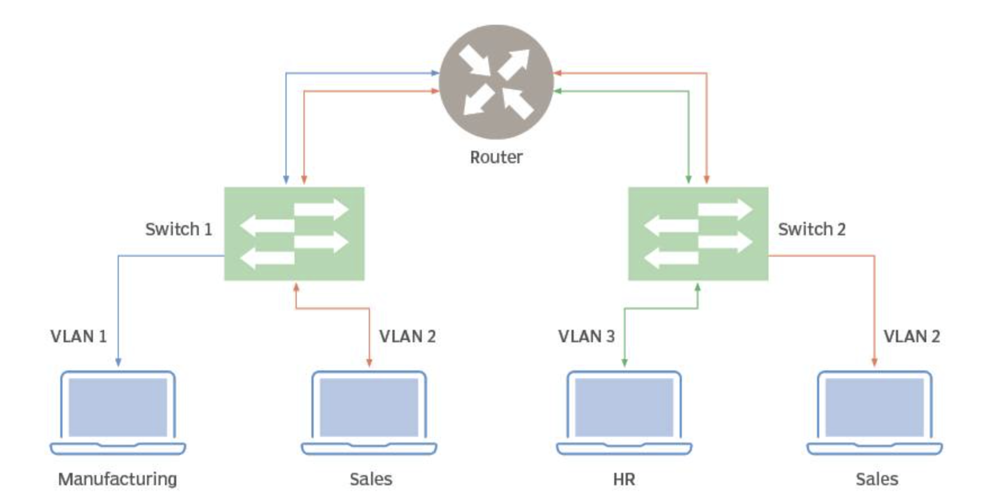

# VLAN-OVERVIEW.

## I. MỘ SỐ KHÁI NIỆM.

### 1.1. LAN LÀ GÌ?

LAN là một mạng cục bộ (viết tắt của Local Area Network), được định nghĩa là tất cả các máy tính trong cùng một miền quảng bá (broadcast domain).

### 1.2. VLAN LÀ GÌ?

VLAN là một mạng LAN ảo. Về mặt kỹ thuật, VLAN là một miền quảng bá được tạo bởi các switch. Bình thường thì router đóng vai trò tạo ra miền quảng bá. Đối với VLAN, switch có thể tạo ra miền quảng bá.

Bạn có thể hiểu một cách dễ hơn là VLAN dùng để chia một con switch thành nhiều con switch nhỏ hơn và hoàn toàn độc lập với nhau.

## II. CẤU TRÚC HOẠT ĐỘNG.

Cấu trúc của một mạng các VLAN gồm 3 tầng thiết bị như hình dưới.          

- Tầng 1: là Router làm nhiệm vụ định tuyến giữa các VLAN         

- Tầng 2: là các switch. Trên các cổng của mỗi switch chia thành các VLAN          

- Tầng 3: là các workstation

## III. LỢI ÍCH KHI DÙNG VLAN.

- Tiết kiệm băng thông của mạng: Do VLAN có thể chia nhỏ LAN thành các đoạn khác nhau.

- Khi gửi 1 gói tin , nó sẽ chỉ gửi trong một VLAN duy nhất, không truyền ở các VLAN khác nên giảm được lưu lượng, tiết kiệm được băng thông đường truyền, không làm giảm tốc độ đường truyền.

- Tăng khả năng bảo mật: Các VLAN khác nhau không truy cập được vào nhau (trừ khi có khai báo định tuyến). Nếu có sự cố của một VLAN cũng không là ảnh hưởng tới VLAN khác.

- Dễ dàng thêm hay bớt các máy tính vào VLAN: Trên một switch nhiều cổng, có thể cấu hình VLAN khác nhau cho từng cổng, do đó dễ dàng kết nối thêm các máy tính với các VLAN.

- Mạng có tính linh động cao: VLAN có thể dễ dàng di chuyển các thiết bị. VLAN có thể được cấu hình tĩnh hay động. Trong cấu hình tĩnh, người quản trị mạng phải cấu hình cho từng cổng của mỗi switch. Sau đó, gán cho nó vào một VLAN nào đó. Trong cấu hình động mỗi cổng của switch có thể tự cấu hình VLAN cho mình dựa vào địa chỉ MAC của thiết bị được kết nối vào.

## IV. PHÂN LOẠI VLAN.

Có 3 loại VLAN, bao gồm:

* VLAN dựa trên cổng (port based VLAN): Mỗi cổng (Ethernet hoặc Fast Ethernet) được gắn với một VLAN xác định. Do đó mỗi máy tính/thiết bị host kết nối với một cổng của switch đều thuộc một VLAN nào đó. Đây là cách cấu hình VLAN đơn giản và phổ biến nhất.

* VLAN dựa trên địa chỉ vật lý MAC (MAC address based VLAN): Mỗi địa chỉ MAC được gán tới một VLAN nhất định. Cách cấu hình này rất phức tạp và khó khăn trong việc quản lý.

* VLAN dựa trên giao thức (protocol based VLAN): tương tự với VLAN dựa trên địa chỉ MAC nhưng sử dụng địa chỉ IP thay cho địa chỉ MAC. Cách cấu hình này không được thôngdụng.

## IV. CÁCH HOẠT ĐỘNG.

Một VLAN được xác định trên các switch bằng một ID VLAN. Mỗi cổng trên một switch sẽ được gán cho một hoặc nhiều VLAN ID, trường hợp không được chỉ định thì nó sẽ được chuyển tới một VLAN mặc định. Mỗi VLAN sẽ cung cấp quyền truy cập dữ liệu cho tất cả những thiết bị kết nối với cổng trên switch phù hợp với VLAN ID của nó.

ID VLAN sẽ được dịch sang thẻ VLAN bằng một thẻ 12 bit xác định tối đa 4.096 VLAN trên mỗi miền chuyển mạch. IEEE sẽ chịu trách nhiệm gắn thẻ VLAN theo tiêu chuẩn 802.1Q. Switch sẽ thêm thẻ VLAN cho khung Ethernet. Với Static VLAN, switch sẽ chèn thẻ được liên kết với ID VLAN của cổng nhập. Riêng Dynamic VLAN, switch sẽ chèn thẻ được liên kết với ID của thiết bị đó hoặc loại lưu lượng mà nó tạo ra.

Các khung Ethernet được gắn thẻ sẽ chuyển tiếp về địa chỉ MAC đích của chúng (chỉ chuyển tiếp đến các cổng có liên kết VLAN). Lưu lượng quảng bá (broadcast), unicast, multicast đều được chuyển tiếp đến các cổng trong VLAN.

Đường trung kế kết nối (Truck) giữa các switch nhận biết được VLAN nào trải dài trên switch. Truck còn đóng vai trò truyền lưu lượng truy cập cho các VLAN được sử dụng ở hai phía đầu, cuối của nó. Khi một khung chạm đến switch đích thì thẻ VLAN sẽ bị xóa trước khi khung được truyền tới máy tính đích.

Spanning Tree Protocol ( STP )là một giao thức được dùng để ngăn chặn sự lặp vòng giữa các switch trong mỗi miền lớp 2 (Ethernet). Mỗi VLAN sẽ chạy một STP riêng biệt, không phụ thuộc lẫn nhau. Nếu cấu trúc liên kết giữa nhiều VLAN giống nhau thì có thể chạy STP đa trường hợp để giảm chi phí STP.

## V. GIAO THỨC SỬ DỤNG 

## Vi. ĐƯỜNG ACCESS VÀ ĐƯỜNG TRUNKING

### 6.1 ĐƯỜNG ACCESS.

- Một cổng trên Switch sẽ hoạt động trong chế độ cổng truy nhập (Access link) hoặc cổng trung kế (Trunk link).

- Trong chế độ cổng truy nhập, cổng chỉ thuộc một VLAN. Tất cả các máy tính cắm vào cổng mày đều thuộc VLAN đó.

- Frame được gửi trên cổng truy nhập sẽ tuân theo chuẩn định dạng khung ethernet (802.3).

- Cổng truy nhập thường dùng khi cổng được kết nối đến máy trạm.

### 6.2. ĐƯỜNG TRUNKING

- Cổng trung kế (Trunk link) là một kết nối vật lý và logic để hỗ trợ các VLAN trên các Switch liên kết với nhau.

- Cổng trung kế cho phép frame của nhiều VLAN có thể truyền trên đó. Một cổng trung kế không được gán cho một VLAN riêng biệt.

- Cổng trung kế thường được dùng để kết nối giữa các Switch hoặc giữa Switch và Router. Chính vì vậy cổng trung kế thường là cổng có băng thông lớn.

- Các VLAN được ghép kênh qua cổng trung kế. Để ghép kênh lưu lượng của các VLAN, một giao thức đặc biệt sẽ được sử dụng để đóng gói frame để thiết bị có thể xác định được nó thuộc VLAN nào. Chuẩn frame được sử dụng đó là 802.1Q hoặc ISL.

- Nhờ cổng trung kế mà một VLAN có thể được mở rộng ra toàn mạng.

- Chỉ cần một đường vật lý cho cả hai VLAN giữa hai Switch.

---
*Danh mục tài liệu tham khảo*

[1] https://www.dienmayxanh.com/kinh-nghiem-hay/vlan-la-gi-co-can-thiet-su-dung-khong-lam-the-nao-1137273 

[2] https://www.daihockhonggiay.com/blogs/post/gioi-thieu-ve-vlan#:~:text=Tr%C3%AAn%20m%E1%BB%99t%20Switch%20v%E1%BA%ADt%20l%C3%BD,c%C3%B3%20c%E1%BB%95ng%20t%E1%BB%AB%2016%2D24.

[3] https://bkhost.vn/blog/vlan/

