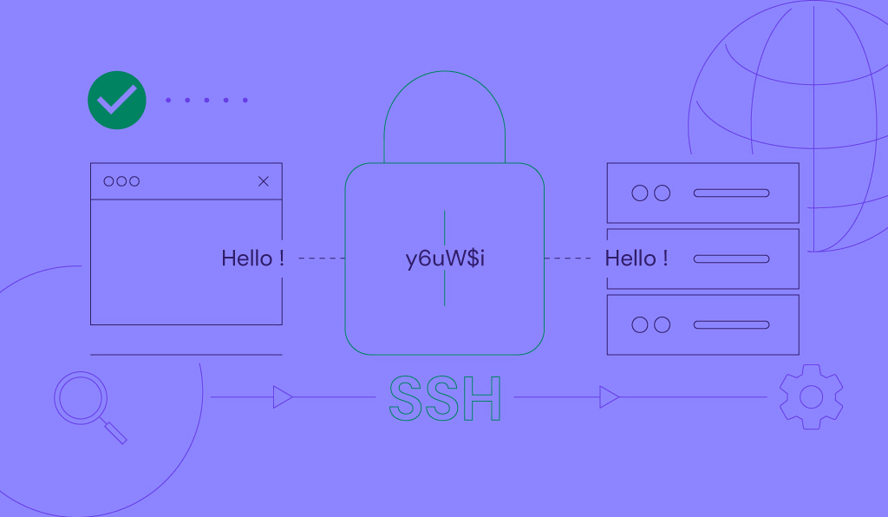
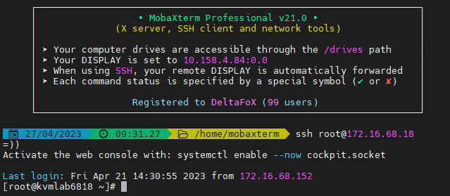
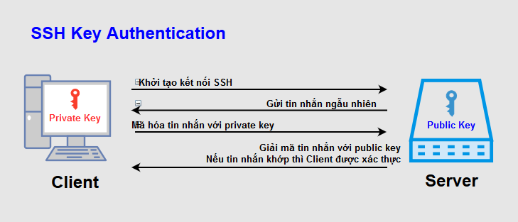
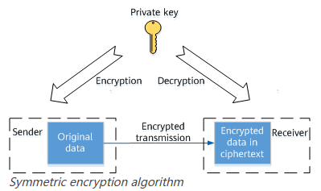
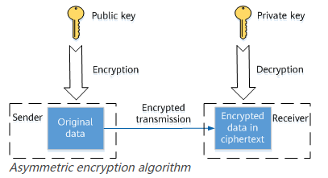
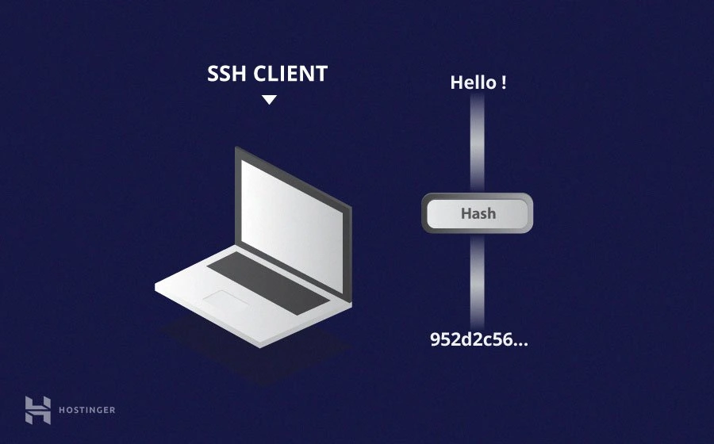
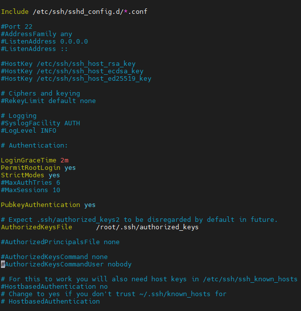

# Tìm hiểu về SSH
## 1. SSH là gì ?

**SSH (Secure Shell)** là một giao thức mạng được sử dụng để thiết lập kết nối mạng an toàn giữa các thiết bị từ xa. SSH cho phép người dùng truy cập và điều khiển các thiết bị từ xa thông qua một kết nối được mã hóa, bảo mật hơn so với các giao thức khác như Telnet. SSH cung cấp một cách an toàn để truyền tải dữ liệu và các lệnh giữa các thiết bị mạng từ xa.

SSH sử dụng phương thức mã hóa để đảm bảo rằng tất cả dữ liệu được truyền đi và đến từ thiết bị từ xa đều được bảo mật. Các lệnh và dữ liệu được mã hóa và giải mã khi truyền qua mạng, đảm bảo rằng những người không có quyền truy cập không thể đọc hoặc hiểu được nội dung.

SSH được sử dụng rộng rãi trong các môi trường mạng doanh nghiệp và các hệ thống máy chủ, nơi mà việc truy cập từ xa và quản lý các thiết bị mạng là rất quan trọng. Ngoài ra, SSH cũng được sử dụng cho các mục đích khác như truyền tệp tin an toàn giữa các thiết bị từ xa và thực hiện các tác vụ tự động trên các hệ thống máy chủ.

Ví dụ dưới đây cho thấy một lời nhắc SSH điển hình. Bất kỳ người dùng Linux hoặc macOS nào có thể SSH vào máy chủ từ xa của họ trực tiếp từ cửa sổ terminal. Bạn có thể thực thi các lệnh shell theo cùng cách như bạn sẽ làm nếu bạn đang vận hành máy tính từ xa.

### **1.1. Một số đặc điểm của SSH**

1. **Bảo mật cao**: SSH được thiết kế để cung cấp một cách an toàn để truyền tải dữ liệu và các lệnh giữa các thiết bị từ xa. Nó sử dụng mã hóa để đảm bảo rằng dữ liệu truyền đi và đến từ thiết bị từ xa được bảo mật, không bị những người không có quyền truy cập đọc được.

2. **Xác thực người dùng**: SSH cung cấp các phương thức xác thực khác nhau, bao gồm mật khẩu, chứng chỉ số, mã thông báo động (OTP) và các phương thức xác thực khác. Điều này đảm bảo rằng chỉ những người được ủy quyền mới có thể truy cập và điều khiển các thiết bị từ xa.

3. **Điều khiển từ xa**: SSH cho phép người dùng điều khiển các thiết bị từ xa thông qua một kết nối bảo mật. Bất kỳ lệnh hoặc tác vụ nào mà người dùng có thể thực hiện trên thiết bị từ xa thông qua một phiên SSH đều được xử lý như nếu người dùng đang ngồi trước thiết bị đó.

4. **Đa nền tảng**: SSH có sẵn trên nhiều nền tảng, bao gồm Linux, macOS, Windows và các hệ điều hành khác. Điều này cho phép người dùng truy cập và điều khiển các thiết bị từ xa từ bất kỳ nền tảng nào mà họ đang sử dụng.

5. **Tích hợp với các công cụ khác**: SSH có thể được tích hợp với các công cụ khác để thực hiện các tác vụ tự động, kiểm tra hệ thống, sao lưu và khôi phục dữ liệu và các tác vụ khác.

### **1.2. SSH forwarding**

**SSH forwarding** là một tính năng của giao thức SSH cho phép người dùng truy cập và sử dụng các dịch vụ từ xa thông qua một máy chủ trung gian. Điều này cho phép người dùng truy cập các dịch vụ từ xa một cách an toàn và bảo mật hơn

**Các kiểu chuyển tiếp SSH:**

1. **Chuyển tiếp cổng (Port forwarding)**: Cho phép người dùng truy cập các dịch vụ từ xa thông qua một cổng địa phương trên máy tính của mình. Ví dụ, nếu người dùng muốn truy cập máy chủ web từ xa, họ có thể sử dụng chuyển tiếp cổng để truy cập dịch vụ HTTP trên máy chủ từ xa thông qua một cổng địa phương trên máy tính của mình.

2. **Chuyển tiếp đối tượng (Agent forwarding)**: Cho phép người dùng truy cập các dịch vụ từ xa mà yêu cầu xác thực SSH một cách bảo mật hơn. Ví dụ, nếu người dùng muốn truy cập một máy chủ từ xa mà yêu cầu xác thực bằng cách sử dụng khóa SSH, họ có thể sử dụng chuyển tiếp đối tượng để chuyển tiếp các thông tin xác thực từ máy tính của mình đến máy chủ từ xa.

3. **Chuyển tiếp SOCKS**: Cho phép người dùng sử dụng các ứng dụng mạng từ xa một cách bảo mật. Ví dụ, người dùng có thể sử dụng chuyển tiếp SOCKS để truy cập trang web bị chặn thông qua máy chủ trung gian của mình.

4. **Chuyển tiếp X11**: Cho phép người dùng chạy các ứng dụng X Window System từ xa thông qua một máy chủ trung gian. Ví dụ, người dùng có thể sử dụng chuyển tiếp X11 để chạy một ứng dụng đồ họa trên máy chủ từ xa và hiển thị nó trên máy tính của mình.

5. **Chuyển tiếp quyền sudo**: Cho phép người dùng chạy các lệnh với quyền sudo từ xa một cách bảo mật. Ví dụ, người dùng có thể sử dụng chuyển tiếp quyền sudo để thực thi các lệnh với quyền root trên máy chủ từ xa.

Tùy thuộc vào nhu cầu sử dụng của người dùng, các kiểu chuyển tiếp SSH này có thể được kích hoạt hoặc tắt trong cấu hình SSH của máy chủ và máy tính cá nhân.

### **1.3. Các thành phần trong SSH**

Giao thức SSH (Secure Shell) bao gồm nhiều thành phần khác nhau để đảm bảo tính bảo mật và hiệu suất của kết nối. Các thành phần chính trong SSH bao gồm:

1. **SSH Client**: Là một phần mềm được cài đặt trên máy tính của người dùng và được sử dụng để kết nối đến máy chủ từ xa. SSH client sẽ gửi yêu cầu đến SSH server để mở một phiên làm việc từ xa trên máy chủ.

2. **SSH Server**: Là phần mềm chạy trên máy chủ và chấp nhận các yêu cầu từ SSH client để mở phiên làm việc từ xa. Khi một kết nối được thiết lập, SSH server sẽ xác thực người dùng và cho phép họ truy cập vào hệ thống từ xa.

3. **SSH Key**: Là một cặp khóa bao gồm khóa riêng tư và khóa công khai, được sử dụng để xác thực người dùng và mã hóa dữ liệu trong quá trình kết nối. Người dùng có thể sử dụng khóa riêng tư để xác thực với máy chủ từ xa mà không cần phải nhập mật khẩu.

4. **SSH Authentication**: Là quá trình xác thực người dùng trên máy chủ từ xa để đảm bảo tính bảo mật cho kết nối SSH. SSH hỗ trợ nhiều phương thức xác thực như mật khẩu, khóa SSH và X.509.

5. **SSH Tunneling**: Là kỹ thuật cho phép người dùng truyền dữ liệu qua một kết nối SSH bảo mật. Các dữ liệu được mã hóa trước khi truyền qua mạng, đảm bảo tính bảo mật của thông tin.

6. **SSH Port Forwarding**: Cho phép người dùng chuyển tiếp các cổng trên máy chủ từ xa để truy cập các dịch vụ từ xa. 

Các thành phần này cùng hoạt động để đảm bảo tính bảo mật và hiệu suất của kết nối SSH khi người dùng truy cập máy chủ từ xa.

### **1.4. Cơ chế hoạt động của SSH**

Bao gồm các bước sau đây:

1. **Thiết lập kết nối**: Khi người dùng yêu cầu kết nối SSH tới remote server, SSH client sẽ gửi yêu cầu kết nối tới SSH server.

2. **Xác thực người dùng**: Sau khi kết nối được thiết lập, SSH server yêu cầu người dùng xác thực bằng cách yêu cầu nhập mật khẩu hoặc sử dụng các phương pháp xác thực khác như public key.

3. **Quá trình mã hóa**: Khi xác thực được thực hiện, các thông tin truyền tải giữa client và server sẽ được mã hóa bằng cách sử dụng phương thức mã hóa đối xứng như AES hoặc Blowfish.

4. **Tạo tunnel**: SSH cung cấp tính năng tạo ra một tunnel để chuyển tiếp lưu lượng dữ liệu giữa client và server. Điều này đảm bảo rằng thông tin được truyền tải thông qua kết nối SSH sẽ được bảo mật.

5. **Thực thi lệnh**: Sau khi kết nối SSH được thiết lập, người dùng có thể thực thi các lệnh trên remote server thông qua SSH client.

6. **Kết thúc kết nối**: Khi người dùng kết thúc phiên làm việc, kết nối SSH sẽ được đóng.

Cơ chế hoạt động của SSH đảm bảo tính bảo mật cao khi truyền tải thông tin giữa client và server, bằng cách sử dụng phương thức mã hóa và xác thực để đảm bảo rằng thông tin chỉ được truyền tải giữa các bên đã được xác thực và được mã hóa.

### **1.5. SSH Port Number**

SSH được sử dụng để cung cấp các dịch vụ bảo mật khác nhau như SSH, SCP, SFTP, NETCONF, v.v. Các dịch vụ này có thể sử dụng cổng mặc định là cổng 22 hoặc các cổng khác tùy thuộc vào cách cấu hình. Khi cổng SSH được thay đổi, tất cả các kết nối hiện tại sẽ bị ngắt kết nối và máy chủ SSH sẽ bắt đầu lắng nghe trên cổng mới được chỉ định. Tuy nhiên, việc sử dụng các cổng khác thay vì cổng mặc định cũng có thể gây ra những vấn đề về tính bảo mật, do đó cần cân nhắc cẩn thận trước khi thay đổi cổng SSH.

### **1.6. SSH key**

#### Khái niệm
- SSH key là một cặp key được tạo ra bởi người dùng và được sử dụng để xác thực cho việc kết nối SSH đến một máy chủ từ một thiết bị khác
- Key bao gồm một public key (khóa công khai) và private key (khóa bí mật) được lưu trữ trên máy chủ và thiết bị của người dùng. Khi thiết lập kết nối SSH, public key được gửi đến máy chủ để xác thực người dùng, sau đó private key được sử dụng để giải mã kết nối SSH. 
#### Các thành phần

Khi tạo SSH Key thì sẽ có 3 thành phần quan trọng:

1. **Public Key**: Là phần được sao chép và đưa vào file `authorized_keys` trên server để xác thực cho quá trình đăng nhập vào server bằng SSH. Public Key này có thể được lưu dưới dạng file hoặc chuỗi ký tự.

2. **Private Key**: Là phần được lưu trữ trên máy tính của người dùng để xác thực cho quá trình đăng nhập vào server bằng SSH. Private Key này cần được bảo mật và không được chia sẻ với bất kỳ ai khác. Private Key cũng có thể được lưu dưới dạng file hoặc chuỗi ký tự.

3. **Passphrase**: Là mật khẩu được sử dụng để mã hóa Private Key và bảo vệ nó khỏi các cuộc tấn công. Passphrase này được yêu cầu khi người dùng đăng nhập vào server bằng SSH và cần được ghi nhớ để tránh mất Private Key.

SSH key hoạt động bằng cách sử dụng cặp key gồm Public Key và Private Key. Khi người dùng đăng nhập vào một server thông qua SSH key, thay vì phải nhập mật khẩu, máy chủ yêu cầu người dùng cung cấp Public Key tương ứng với Private Key đã được lưu trữ trước đó trên máy tính của người dùng.

Khi đăng nhập, máy chủ sẽ gửi cho máy tính của người dùng một thông điệp dùng Public Key đã được lưu trữ để kiểm tra tính xác thực. Nếu Public Key trùng khớp với Private Key được lưu trữ trên máy tính, máy chủ sẽ xác thực người dùng và cho phép truy cập vào server mà không cần phải yêu cầu mật khẩu.

Điều này giúp tăng tính bảo mật và tiện lợi cho người dùng. Nếu người dùng muốn truy cập vào nhiều server khác nhau, họ chỉ cần lưu trữ cặp Public Key và Private Key tương ứng trên máy tính của mình và sử dụng chúng để đăng nhập vào các server mà không cần phải ghi nhớ mật khẩu cho mỗi tài khoản trên từng server.

## **2. Các kỹ thuật mã hóa**

Một trong những lợi thế quan trọng của SSH so với các tiền bối của nó như Telnet và rlogin là khả năng cung cấp giao tiếp an toàn giữa máy khách và máy chủ thông qua việc sử dụng mã hóa. Máy chủ (host) được hiểu là máy chủ từ xa mà bạn đang cố gắng truy cập, trong khi máy khách (client) là máy tính mà bạn đang sử dụng để truy cập máy chủ

Có 3 công nghệ mã hóa khác nhau được SSH sử dụng:
- Mã hóa đối xứng
- Mã hóa bất đối xứng
- Hàm băm

### **2.1. Mã hóa đối xứng**

**Mã hóa đối xứng** là một hình thức mã hóa trong đó khóa bí mật được sử dụng cho cả mã hóa và giải mã tin nhắn của cả máy khách và máy chủ. Thực tế, bất kỳ ai sở hữu khóa đều có thể giải mã tin nhắn đang được chuyển.

Trong SSH, các thuật toán mã hóa đối xứng được sử dụng bao gồm AES (Advanced Encryption Standard), Blowfish và 3DES (Triple Data Encryption Standard). AES là một thuật toán mã hóa đối xứng được sử dụng phổ biến nhất trong SSH và được xem là một trong những thuật toán mã hóa đối xứng an toàn và hiệu quả nhất hiện nay.

Để sử dụng mã hóa đối xứng trong SSH, một khóa đối xứng sẽ được tạo ra khi máy khách kết nối đến máy chủ, và sau đó được sử dụng để mã hóa và giải mã dữ liệu truyền qua kết nối. Khóa đối xứng sẽ được tạo ra bằng cách sử dụng các thuật toán mã hóa bất đối xứng, như RSA hoặc DSA, để tạo ra các khóa đối xứng.

Mã hóa đối xứng là một phương thức mã hóa hiệu quả và nhanh chóng, đảm bảo tính bảo mật và toàn vẹn cho dữ liệu truyền tải trong kết nối SSH.

### **2.2. Mã hóa bất đối xứng**

**Mã hóa bất đối xứng (asymmetric encryption)** là một phương thức mã hóa được sử dụng trong SSH để tạo ra các khóa công khai (public key) và khóa bí mật (private key). Khóa công khai và khóa bí mật là hai khóa liên quan đến nhau, được sử dụng để mã hóa và giải mã thông tin.

Trong mã hóa bất đối xứng, khóa công khai được chia sẻ với mọi người, trong khi khóa bí mật chỉ được giữ bí mật và không được chia sẻ với bất kỳ ai khác. Khi một thông điệp được mã hóa bằng khóa công khai, nó chỉ có thể được giải mã bằng khóa bí mật tương ứng.

Trong SSH, các thuật toán mã hóa bất đối xứng được sử dụng để tạo ra các khóa công khai và khóa bí mật, và cũng được sử dụng để tạo ra các khóa đối xứng dùng trong mã hóa đối xứng. Một trong những thuật toán mã hóa bất đối xứng phổ biến được sử dụng trong SSH là RSA (Rivest-Shamir-Adleman).

Trong quá trình tạo khóa, thuật toán RSA sẽ sử dụng hai số nguyên tố lớn để tạo ra khóa công khai và khóa bí mật. Khóa công khai sẽ được chia sẻ với mọi người, trong khi khóa bí mật sẽ được giữ bí mật bởi chủ sở hữu của nó.

Khi máy khách kết nối đến máy chủ SSH, máy chủ sẽ gửi khóa công khai của nó đến máy khách. Máy khách sẽ sử dụng khóa công khai này để mã hóa thông điệp và gửi nó đến máy chủ. Máy chủ sau đó sẽ sử dụng khóa bí mật của mình để giải mã thông điệp.

Mã hóa bất đối xứng là một phương pháp mã hóa mạnh và an toàn được sử dụng trong SSH để bảo vệ tính bảo mật và toàn vẹn của thông tin truyền qua mạng. 

### **2.3. Hàm băm**

**Hàm băm (hash function)** là một công cụ mã hóa được sử dụng trong SSH để bảo mật dữ liệu trong quá trình truyền tải. Hàm băm thực hiện việc chuyển đổi một chuỗi dữ liệu có độ dài bất kỳ thành một giá trị cố định có độ dài cố định.

Một trong những hàm băm được sử dụng phổ biến trong SSH là SHA-2 (Secure Hash Algorithm 2). Thuật toán SHA-2 tạo ra một giá trị băm có độ dài 256 bit từ một đầu vào có độ dài bất kỳ. Giá trị băm này được sử dụng để xác thực tính toàn vẹn của dữ liệu truyền tải.

Khi một tệp tin được gửi qua SSH, giá trị băm của nó sẽ được tính toán và gửi cùng với tệp tin. Khi tệp tin đến đích, giá trị băm sẽ được tính toán lại và so sánh với giá trị băm ban đầu. Nếu giá trị băm tính toán được khớp với giá trị băm ban đầu, điều đó chứng tỏ tệp tin không bị thay đổi trong quá trình truyền tải. Ngược lại, nếu giá trị băm tính toán không khớp với giá trị băm ban đầu, điều đó cho thấy rằng tệp tin đã bị thay đổi.

Hàm băm cũng được sử dụng trong SSH để xác thực danh tính của máy chủ. Khi kết nối đến một máy chủ SSH lần đầu tiên, máy khách sẽ nhận được giá trị băm của khóa công khai của máy chủ. Máy khách sẽ so sánh giá trị băm này với giá trị băm đã biết trước đó của máy chủ. Nếu hai giá trị băm khớp nhau, điều đó cho thấy rằng máy chủ được xác thực và an toàn để kết nối đến.

### **2.4. SSH hoạt động như thế nào với các kỹ thuật mã hóa này**

SSH sử dụng các kỹ thuật mã hóa đối xứng và bất đối xứng cùng với hàm băm để bảo vệ tính bảo mật và toàn vẹn của thông tin trong quá trình truyền tải. Quá trình hoạt động của SSH với các kỹ thuật mã hóa này như sau:

1. Đầu tiên, khi máy khách kết nối đến máy chủ SSH, máy chủ sẽ gửi khóa công khai của mình đến máy khách. Khóa công khai này sẽ được sử dụng trong quá trình mã hóa thông điệp từ máy khách.

2. Sau đó, máy khách sẽ tạo một khóa phiên ngẫu nhiên để sử dụng trong quá trình truyền tải thông điệp. Khóa phiên này sẽ được mã hóa bằng khóa công khai của máy chủ và gửi đến máy chủ.

3. Máy chủ sẽ sử dụng khóa bí mật của mình để giải mã khóa phiên và sử dụng khóa phiên này để mã hóa thông điệp từ máy khách. Trong quá trình này, các thuật toán mã hóa đối xứng như AES hay Blowfish có thể được sử dụng.

4. Khi thông điệp được gửi từ máy khách đến máy chủ, giá trị băm của thông điệp sẽ được tính toán và gửi cùng với thông điệp. Giá trị băm này sẽ được sử dụng để xác thực tính toàn vẹn của thông điệp đến máy chủ.

5. Khi máy chủ nhận được thông điệp, nó sẽ sử dụng khóa phiên để giải mã thông điệp và tính toán lại giá trị băm. Nếu giá trị băm tính toán được khớp với giá trị băm được gửi cùng với thông điệp, điều đó cho thấy rằng thông điệp đã được gửi đến máy chủ một cách toàn vẹn và không bị thay đổi.

Như vậy, SSH sử dụng các kỹ thuật mã hóa đối xứng và bất đối xứng cùng với hàm băm để đảm bảo tính bảo mật và toàn vẹn của thông tin trong quá trình truyền tải. Điều này giúp người dùng có thể kết nối đến các máy chủ từ xa một cách an toàn và bảo mật.

## **3. Xác thực người dùng**

Xác thực người dùng là quá trình xác định xem người dùng đang truy cập vào hệ thống có được ủy quyền để thực hiện các hành động hay không. Trong SSH, quá trình xác thực người dùng thường được thực hiện bằng cách sử dụng tên người dùng và mật khẩu.

Khi người dùng cố gắng kết nối đến một máy chủ SSH, họ sẽ được yêu cầu cung cấp tên người dùng và mật khẩu. Thông tin này sẽ được gửi đến máy chủ để xác thực. Nếu tên người dùng và mật khẩu được chấp nhận, người dùng sẽ được cho phép truy cập vào hệ thống.

Tuy nhiên, để tăng cường tính bảo mật, SSH cũng hỗ trợ các phương pháp xác thực khác như khóa công khai và chứng chỉ số. Trong phương pháp này, thay vì sử dụng mật khẩu, người dùng sẽ tạo một cặp khóa công khai và khóa bí mật trên máy tính của họ. Khóa công khai sẽ được gửi đến máy chủ SSH để xác thực. Khi người dùng cố gắng kết nối đến máy chủ, họ sẽ được yêu cầu cung cấp khóa bí mật để chứng minh họ là người sở hữu khóa công khai đó. Quá trình xác thực này sử dụng các thuật toán mã hóa đối xứng và bất đối xứng để đảm bảo tính bảo mật của thông tin xác thực.

Tổng quát, SSH cung cấp các phương pháp xác thực khác nhau để đảm bảo tính bảo mật và xác thực người dùng khi kết nối đến máy chủ. Người dùng có thể lựa chọn phương pháp xác thực phù hợp nhất với nhu cầu của họ.

## **4. Đàm phán mã hóa phiên**

Đàm phán mã hóa phiên là quá trình trong SSH để thỏa thuận trên một phương thức mã hóa cho phiên truy cập SSH hiện tại. Khi người dùng kết nối đến máy chủ SSH, máy chủ sẽ gửi một danh sách các phương thức mã hóa hỗ trợ cho người dùng.

Sau đó, người dùng sẽ chọn một phương thức mã hóa phù hợp và thông báo cho máy chủ. Máy chủ sẽ chấp nhận phương thức này nếu nó được hỗ trợ và tiếp tục quá trình kết nối với phương thức mã hóa đã chọn.

Các phương thức mã hóa thường được sử dụng trong SSH bao gồm mã hóa đối xứng như AES, IDEA, Blowfish, và mã hóa bất đối xứng như RSA, DSA, và ECDSA. Tuy nhiên, để đảm bảo tính bảo mật của thông tin truyền qua mạng, các phiên bản SSH mới đã loại bỏ hoặc giới hạn sử dụng các phương thức mã hóa yếu hoặc bị lỗi.

Quá trình đàm phán mã hóa phiên trong SSH rất quan trọng để đảm bảo tính bảo mật và xác thực cho phiên truy cập. Bằng cách sử dụng phương thức mã hóa mạnh và bảo vệ khóa mã hóa được sử dụng, SSH đảm bảo rằng thông tin truyền qua mạng được bảo vệ khỏi các cuộc tấn công của tin tặc.

## **5. Các trường trong file sshd_config

Trong tệp cấu hình `/etc/ssh/sshd_config`, có nhiều trường (option) khác nhau để cấu hình các thiết lập và tùy chọn cho máy chủ SSH. Dưới đây là một số trường phổ biến và ý nghĩa của chúng:

1. `Port`: Số cổng mà máy chủ SSH lắng nghe để chấp nhận kết nối SSH (mặc định là 22).
2. `ListenAddress`: Địa chỉ IP mà máy chủ SSH lắng nghe kết nối (mặc định là tất cả các địa chỉ IP trên máy chủ).
3. `PermitRootLogin`: Xác định liệu phép đăng nhập trực tiếp bằng tài khoản root được phép hay không (có thể là "yes", "no" hoặc "prohibit-password").
4. `PasswordAuthentication`: Xác định liệu xác thực mật khẩu từ xa được phép hay không (có thể là "yes" hoặc "no").
5. `PubkeyAuthentication`: Xác định liệu xác thực khóa công khai (public key) từ xa được phép hay không (có thể là "yes" hoặc "no").
6. `AllowUsers`: Liệt kê danh sách các tên người dùng được phép đăng nhập vào máy chủ SSH.
7. `DenyUsers`: Liệt kê danh sách các tên người dùng bị từ chối đăng nhập vào máy chủ SSH.
8. `AllowGroups`: Liệt kê danh sách các nhóm người dùng được phép đăng nhập vào máy chủ SSH.
9. `DenyGroups`: Liệt kê danh sách các nhóm người dùng bị từ chối đăng nhập vào máy chủ SSH.
10. `HostKey`: Đường dẫn tới các tệp khóa máy chủ (host key) sử dụng bởi máy chủ SSH.
11. `LogLevel`: Mức độ chi tiết của các thông báo ghi lại trong các tệp log SSH (có thể là "QUIET", "FATAL", "ERROR", "INFO" hoặc "DEBUG").

Đây chỉ là một số trường cấu hình phổ biến trong tệp `/etc/ssh/sshd_config`. Tùy thuộc vào phiên bản SSH và cấu hình cụ thể của máy chủ SSH, có thể có nhiều trường khác nhau có thể được sử dụng.

# Tài liệu tham khảo

1. https://www.hostinger.com/tutorials/ssh-tutorial-how-does-ssh-work
2. https://info.support.huawei.com/info-finder/encyclopedia/en/SSH.html
3. https://vi.wikipedia.org/wiki/SSH
4. https://github.com/danghai1996/thuctapsinh/blob/master/HaiDD/SSH/docs/01-ssh.md