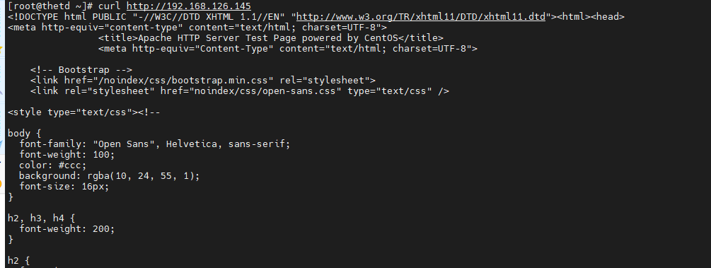
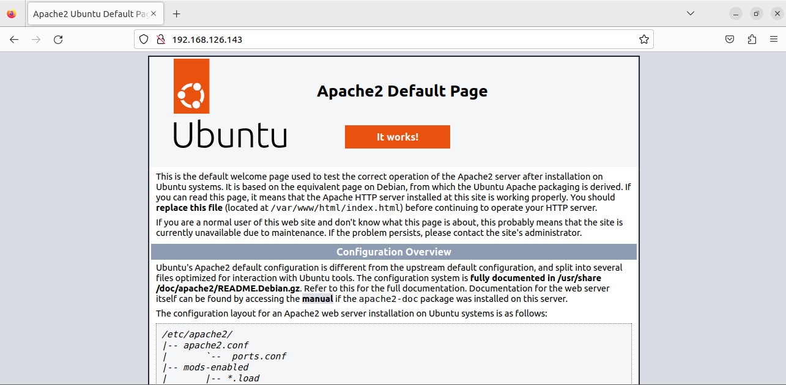

# 1. Tìm hiểu về Apache Web Server

Apache là phần mềm web server miễn phí mã nguồn mở, tên chính thức là **Apache HTTP Server**, được điều hành và phát triển bởi Apache Software Foundation

Nó giúp chủ Website đưa nội dung lên web - vì vậy nó hay được gọi là Web server, phiên bản đầu tiên đã ra mắt 20 năm trước (những năm 1995)

## 1.1. Web Server là gì 

Web server là một server vật lý hay một máy chủ ảo cài phần mềm chuyên biệt để cung cấp dịch vụ Word Wide Web, điển hình là Apache

Nhiệm vụ của web server là đưa website lên internet. Để làm được điều đó, nó hoạt động giống như là một người đứng giữa server và máy khách (client). Nó sẽ kéo nội dung từ server về cho mỗi một truy vấn xuất phát từ máy khách để hiển thị kết quả tương ứng dưới hình thức là một website

## 1.2. Apache Web Server hoạt động như nào 

Mặc dù gọi Apache là Web server, nhưng nó lại không phải là server vật lý, nó là một phần mềm chạy trên server đó. Công việc của nó là thiết lập kết nối giữa server và trình duyệt người dùng (Firefox, Google,...) rồi chuyển file tới và lui giữa chúng (Cấu trúc 2 chiều dạng Client-Server). 

Khi một khách truy cập tải một trang web trên website của bạn, trình duyệt người dùng sẽ gửi yêu cầu tải trang web đó lên server và Apache sẽ trả kết quả với tất cả đầy đủ các file cấu hianhf nên trang web (hình ảnh, chữ, vv). Server và Client giao tiếp với nhau qua giao thức HTTP và Apache chịu trách nhiện cho việc đảm bảo tiến trình này diễn ra mượt mà và bảo mật giữa hai máy.

# 2. Cài đặt Web Server Apache trên CentOS và Ubuntu

Để cài đặt web server Apache trên CentOS và Ubuntu, bạn có thể làm theo các bước sau:

## 2.1. Cài đặt Apache trên CentOS
1. Mở terminal và đăng nhập vào máy chủ CentOS với quyền root hoặc quyền sudo.

2. Chạy lệnh sau để cài đặt Apache:
```sh
sudo yum install httpd
```

3. Sau khi quá trình cài đặt hoàn tất, bạn có thể khởi động dịch vụ Apache bằng lệnh:
```sh
sudo systemctl start httpd
```

4. Để Apache khởi động cùng hệ thống, chạy lệnh sau:
```sh
sudo systemctl enable httpd
```

5. Kiểm tra trạng thái của dịch vụ Apache:
```sh
sudo systemctl status httpd
```




## 2.2. Cài đặt Apache trên Ubuntu
1. Mở terminal và đăng nhập vào máy chủ Ubuntu với quyền root hoặc quyền sudo.

2. Chạy lệnh sau để cài đặt Apache:
```sh
sudo apt update
sudo apt install apache2
```

3. Sau khi quá trình cài đặt hoàn tất, dịch vụ Apache sẽ tự động được khởi động. Bạn có thể kiểm tra trạng thái của Apache bằng lệnh:
```sh
sudo systemctl status apache2
```


4. Để Apache khởi động cùng hệ thống, chạy lệnh sau:
```sh
sudo systemctl enable apache2
```


5. Bạn có thể truy cập vào trang web mặc định của Apache bằng cách mở trình duyệt và nhập địa chỉ IP của máy chủ Ubuntu vào thanh địa chỉ. Ví dụ: `http://your_server_ip`



# 3. File Log Apache

## 3.1. Đường dẫn

- File log của **Apache Server** nằm ở thư mục `/var/log/apache2` (**Ubuntu**) và `/var/log/httpd` (**CentOS**)

- Bao gồm 2 file chính đó là : **Access log** và **Error log** và 1 file phụ là **other_vhosts_access.log** ở trên Ubuntu là một tệp tin ghi lại các yêu cầu truy cập đến các virtual host khác trong Apache

## 3.2. Cấu trúc File Logs

### Access Log

- Access log (tệp tin ghi nhật ký truy cập) là một tệp tin được Apache ghi lại thông tin về mọi yêu cầu truy cập đến máy chủ web của bạn. Nó ghi lại các thông tin như địa chỉ IP của người dùng, ngày giờ truy cập, phương thức HTTP, URL được yêu cầu, mã trạng thái HTTP và thông tin khác liên quan.


- File log được lưu trữ tại `/var/log/apache2/access.log` (hoặc`/var/log/httpd/access_log`)
- Định dạng log cơ bản như sau: **%h %l %u %t \"%r\" %>s %O \"%{Referer}i\" \"%{User-Agent}i\"**

    - %h: Địa chỉ IP của người gửi yêu cầu (client).
    - %l: Remote Logname - Không sử dụng trong phiên bản Apache hiện tại.
    - %u: Remote User - Không sử dụng trong phiên bản Apache hiện tại.
    - %t: Ngày và thời gian của yêu cầu truy cập.
    - \"%r\": Yêu cầu truy cập đầy đủ từ client, bao gồm phương thức, URL và phiên bản HTTP.
    - %>s: Mã trạng thái HTTP trả về cho yêu cầu.
    - %O: Kích thước của phản hồi gửi từ server đến client (byte).
    - \"%{Referer}i\": Referrer - Đường dẫn từ trang web trước đó mà người dùng đã truy cập.
    - \"%{User-Agent}i\": User Agent - Thông tin về trình duyệt hoặc ứng dụng gửi yêu cầu truy cập.

Ngoài những trường trên, còn có thêm một số trường khác trong bảng định dạng của file log như sau:


VD:
```sh
192.168.126.143 - - [12/May/2023:14:04:05 +0700] "GET / HTTP/1.1" 200 3459 "-" "Mozilla/5.0 (X11; Ubuntu; Linux x86_64; rv:109.0) Gecko/20100101 Firefox/112.0"
```

Ngoài ra bạn có thể thay đổi Format của file log này trong file cấu hình của **Apache Server** tại thư mục `/etc/apache2/apache2.conf`


