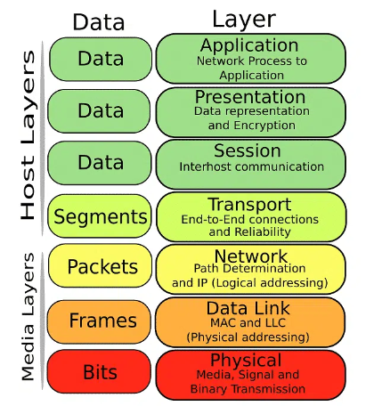
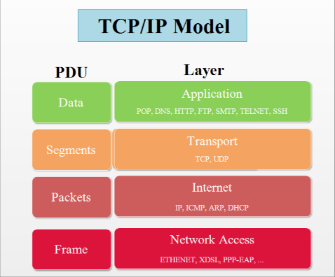

    Mô hình OSI và TCP là hai mô hình giao thức mạng phổ biến được sử dụng trong các mạng máy tính và Internet.

# **Mô hình OSI**
Mô hình OSI (Open systems Interconnection) là một mô hình giao thức mạng, được xây dựng bới ISO (International Organization for Standardization). Nó mô tả cách mà dữ liệu được truyền qua mạng máy tính và chia thành 7 tầng.

- `Tầng 1 (Tầng vật lý)`: có chức năng chính là điều khiển việc truyền tải các bit trên đường truyền vật lý. Chúng định nghĩa các tín hiệu điện, trạng thái đường truyền, phương pháp mã hóa dữ liệu.
- ` Tầng 2 (liên kết dữ liệu) `: Đảm bảo truyền tải các khung dữ liệu (Frame) giữa hai máy tính có đường truyền vật lý nối trực tiếp với nhau là điều mà chúng thực hiện. Ngoài ra nó còn cài đặt cơ chế phát hiện và xử lý lỗi dữ liệu nhận.
- ` Tầng 3 (Tầng mạng)`: đảm nhiệm việc truyền các gói tin (packet) giữa hai máy tính bất kỳ trong mạng máy tính.
- ` Tầng 4 (Tầng vận chuyển)`: Vai trò của chúng là phân nhỏ các gói tin có kính thước lớn khi gửi và tập hợp chúng khi nhận, quá trình phân nhỏ khi gửi đảm bảo tính toàn vẹn dữ liệu (không bị mất mát, không lặp và đúng thứ tự).
- ` Tầng 5 (Tầng phiên)`: Quản lý phiên làm viễ giữa các người sử dụng chính là việc mà chúng làm. Tầng mạng này cung cấp cơ chế nhận biết tên và chức năng bảo mật thông tin qua mạng máy tính.
- ` Tầng 6 (Tầng trinhg bày)`: Đảm bảo các máy tính có kiểu dạng dữ liệu khác nhau vẫn có thể trao đổi thông tin cho nhau. Thường thì các máy tính sẽ thống nhất với nhau về một kiểu định dạng dữ liệu trung gian để trao đổi thông tin giữa các máy tính. Trong quá trình truyền dữ liệu, tầng trình bày bên máy gửi có nhiệm vụ dịch dữ liệu từ định dạng riêng sang định dạng chung và quá trình ngược lại trên tầng trình bày bên máy nhận.
- ` Tầng 7 (Tầng ứng dụng)`: Là tầng cung cấp các ứng dụng truy xuất đến các dịch vụ mạng như Web Browser, Mail User... hoặc các Program  cung cấp các dịch vụ mạng như Web Server, FTP Server,...

# **Mô hình TCP/IP**
Mô hình TCP/IP (Transmission Control Protocop/Internet Protocol) là một mô hình giao thức mạng được sử dụng rộng rãi trên Internet và các mạng máy tính. Nó chia thành 4 tầng, mỗi tầng cung cấp các dịch vụ khác nhau cho tầng trên và dưới.

- ` Tầng 1 (Tầng truy nhập)`:Tầng này có thể coi là một tầng riêng biệt hoặc cũng có thể tách nó thành 2 tầng vật lý và liên kết dữ liệu như trong mô hình OSI. Nó được sử dụng để truyền gói tin từ tầng mạng đến các Host trong mạng. Các thiết bị vật lý như: Switch, cáp mạng, card mạng HBA-Host Bus Adapter là các thành phần truy cập.
- ` Tầng 2 (Tầng mạng)`: Trên mô hình TCP/IP có vai trò chính là giải quyết vấn đề dẫn đến các gói tin đi qua mạng để đến đúng đích.
- ` Tầng 3 (Tầng vận chuyển)`:Đảm nhiệm việc phân nhỏ các gói tin có kích thước lớn khi gửi và tập hợp lại khi nhận, tính toàn vẹn cho dữ liệu (không lỗi, không mất, đúng thứ tự) là yếu tố được đảm bảo. Nếu để ý thì bạn sẽ thấy chức năng của tầng vận chuyển ở giao thức TCP/IP cũng giống với tầng vận chuyển ở mô hình OSI.
- ` Tầng 4 (Tầng ứng dụng)`:
Là nơi các chương trình mang =j như Web Browser, Mail User, ... làm việc để liên lạc giữa các node mạng. Do mô hình TCP/IP không có tầng nào nằm giữa các tầng ứng dụng và tầng vận chuyển, nên tầng Ứng dụng của TCP/IP bao gồm các giao thức hoạt động như tầng trình diễn và phiên trong OSI.
# **Bảng so sánh mô hình OSI và mô hình TCP/IP**
|Nội dung|Mô hình OSI|Mô hình TCP/IP|
|--------|-----------|--------------|
|Độ tin cậy và phổ biến|Nhiều người cho rằng đầy là mô hình cũ chỉ để tham khảo, số người sử dụng hạn chế hơn so với TCP/IP|Được chuẩn hóa, nhiều người tin cậy và sử dụng phổ biến trên toàn cầu|
|Phương pháp tiếp cận|Tiếp cận theo chiều dọc|Tiếp cận theo chiều ngang|
|Sự kết hợp giữa các tầng|Mỗi tầng khác nhau sẽ thực hiện một nhiệm vụ khác nhau, không có sự kết hợp giữa bất cứ tầng nào|Trong tầng ứng dụng có tầng trình diễn và tầng phiên kết hợp với nhau|
|Thiết kế|Phát triển mô hình trước sau đó sẽ phát triển giao thức|Các giao thức được thiết kế trước sau đó phát triển mô hình|
|Số lớp (Tầng)|7|4|
|Truyền thông|Hỗ trợ cả kết nối định tuyến và không dây|Hỗ trợ truyền thông không kết nối từ tầng mạng|
|Tính phụ thuộc|Giao thức độc lập|Phụ thuộc vào giao thức|

# **Kết luận**
Mô hình OSI và TCP/IP là hai mô hình giao thức mạng phổ biến được sử dụng trong các mạng máy tính và Internet. Chúng ta cần hiểu rõ về cả hai mô hình để có thể hiểu rõ cách hoạt động của mạng máy tính và Internet. Mô hình OSI là mô hình giao thức mạng chung và chuẩn hóa, trong khi mô hình TCP/IP là mô hình giao thức mạng cụ thể được sử dụng trên Internet. Tuy nhiên, hai mô hình này có một số tương đồng về chức năng với nhau để hoạt động hiệu quả trong mạng máy tính.
 
Trong tương lai, sẽ có thêm nhiều cải tiến và phát triển mới cho mô hình giao thức mạng, nhưng mô hình OSI và TCP/IP vẫn sẽ tiếp sẽ là nền tảng quan trọng cho các mạng máy tính và Internet

# **Tài liệu tham khảo**
https://www.bkns.vn/so-sanh-mo-hinh-osi-va-tcp-ip.html

